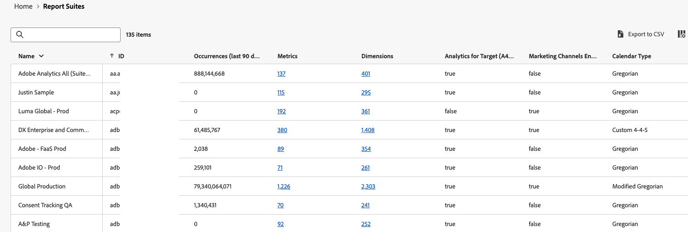

# Analytics 인벤토리 {#analytics-inventory}

<!-- markdownlint-disable MD034 -->

>[!CONTEXTUALHELP]
>id="analytics-inventory"
>title="Analytics 인벤토리"
>abstract="이 페이지에서는 프로젝트 및 구성 요소 수, 보고서 세트, 사용자 등을 포함하여 Adobe Analytics 환경에 대한 포괄적인 개요를 제공합니다. 이 정보는 특히 Customer Journey Analytics로 업그레이드하기 위한 준비를 시작할 때 매우 유용합니다."

<!-- markdownlint-enable MD034 -->

Analytics 인벤토리는 프로젝트 및 구성 요소 수, 보고서 세트, 사용자 등을 포함하여 Adobe Analytics 환경에 대한 포괄적인 개요를 제공합니다. 이 정보는 특히 Customer Journey Analytics로 업그레이드하기 위한 준비를 시작할 때 매우 유용합니다.

Analytics 인벤토리의 목표는 다음 질문에 답변하는 데 도움이 됩니다.

* 조직의 경우 어떤 에셋(보고서 세트, 세그먼트, 사용자, 작업 영역 프로젝트 등)을 마이그레이션해야 하며 어떤 에셋을 남겨둘 수 있습니까?

* 마이그레이션해야 하는 자산을 결정했으면 다음과 같이 하십시오.

   * 이 업그레이드 전에 에셋 정리를 수행해야 합니까?

   * 프로세스의 일부로 자산 통합을 수행해야 합니까?

   * 자산에 대한 업그레이드 시퀀스는 무엇입니까?

   * 첫 번째 또는 마지막 보고서 세트를 업그레이드해야 합니까?

## 권한

Analytics 인벤토리는 [Adobe Admin Console](https://experienceleague.adobe.com/en/docs/analytics/admin/admin-console/admin-roles-in-analytics)에서 Adobe Analytics 제품 관리자 권한이 있는 사용자가 사용할 수 있습니다.

## Analytics 인벤토리 액세스

1. **[!UICONTROL 관리자]** 메뉴에서 **[!UICONTROL Analytics 인벤토리]**&#x200B;를 클릭합니다. 또는 **[!UICONTROL 모든 관리자]** > **[!UICONTROL Analytics 인벤토리]**(으)로 이동합니다.

1. 기본 화면에는 Adobe Analytics 환경의 전체 인벤토리가 표시됩니다.

   

   특히 이 화면에는 다음이 표시됩니다.

   * 모든 사용자에 대해 이 조직에서 활성화된 Analysis Workspace 및 모바일 스코어카드 프로젝트의 총 수입니다.
   * 모든 사용자에 대해 이 조직에서 활성화된 세그먼트 및 계산된 지표의 총 수입니다.
   * 정의된 총 기본 보고서 세트 수입니다. 가상 보고서 세트는 포함되지 않습니다.
   * Media Analytics 기능이 활성화되어 있고, 활성화되어 있으면 어떤 모드로 전환됩니다.
   * 이 조직에 정의된 총 사용자 수.

## 구성 요소 {#components}

<!-- markdownlint-disable MD034 -->

>[!CONTEXTUALHELP]
>id="analytics-inventory-components"
>title="구성 요소"
>abstract="이 섹션에서는 Adobe Analytics 환경에 있는 프로젝트, 세그먼트 및 계산된 지표의 수를 보여 줍니다. 프로젝트와 구성 요소를 Customer Journey Analytics로 마이그레이션할 수 있습니다."

<!-- markdownlint-enable MD034 -->

이 초기 릴리스에서는 Workspace 프로젝트, 세그먼트 및 계산된 지표에 대한 요약 인벤토리 번호를 볼 수 있습니다. 후속 릴리스를 통해 이러한 구성 요소를 분석할 수 있습니다.

## 데이터 구성 및 수집 {#data-config}

<!-- markdownlint-disable MD034 -->

>[!CONTEXTUALHELP]
>id="analytics-inventory-data-config"
>title="데이터 구성 및 수집"
>abstract="이 섹션에서는 Adobe Analytics 환경의 보고서 세트 수와 스트리밍 미디어에 대한 액세스 권한을 보여 줍니다. "

<!-- markdownlint-enable MD034 -->

### 보고서 세트

보고서 세트 보기에는 조직 아래에 정의된 모든 보고서 세트가 표시됩니다. 이 옵션을 통해 다음 질문에 답변할 수 있습니다.

* 지난 90일 동안 가장 많은 조회 수를 기록한 보고서 세트는 무엇입니까?
* 지난 90일 동안 조회 수가 없는 보고서 세트는 무엇입니까?
* 정의된 차원 수가 가장 큰 보고서 세트는 무엇입니까?
* 정의된 지표 수가 가장 많은 보고서 세트는 무엇입니까?

이러한 질문에 대한 답변은 어떤 보고서 세트가 마이그레이션에 가장 적합한지 좋은 아이디어를 제공합니다.

>[!NOTE]
>
>이 테이블은 한 번에 하나의 셀 값을 천천히 채웁니다.

1. 보고서 세트를 분석하려면 **[!UICONTROL 데이터 구성 및 컬렉션]** > **[!UICONTROL 보고서 세트]**&#x200B;로 이동하고 **[!UICONTROL 분석]**&#x200B;을 클릭합니다.

   

   | 요소 | 설명 |
   | --- | --- |
   | 이름 | 보고서 세트의 이름 |
   | ID | 보고서 세트 ID(rsid)입니다. 영숫자만 포함한 고유 ID를 지정합니다. 이 ID는 생성하고 나면 변경할 수 없습니다. Adobe가 필수 ID 접두사를 설정하므로 어느 것도 변경할 수 없습니다. |
   | 발생 횟수 (최근 90일) | 발생 횟수 지표는 주어진 차원이 설정되거나 지속된 히트의 수를 보여줍니다. 지난 90일 동안 이 보고서 세트가 받은 히트는 몇 개입니까? |
   | 지표 | 이 보고서 세트에 정의된 지표는 몇 개입니까? |
   | 차원 | 이 보고서 세트에는 몇 개의 차원이 정의되어 있습니까? |
   | A4T(Analytics for Target) 활성화됨 | [기본적으로 숨겨짐] 이 보고서 세트가 [Analytics for Target](https://experienceleague.adobe.com/en/docs/target/using/integrate/a4t/a4t)에 대해 활성화되어 있습니까? |
   | 마케팅 채널 활성화됨 | [기본적으로 숨김] 이 보고서 세트가 [마케팅 채널](https://experienceleague.adobe.com/en/docs/analytics/components/marketing-channels/c-getting-started-mchannel)에 대해 활성화되어 있습니까? |
   | Source 커넥터 활성화됨 | 이 보고서 세트는 Adobe Experience Platform의 보고서 세트 데이터용 [Adobe Analytics Source Connector](https://experienceleague.adobe.com/en/docs/experience-platform/sources/connectors/adobe-applications/analytics)에 대해 활성화됩니까? 즉, Analytics Source 커넥터를 사용하여 이 보고서 세트를 Customer Journey Analytics으로 마이그레이션할 수 있습니까? |
   | 캘린더 유형 | [기본적으로 숨김] 자세한 내용은 [사용자 지정 달력](https://experienceleague.adobe.com/en/docs/analytics/admin/admin-tools/manage-report-suites/edit-report-suite/report-suite-general/custom-calendar#)을 참조하세요. |

#### 차원 분석

이 화면에서는 특정 보고서 세트에 대해 정의된 모든 차원을 자세히 볼 수 있습니다. 이 보기에서 다음 질문에 답변할 수 있습니다.

* 이 보고서 세트에 대해 활성화된 차원은 무엇입니까?
* 이 차원에 대한 최근 90일 동안의 상위 10개 차원 항목은 무엇입니까?

1. 보고서 세트 페이지에서 **[!UICONTROL 차원]** 링크를 클릭합니다.

   | 요소 | 설명 |
   | --- | --- |
   | 이름 | 차원의 이름 |
   | ID | 차원 ID입니다. |
   | 유형 | 차원 유형. 가능한 값에는 전환, 트래픽, 탐색, 트래픽 소스, 고객, 날짜 또는 AEM, 대상, Adobe Campaign, 모바일 앱 등과 같은 Adobe 제품별 차원이 포함됩니다. |
   | 설명 | 모든 차원에 설명이 있는 것은 아닙니다. |
   | Source 커넥터 활성화됨 | 이 차원이 Adobe Experience Platform의 보고서 세트 데이터용 [Adobe Analytics Source 커넥터](https://experienceleague.adobe.com/en/docs/experience-platform/sources/connectors/adobe-applications/analytics)에 대해 활성화되어 있습니까? 즉, Analytics Source 커넥터를 사용하여 이 차원을 Customer Journey Analytics으로 마이그레이션할 수 있습니까? |

1. CJA으로 마이그레이션하는 것이 적절한 차원을 결정합니다.

#### 지표 분석

이 화면에서는 특정 보고서 세트에 대해 정의된 모든 지표에 대한 세부 보기를 제공합니다. 이 보기에서 다음 질문에 답변할 수 있습니다.

* 이 보고서 세트에 대해 활성화된 지표는 무엇입니까?
* 지난 90일 동안의 상위 10개 지표는 무엇입니까?

1. 보고서 세트 페이지에서 **[!UICONTROL 지표]** 링크를 클릭합니다.

   | 요소 | 설명 |
   | --- | --- |
   | 이름 | 지표의 이름 |
   | ID | 지표 ID입니다. |
   | 유형 | 지표 유형. 가능한 값에는 전환, 트래픽, 탐색, 트래픽 소스, 고객, 날짜 또는 AEM, 대상, Adobe Campaign, 모바일 앱 등과 같은 Adobe 제품별 차원이 포함됩니다. |
   | 설명 | 모든 차원에 설명이 있는 것은 아닙니다. |
   | Source 커넥터 활성화됨 | 이 지표는 Adobe Experience Platform의 보고서 세트 데이터용 [Adobe Analytics Source 커넥터](https://experienceleague.adobe.com/en/docs/experience-platform/sources/connectors/adobe-applications/analytics)에 대해 활성화됩니까? 즉, Analytics Source 커넥터를 사용하여 이 지표를 Customer Journey Analytics으로 마이그레이션할 수 있습니까? |

1. CJA으로 마이그레이션하는 것이 적절한 지표를 결정합니다.

#### CSV로 내보내기

1. 보고서 세트나 차원 또는 지표 목록을 .csv 파일로 내보내려면 **[!UICONTROL CSV로 내보내기]**&#x200B;를 클릭합니다.

1. 다운로드 폴더에 .csv 파일이 나타납니다.

1. 장치에서 스프레드시트 애플리케이션을 사용하여 열고 저장합니다.

>[!NOTE]
>
>필터링된 항목 및 열은 .csv 파일로 내보낼 수 없습니다.

#### 필터링, 검색, 순서 지정 및 탐색

* 테이블을 검색하시면 됩니다
* 왼쪽 레일에서 필터 아이콘을 클릭하여 &quot;유형&quot;별로 필터링합니다. 또는 **[!UICONTROL 필터 숨기기]**&#x200B;를 클릭합니다.
* 모든 열의 순서를 오름차순/내림차순으로 정렬할 수 있습니다(단일 열 순서만 지정).
* 이동 경로에서 항목을 클릭하여 다른 화면으로 이동할 수 있습니다.

## 사용자 관리 {#user-management}

<!-- markdownlint-disable MD034 -->

>[!CONTEXTUALHELP]
>id="analytics-inventory-user-management"
>title="사용자 관리"
>abstract="이 섹션에서는 Adobe Analytics 환경의 사용자 수를 보여 줍니다."

<!-- markdownlint-enable MD034 -->

사용자 관리는 Analytics 인벤토리의 이후 릴리스에서 사용할 수 있습니다.