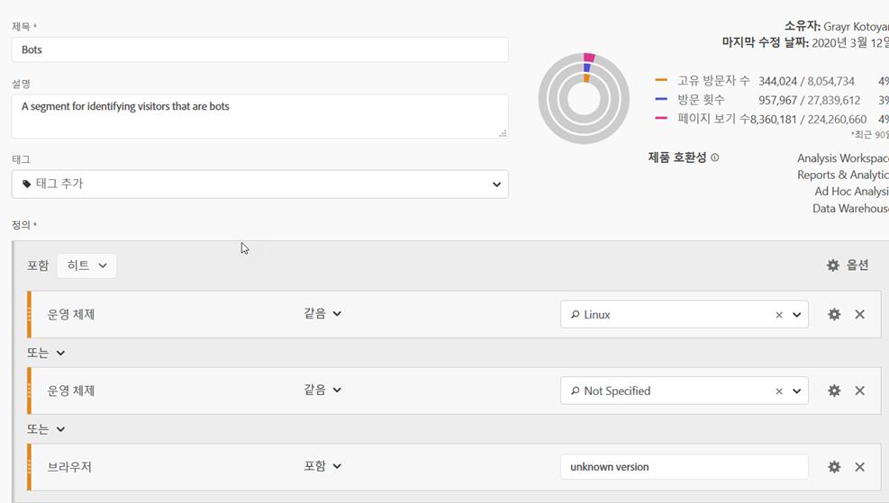
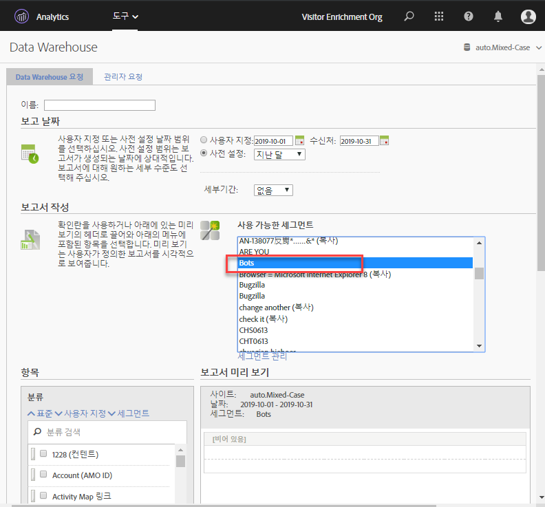

# Adobe Analytics의 보트 제거

Adobe Analytics 에서는 보고에서 보트 트래픽을 제거할 수 있는 세 가지 기본 옵션이 있습니다.

1. Adobe Analytics의 기본 보트 필터링 방법은 IAB 보트 목록을 [기반으로 하는 보트 규칙을](/help/admin/admin/bot-removal/bot-rules.md) 만드는 것입니다. 이 목록은 매월 업데이트되며 Cdns 및 주요 인터넷 속성을 비롯한 다양한 소스의 목록을 컴파일합니다. 여기에는 즐겨찾기를 모두 포함한 수천 개의 알려진 보트가 포함됩니다. Google, Bing, Mozilla 등 이 목록은 보트 필터링에 대한 대부분의 사용 사례와 요구 사항을 다룹니다.

1. 분당 수십 또는 수백 개의 히트를 전송하여 보트 같은 방문자를 제거하는 [s. hitgov 구현 플러그인을 사용합니다](https://docs.adobe.com/content/help/en/analytics/implementation/javascript-implementation/plugins/hitgovernor.html).

1. 또한 보트는 빠르게 발전하기 때문에 Adobe는 정기적으로 그리고 정기적으로 결합할 때 이러한 적의 데이터 품질을 제거할 수 있는 강력한 기능을 다양하게 제공합니다. 이러한 기능은 다음과 같습니다. Experience Cloud ID 서비스, 세그멘테이션, 데이터 웨어하우스, 고객 속성 및 가상 보고서 세트. 다음은 이러한 도구를 활용하는 방법에 대한 개요입니다.

## 1 단계: 방문자의 Experience Cloud ID를 새로운 선언된 ID로 전달

시작하려면 [대상 핵심 서비스에서 새로 선언된 ID를 만들어야](https://docs.adobe.com/content/help/en/core-services/interface/audiences/audience-library.html)합니다. 방문자의 Experience Cloud ID를 이 새로운 선언된 ID로 전달해야 합니다. 이 ID는 [Adobe Experience Platform Launch](https://docs.adobe.com/content/help/en/launch/using/implement/solutions/idservice-save.html)를 사용하여 빠르고 쉽게 수행할 수 있습니다. 선언된 ID에 대해 "ecid" 이름을 사용합니다.

스크린샷 여기

다음은 데이터 요소를 통해 이 ID를 캡처할 수 있는 방법에 대한 스크린샷입니다. Adobe mcorg ID를 데이터 요소에 정확하게 채워야 합니다.

```return Visitor.getInstance("REPLACE_WITH_YOUR_ECORG_ID@AdobeOrg").getExperienceCloudVisitorID();```

이 데이터 요소가 설정되면 다음 [지침에](https://docs.adobe.com/content/help/en/launch/using/implement/solutions/idservice-save.html) 따라 선언된 ID를 Launch의 ECID 도구에 전달하십시오.

## 2 단계: 세그멘테이션을 사용하여 보트 식별

이제 방문자의 ECID를 선언된 ID로 전달했으므로, 분석 작업 공간에서 세그멘테이션을 사용하여 보트 좋아요 방문자를 식별할 차례입니다. 보트는 종종 자신의 행동으로 정의됩니다. 단일 액세스 방문, 비정상적인 사용자-에이전트, 알 수 없는 장치/브라우저 정보, 레퍼러, 새 방문자, 비정상적인 랜딩 페이지 등 작업 영역 드릴다운 및 세그멘테이션의 기능을 사용하여 IAB 필터링 및 보고서 세트 보트 규칙을 포함한 보트를 식별할 수 있습니다. 예를 들어, 다음은 사용할 수 있는 세그먼트의 스크린샷입니다.



## 3 단계: 데이터 웨어하우스를 통해 세그먼트에서 모든 ECID 내보내기

세그먼트를 사용하여 보트를 식별했으므로 다음 단계는 데이터 웨어하우스를 활용하여 이 세그먼트와 연계된 모든 Experience Cloud ID를 추출하는 것입니다. 데이터 [웨어하우스](https://docs.adobe.com/content/help/en/analytics/export/data-warehouse/data-warehouse.html) 보고서를 설정하는 방법은 다음과 같습니다.



Experience Cloud 방문자 ID를 차원으로 사용하고 보트 세그먼트를 적용해야 합니다.

## 4 단계: 이 목록을 고객 속성으로 다시 Adobe에 전달

데이터 웨어하우스 보고서가 도착하면 내역 데이터에서 필터링해야 하는 ECID 목록이 나타납니다. 다음 Ecid를 복사하여 두 개의 열, ECID 및 보트 플래그가 있는 빈 CSV 파일에 붙여 넣습니다.


첫 번째 열 헤더가 위에서 새로 선언된 ID에 제공한 이름과 일치하는지 확인하십시오. 이. csv 파일을 고객 속성 가져오기 파일로 사용한 다음 [이 블로그 게시물에 설명된 대로 고객 속성에 보고서 세트를 구독합니다](https://theblog.adobe.com/link-digital-behavior-customers).

## 5 단계: 새 고객 속성을 활용하는 세그먼트 만들기

데이터 세트가 처리 작업 공간에 처리되고 통합되면, 새로운 "보트 플래그" 고객 속성 차원을 활용하는 하나 이상의 세그먼트를 만듭니다.
