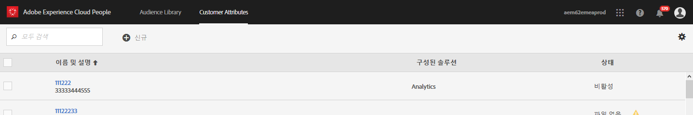
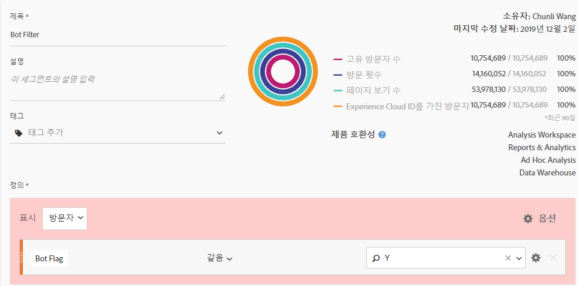
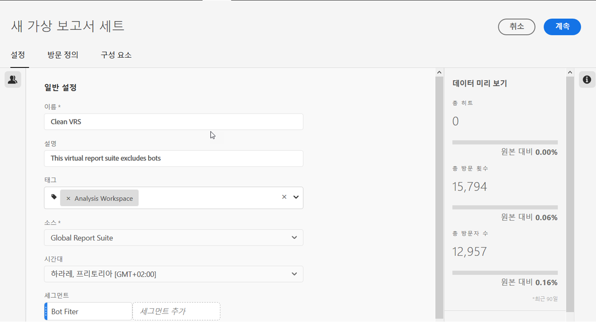

# Adobe Analytics에서 보트 제거

Adobe Analytics에서는 보고에서 보트 트래픽을 제거하기 위한 다양한 옵션이 있습니다.

## 보트 규칙 사용

표준 및 사용자 지정 **[!UICONTROL 보트 필터링 방법 모두 Analytics]** &gt; **[!UICONTROL 관리]** &gt; **[!UICONTROL 사용자 지정]** 보고서 **[!UICONTROL 설정]** &gt; 편집 **[!UICONTROL &gt; 일반]** ****&#x200B;보트 규칙Analytics에서 지원됩니다.

| 규칙 유형 | 설명 |
|--- |--- |
| 표준 IAB 보트 규칙 | IAB **[!UICONTROL 보트 필터링 규칙]** 활성화를 선택하면 IAB(International Advertising Bureau ['s](https://www.iab.com/) ) 국제 스파이더 및 보트 목록을 사용하여 보트 트래픽을 제거합니다. 대부분의 고객은 이 옵션을 최소한 선택합니다. |
| 사용자 지정 보트 규칙 | 사용자 에이전트, IP 주소 또는 IP 범위를 기반으로 사용자 지정 보트 규칙을 정의하고 추가할 수 있습니다. |

자세한 내용은 보트 [규칙 개요를](/help/admin/admin/bot-removal/bot-rules.md)참조하십시오.

## 구현 플러그인 `hitGovernor` 사용

s. [hitGovernor 구현 플러그인을](https://docs.adobe.com/content/help/en/analytics/implementation/javascript-implementation/plugins/hitgovernor.html)사용하여 보트처럼 행동하는 방문자를 제거합니다. 즉, 이 방문자가 분당 수십 또는 수백 개의 히트를 보냅니다.

## Adobe 툴의 조합 사용

또한 보트가 빠르게 변형되기 때문에 Adobe는 적절하게 정기적으로 결합될 때 이러한 데이터 품질의 적들을 제거하는 데 도움이 되는 몇 가지 다른 강력한 기능을 제공합니다. 이러한 기능은 다음과 같습니다.Experience Cloud ID 서비스, 세그멘테이션, 데이터 웨어하우스, 고객 속성 및 가상 보고서 세트. 다음은 이러한 툴을 활용하는 방법에 대한 개요입니다.

### 1단계:방문자의 Experience Cloud ID 파섹

시작하려면 사람 코어 서비스에 선언된 새 ID를 [만듭니다](https://docs.adobe.com/content/help/en/core-services/interface/audiences/audience-library.html). Adobe Experience Platform Launch를 사용하여 빠르고 손쉽게 수행할 수 있는 이 새로운 선언된 ID에 방문자의 Experience Cloud ID를 전달해야 [합니다](https://docs.adobe.com/content/help/en/launch/using/implement/solutions/idservice-save.html). 선언된 ID에 "ECID"라는 이름을 사용합시다.



다음은 데이터 요소를 통해 이 ID를 캡처하는 방법입니다. Experience Cloud OrgID를 데이터 요소에 올바르게 채워야 합니다.

```return Visitor.getInstance("REPLACE_WITH_YOUR_ECORG_ID@AdobeOrg").getExperienceCloudVisitorID();```

이 데이터 요소가 설정되면 [다음 지침에](https://docs.adobe.com/content/help/en/launch/using/implement/solutions/idservice-save.html) 따라 선언된 ID를 Launch의 ECID 도구에 전달합니다.

### 2단계:세그먼트를 사용하여 보트 식별

이제 방문자의 ECID가 선언된 ID로 전달되었으므로 분석 작업 공간의 [세그멘테이션을 사용하여](https://docs.adobe.com/content/help/en/analytics/analyze/analysis-workspace/components/t-freeform-project-segment.html) 보트와 같은 역할을 하는 방문자를 식별할 수 있습니다. 보트는 종종 자신의 동작에 의해 정의됩니다.단일 액세스 방문, 비정상적인 사용자 에이전트, 알 수 없는 장치/브라우저 정보, 레퍼러 없음, 새 방문자, 비정상적인 랜딩 페이지 등 작업 공간 드릴다운 및 세그멘테이션의 기능을 사용하여 IAB 필터링을 거부한 보트와 보고서 세트 보트 규칙을 식별합니다. 예를 들어, 다음은 사용할 수 있는 세그먼트의 스크린샷입니다.


### 3단계:데이터 웨어하우스를 통해 세그먼트에서 모두 [!DNL Experience Cloud IDs] 내보내기

세그먼트를 사용하여 보트를 식별했으므로 다음 단계는 데이터 웨어하우스를 활용하여 이 세그먼트와 연결된 모든 Experience Cloud ID를 추출하는 것입니다. 다음은 데이터 웨어하우스 [요청을 설정하는](https://docs.adobe.com/content/help/en/analytics/export/data-warehouse/data-warehouse.html) 방법입니다.


Experience Cloud 방문자 ID를 차원으로 사용하고 보트 세그먼트를 적용해야 합니다.

### 4단계:이 목록을 다시 Adobe에 고객 속성으로 전달

데이터 웨어하우스 보고서가 도착하면 내역 데이터에서 필터링해야 하는 ECID 목록이 있습니다. 이러한 ECID를 복사하여 단 두 개의 열, ECID 및 보트 플래그와 함께 빈 .CSV 파일에 붙여 넣습니다.

* **ECID**:이 열 헤더가 위에서 선언된 새 ID에 제공한 이름과 일치하는지 확인합니다.
* **보트 플래그**:고객 속성 스키마 차원으로 추가합니다.

이 .CSV 파일을 고객 속성 가져오기 파일로 사용한 다음 이 [블로그 게시물에](https://theblog.adobe.com/link-digital-behavior-customers)설명된 대로 보고서 세트를 고객 속성에 가입하십시오.


### 5단계:새 고객 속성을 활용하는 세그먼트 만들기

데이터 세트가 처리 및 분석 작업 공간에 통합되면 새로운 "보트 플래그" 고객 속성 차원과 제외 [!UICONTROL 컨테이너를 활용하는 세그먼트를 하나 더 만듭니다] .



### 6단계:이 세그먼트를 가상 보고서 세트 필터로 사용

마지막으로, 이 세그먼트를 [활용하는](/help/components/vrs/vrs-about.md) 가상 보고서 세트를 만들어 식별된 보트를 필터링해야 합니다.



이렇게 새로 세그먼트화된 가상 보고서 세트는 식별된 보트가 완전히 제거되어 데이터 세트가 크게 더 깨끗해집니다.

### 7단계:2, 3 및 4단계를 정기적으로 반복합니다.

정기적으로 예약된 분석을 수행하기 전에 적어도 월별 미리 알림을 설정하여 새 보트를 식별하고 필터링합니다.
