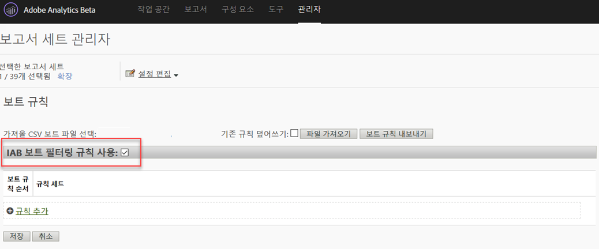

# 보트 규칙 개요

보트 규칙을 사용하면 알려진 스파이더 및 보트가 생성하는 보고서 세트에서 트래픽을 제거할 수 있습니다. 보트 트래픽을 제거하면 웹 사이트에서 사용자 활동을 더 정확하게 측정할 수 있습니다.

보트 규칙이 정의된 후, 모든 들어오는 트래픽이 정의된 규칙과 비교됩니다. 이러한 규칙과 일치하는 트래픽은 보고서 세트에서 수집되지 않고 트래픽 지표에 포함되지 않습니다.

To update or upload bot rules, navigate to **[!UICONTROL Analytics]** &gt; **[!UICONTROL Admin]** &gt; **[!UICONTROL Report Suites]**. Select the correct Report Suite, and then go to **[!UICONTROL Edit Settings]** &gt; **[!UICONTROL General]** &gt; **[!UICONTROL Bot Rules]**.

일반적으로 보트 트래픽을 제거하면 트래픽 양과 전환 지표가 줄어듭니다. 대부분의 고객이 보트 트래픽을 제거하면 전환율이 증가하고 기타 유용성 지표도 증가함을 확인할 수 있습니다. 보트 트래픽을 제거하기 전에 이해 당사자들과 소통하여 이러한 변경의 결과로 핵심 성능 지표(KPI)에 필요한 조정을 할 수 있음을 확인하십시오. 가능하면 작은 보고서 세트에서 먼저 보트 트래픽을 제거하여 잠재적 영향을 추정하는 것이 좋습니다.

보트 트래픽 데이터는 개별 보관소에 저장되어  보트 및 보트 페이지 보고서에 표시됩니다. 보트 필터링을 활성화하는 방법에는 두 가지가 있습니다.

| 규칙 유형 | 설명 |
|--- |--- |
| 표준 IAB 보트 규칙 | IAB 보트 필터링 [!UICONTROL 규칙 활성화를 선택하면] [IAB (International Advertising](https://www.iab.com) Bureau's International Advertising Bureau's International Spiders &amp; Bots List) 를 사용하여 보트 트래픽을 제거합니다. 대부분의 고객은 최소한 이 옵션을 선택합니다. |
| 사용자 지정 보트 규칙 | 사용자 에이전트, IP 주소 또는 IP 범위를 기반으로 사용자 지정 보트 규칙을 정의하고 추가할 수 있습니다. |

## 표준 IAB 보트 규칙

표준 IAB 보트 규칙은 IAB 보트 필터링 규칙 [!UICONTROL 활성화] 확인란을 선택하여 켤 수 있습니다. 이 선택 사항은 IAB (International Advertising Bureau's International Advertising Bureau's International Spiders &amp; Bots List) 에서 보트 트래픽을 제거합니다. IAB는 이 목록을 매월 업데이트합니다.



사용자가 보트 보고서를 사용하여 사용자의 사이트에 액세스한 보트 목록을 볼 수 있더라도, Adobe는 세부 IAB 보트 목록을 고객에게 제공할 수 없습니다. 보트를 IAB 목록에 제출하려면 [IAB](https://www.iab.com)를 방문하십시오.

## 사용자 지정 보트 규칙

>[!NOte]
>사용자 인터페이스를 통해 500개의 규칙을 수동으로 정의할 수 있습니다. 이 한도에 도달하면 파일 가져오기 및 [보트 규칙 내보내기] 옵션을 통해 규칙을 일괄적으로 관리해야 합니다.

사용자 지정 보트 규칙을 사용하여 사용자가 정의한 조건을 기준으로 트래픽을 필터링할 수 있습니다.

사용자 지정 보트 규칙은 다음 조건 유형을 사용하여 정의됩니다.

* 사용자 에이전트
* IP 주소
* IP 범위

단일 규칙에 대해 여러 조건을 정의할 수 있습니다. "or"을 사용하여 다중 조건을 일치시킵니다. 예를 들어 사용자 에이전트 및 IP 주소에 대한 값을 제공하는 경우 두 조건 중 하나가 충족되면 트래픽을 보트 트래픽으로 간주합니다.

### 사용자 에이전트

사용자 에이전트 조건은 사용자 에이전트 값을 확인하여 지정된 문자열&#x200B;**[!UICONTROL 로 시작하는지]** 또는 이 문자열을 **포함하는]지 확인합니다.[!UICONTROL ** **[!UICONTROL 포함]을 선택하면 사용자 에이전트의 아무 위치에서나 발견될 경우 하위 문자열과 일치합니다.**

**[!UICONTROL 포함하지 않음]목록에 선택적인 값을 포함하여 성공적인 일치에 사용자 에이전트가 포함해서는 안 되는 값을 정의할 수 있습니다.** 한 줄에 값을 하나씩 포함하여 여러 값을 지정할 수 있습니다. 사용자 에이전트가 일치 문자열에 지정된 기준을 충족하지만, 포함하지 않음 목록의 문자열을 포함할 경우에는 일치로 간주되지 않습니다.

**[!UICONTROL 포함 필드는 100자로 제한됩니다.]** 포함하지 않음 목록은 255자 - 각 줄바꿈에 대한 구문 문자로 제한됩니다. 이것은 문자열 수 - 1과 같습니다. *4개의 포함하지 않음* 문자열을 지정할 경우 3개의 구분 문자가 필요합니다. 모든 문자열 일치는 대/소문자를 구분하지 않습니다.

### IP 주소(와일드카드 일치 포함)

와일드카드(*)를 사용하여 동일한 블록의 IP 주소 또는 다중 주소와 일치시킵니다. 일치시킬 IP 주소의 숫자 값을 제공합니다. 와일드카드를 사용하여 일치시킬 모든 값에 대해 *로 대체합니다. 다음 목록은 IP 주소 일치 문자열의 예를 포함합니다.

```
10.10.10.1
10.10.10.*
```

### IP 주소 범위

일치시킬 IP 주소의 시작 및 끝 범위를 제공합니다. 와일드카드를 사용하여 일치시킬 모든 값에 대해 *로 대체합니다. 

### 사용자 지정 보트 규칙 정의

1. **[!UICONTROL Analytics]** &gt; **[!UICONTROL 관리로]**&#x200B;이동하고, 하나 이상의 보고서 세트를 선택하고 **[!UICONTROL 일반]** &gt; **[!UICONTROL 보트 규칙을 클릭합니다]**.
1. Click **[!UICONTROL Add Rule]** and define one or more match conditions.
1. **[!UICONTROL 저장을 클릭합니다]**. 변경은 30분 이내에 적용됩니다.

## 보트 규칙 업로드

보트 규칙 일괄 가져오기를 수행하기 위해 규칙을 정의하는 CSV 파일을 업로드할 수 있습니다.

표시된 순서대로 다음 열을 포함하는 CSV 파일을 만듭니다.

| 열 1 | 열 2 | 열 3 | 열 4 | 열 5 |
|--- |--- |---|---|---|
| 보트 이름 | IP 시작 | IP 끝 | Agent Match Rule<br>(contains or starts with)</br> | 에이전트 제외<br>(255 자 제한)</br> |

세 가지 유형의 보트 규칙을 정의할 수 있습니다.

* 사용자 에이전트 포함 또는 다음으로 시작
* 단일 IP 주소 또는 와일드카드 일치
* IP 범위 일치

가져오기 파일의 각 행은 다음 보트 정의 중 하나만 포함할 수 있습니다.

* **사용자 에이전트 포함 또는 다음으로 시작**: [에이전트 포함] 열에 일치시킬 단일 사용자 에이전트 문자열을 입력합니다. [에이전트 일치 규칙] 필드에 *포함* 또는 *다음으로 시작*&#x200B;을 배치하여 수행할 일치 유형을 지정합니다. An optional value can be included in the Agent Exclude column that defines one or more pipe-delimited ( `|` ) strings that the Agent does not contain. 문자열 일치는 대/소문자를 구분하지 않습니다. IP 시작 열과 IP 끝 열은 모두 비어 있어야 합니다.

* **단일 IP 주소 또는 와일드카드 일치**: 단일 IP 주소 ( `10.10.10.1`) 또는 와일드카드 IP 주소 ( `10.10.*.*`) 와 일치시키려면 IP 시작 열과 IP 종료 열 모두에 동일한 값을 배치합니다. [일치 규칙], [에이전트 포함] 및 [에이전트 제외]는 비어 있어야 합니다.

* **IP 범위 일치**: IP 시작 및 IP 종료 열을 사용하여 IP 주소 범위를 정의합니다. Wildcards can be used to match IP ranges, for example `10.10.10.*` to `10.10.20.*`. [일치 규칙], [에이전트 포함] 및 [에이전트 제외]는 비어 있어야 합니다.

### OR로 결합된 다중 규칙

OR로 결합된 규칙의 조합을 사용하여 보트를 일치시키려면(예: 사용자 에이전트 또는 IP 주소) 보트 이름 필드에 결합할 모든 규칙에 대한 동일한 이름을 제공하십시오. AND 일치는 지원되지 않습니다.

### 업로드 파일로 모든 규칙 덮어쓰기

모든 기존 규칙을 삭제하고 업로드 파일에 정의된 규칙으로 대체하려면 **[!UICONTROL 기존 규칙 덮어쓰기]확인란을 선택하십시오.**

### 내보내기 규칙

**[!UICONTROL 업로드된 보트 파일 내보내기]버튼을 누르면 UI에 정의된 모든 규칙을 CSV 형식으로 내보냅니다.**


## Impact of bot rules on data collection {#section_F01A3130E7A04A9993371CF26F6586F2}

보트 규칙이 모든 분석 데이터에 적용됩니다. 보트 규칙으로 제거된 데이터는 보트 및 보트 페이지 보고서에서만 볼 수 있습니다.

VISTA rules are applied after Bot Rules (see [Processing Order](../../../admin/admin/c-processing-rules/c-processing-rules-configuration/processing-rule-order.md#concept_8A6BBEA7F50C40C8A8D8755D4F579B1E)).

**하이 히트 방문 처리:** 한 번의 방문에 100개 이상 히트가 발생하는 경우, 보고는 방문 시간(초)이 해당 방문의 히트 수와 같은지 또는 미만인지 파악합니다. 이런 상황에서 길고 집중적인 방문을 처리하는 비용 때문에, 보고는 새 방문으로 다시 시작합니다. 일반적으로 하이 히트 방문은 보트 공격으로 인해 발생하며 일반적인 방문 검색으로 간주되지 않습니다.

>[!NOTE]
>
>표시된 히트는 *`bots`* 서버 호출로 [청구됩니다](https://docs.adobe.com/content/help/en/analytics/admin/server-call-usage/overage-overview.html).

## Impact of IP Obfuscation on bot filtering {#section_92E60B95BE8940D983F28C79E0CD6B12}

IAB 보트 목록은 오로지 사용자 에이전트를 기반으로 하므로, 해당 목록을 기반으로 한 필터링은 IP 난독화 설정의 영향을 받지 않습니다. 비-IAB 보트 필터링(사용자 지정 규칙)의 경우, IP는 필터링 기준의 일부일 수 있습니다. IP를 사용하여 보트를 필터링하는 경우, 해당 설정이 활성화되어 있으면 보트 필터링은 마지막 옥텟이 제거된 후, 하지만 전체 IP를 삭제하거나 일부 고유 ID로 대체하는 등의 다른 IP 난독화 옵션 전에 발생합니다.

IP 난독화가 활성화되어 있으면 IP 주소가 난독화되기 전에 IP 제외가 발생하므로 고객은 IP 난독화를 활성화할 때 아무것도 변경할 필요가 없습니다.

마지막 옥텟이 제거되면 IP 필터링 전에 변경이 수행됩니다. 따라서 마지막 옥텟은 0으로 대체되고, IP 제외 규칙은 끝에 0이 있는 IP 주소와 일치하도록 업데이트해야 합니다. 일치 *는 0과 일치해야 합니다.
