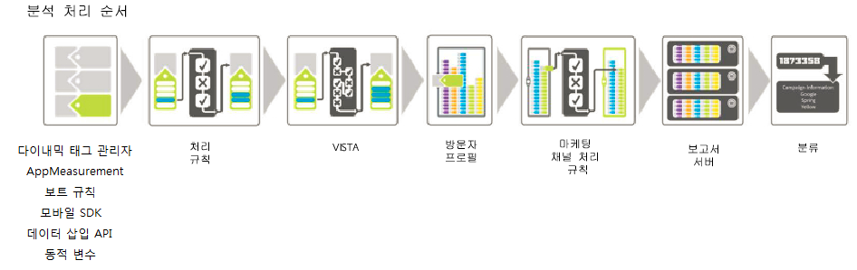

# 처리 순서

처리 규칙을 효과적으로 사용하려면 데이터 수집 중에 언제 처리 규칙이 적용되는지 이해하는 것이 중요합니다. 

다음 표에서는 처리 규칙이 적용되기 전후에 일반적으로 사용할 수 있는 데이터를 나열합니다.

## 처리 규칙 이전

| 측정기준 | 설명 |
|--- |--- |
| 동적 변수 조회 | HTTP 헤더 또는 기타 변수에서 정보를 가져와서 변수를 동적으로 채웁니다. For example, `s.eVar5="D=c1"` will put the value of prop1 into eVar5. |
| AppMeasurement | AppMeasurement에서 사용된 함수 및 플러그인은 브라우저 또는 클라이언트 응용 프로그램에서 실행됩니다. |
| Dynamic Tag Management | Dynamic Tag Management에 정의된 규칙은 정의대로 실행됩니다. |
| 보트 규칙 | [보트 규칙](../../../../admin/admin/bot-removal/bot-rules.md)을 사용하여 알려진 스파이더 및 보트가 생성하는 트래픽을 보고서 세트에서 제거할 수 있습니다. |

## 처리 규칙 이후

| 측정기준 | 설명 |
|--- |--- |
| VISTA가 추가한 데이터 | 처리 규칙은 VISTA 이전에 적용됩니다. |
| 방문 페이지 번호 | 일반적인 규칙으로, 처리 규칙은 현재 히트에만 포함된 데이터를 인식합니다. 방문 페이지 번호는 처리 규칙이 적용된 후 컴파일됩니다. |
| 클린 URL이 설정되지 않은 경우 페이지 이름으로 추가됩니다. | 처리 규칙 및 VISTA가 적용된 후, 설정된 페이지 이름이 없는 경우 클린 URL이 페이지 이름으로 추가됩니다. 이는 처리 규칙이 적용된 후 발생하므로 페이지 이름이 비어 있는지 확인하기 위해 조건을 추가하는 것이 좋습니다.  사이트 컨텐츠 &gt; 페이지 보고서를 실행하고 페이지 이름에 https:// 값이 표시되는 경우 페이지 이름이 비어 있고 URL 이 사용되는 것입니다. 빈 페이지 이름을 테스트하거나, 페이지 이름 또는 페이지 URL이 특정 값을 포함하고 있는지 확인하는 테스트를 위해 조건을 설정할 수 있습니다. 그런 다음 필요에 따라 페이지 이름을 설정할 수 있습니다. |
| 마케팅 채널 처리 규칙 | 처리 규칙을 사용하여 [마케팅 채널 처리 규칙](https://marketing.adobe.com/resources/help/en_US/mchannel/index.html?f=c_rules)으로 처리할 데이터를 준비할 수 있습니다. |
| GEO 조회 | 여기에는 방문자 주 및 방문자 ZIP/우편 번호 값이 포함됩니다. |
| eVar 지속성 | 이전 히트에 포함된 evar는 규칙 처리 중에 각 히트에 지속되지 않습니다. 처리되는 현재 히트에서 설정된 eVar만 사용할 수 있습니다. |

## VISTA를 사용하여 히트를 복사할 때 처리 규칙이 적용되는 방식 {#section_576EE8C240A24CBA979BD614E8D5338D}

히트를 다른 보고서 세트에 복사하도록 VISTA 규칙을 구성한 경우 히트가 다른 보고서 세트에 정의된 처리 규칙을 통해 전송됩니다.

원래 보고서 세트에 처리 규칙을 정의했으면 엔지니어링 서비스에서 VISTA 규칙을 구성한 방식을 기준으로 이러한 규칙이 적용되거나 적용되지 않을 수 있습니다. VISTA 규칙이 "pre" 또는 "post" 값을 추가 보고서 세트에 복사하는지 구현 전문가에게 물어볼 수 있습니다. "pre" 값이 복사되면 원래 보고서 세트에 정의된 처리 규칙은 적용되지 않습니다. "post" 값이 복사되면 히트가 복사되기 전에 처리 규칙이 적용됩니다.
