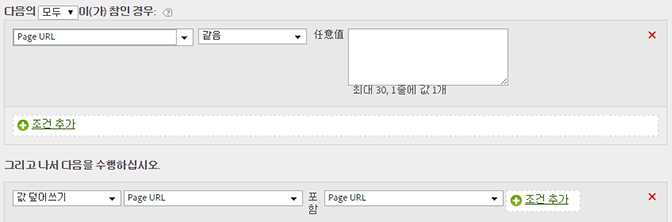

# 보고서에서 값 정리

일반적인 철자 오류에 대해 값을 일치시키고 해당 값을 업데이트하여 보고서에 올바르게 표시할 수 있습니다. 

의도치 않게 다른 값과 일치시키지 않도록 사용 가능한 가장 제한적인 일치 옵션을 사용하십시오. 변수에서 보고서를 실행하고(아래 예의 prop1) 교체하도록 선택하는 용어를 검색하여 의도하지 않는 값을 일치시키지 않도록 할 수 있습니다. 문자열 비교는 대/소문자를 구분하지 않습니다.

| 규칙 세트 | 값 |
|---|---|
| 조건 | prop1이 Shopping으로 시작되는 경우 |
| 작업 | prop1의 값을 Custom Value Shopping으로 덮어쓰기 |

예:

