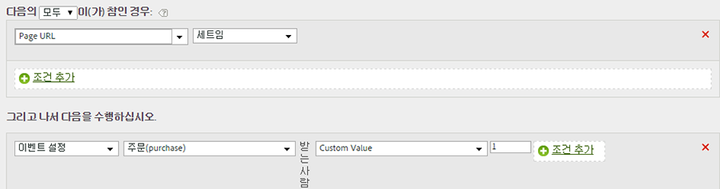

# 컨텍스트 데이터 변수를 사용하여 이벤트 설정

처리 규칙은 컨텍스트 데이터 변수에 따라 이벤트를 트리거할 수 있습니다. 

컨텍스트 데이터 변수는 다음 형식으로 AppMeasurement에서 지정됩니다.

```
 s.contextData['search_term']
```

[!UICONTROL 컨텍스트 변수] 목록은 이전 30일 동안 보고서 세트로 전송된 모든 변수를 포함합니다. If you know the context data variable name but have not sent it into the current report suite, you can add a value by typing the variable name and clicking **[!UICONTROL Add variable name context data]**:


The following rule definition expands on the [Copy a Context Data Variable to an eVar](../../../../admin/admin/c-processing-rules/processing-rules-examples/processing-rules-copy-context-data.md#concept_43AA4980A2D847D6A3BEC50BCC0780E7) rule to also set an event on every hit that contains a specific context data variable:

| 규칙 세트 | 값 |
|---|---|
| 조건 | 'search_term' 컨텍스트 데이터가 설정된 경우 |
| 작업 | 이벤트 '검색' 설정 |

예:



구현 도움말에서 [컨텍스트 데이터 변수](https://marketing.adobe.com/resources/help/en_US/sc/implement/index.html?f=context_data_variables)를 참조하십시오.
