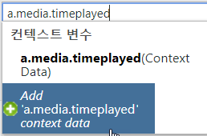
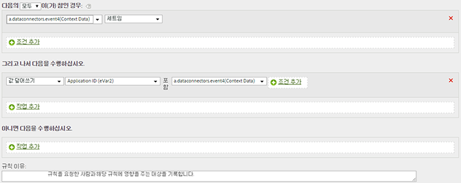

# eVar에 컨텍스트 데이터 변수 복사

처리 규칙을 사용하여 컨텍스트 데이터 변수의 값을 props 및 eVars로 이동합니다.

컨텍스트 데이터 변수는 다음 형식으로 AppMeasurement에서 지정됩니다.

```
 s.contextData['search_term']
```

[!UICONTROL 컨텍스트 변수] 목록은 이전 30일 동안 보고서 세트로 전송된 모든 변수를 포함합니다. If you know the context data variable name but have not sent it into the current report suite, you can add a value by typing the variable name and clicking **[!UICONTROL Add variable name context data]**:



다음 규칙 정의는 특정 컨텍스트 데이터 변수를 포함하는 모든 히트의 evar를 채웁니다.

| 규칙 세트 | 값 |
|---|---|
| 조건 | 'search_term' 컨텍스트 데이터가 설정된 경우 |
| 작업 | eVar3 값을 'search_term'으로 덮어쓰기 |

예:



구현 도움말에서 [컨텍스트 데이터 변수](https://marketing.adobe.com/resources/help/en_US/sc/implement/context_data_variables.html)를 참조하십시오.
