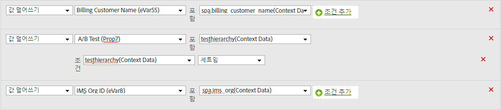

# eVar에 컨텍스트 데이터 변수 복사

처리 규칙은 컨텍스트 데이터 변수에서 prop 및 eVar로 값을 이동하는 데 사용됩니다. 처리 규칙이 없으면 컨텍스트 데이터 변수는 의미가 없으며 Analytics에서 보고서를 채우지 않습니다.

[!UICONTROL 컨텍스트 변수] 목록은 이전 30일 동안 보고서 세트로 전송된 모든 변수를 포함합니다. If you know the context data variable name but have not sent it into the current report suite, you can add a value by typing the variable name and clicking **[!UICONTROL Add variable name context data]**:

다음 예제에서는 `search_term` 컨텍스트 데이터 변수를 가져와 값을 `eVar3`가져옵니다.

위 예는 채울 eVar가 몇 개만 있을 때 잘 작동합니다. 조직에 각각 자체 eVar가 필요한 수백 개의 컨텍스트 데이터 변수가 있는 경우 조건문을 사용할 수 있습니다. 하나의 처리 규칙에 수십 개의 조건문이 포함될 수 있으므로 조직에서 처리 규칙 제한인 150개 규칙으로 실행하지 않고도 보고서 세트의 모든 eVar를 채울 수 있습니다.

다음 예는 컨텍스트 데이터 `prop7` 변수로 `testhierarchy`채워지지만, 설정된 경우에만 `testhierarchy` 채워집니다.

컨텍스트 데이터 변수 구현에 대한 자세한 내용은 구현 [사용 안내서의 컨텍스트 데이터 변수를](../../../../implement/js-implementation/c-variables/context-data-variables.md) 참조하십시오.
