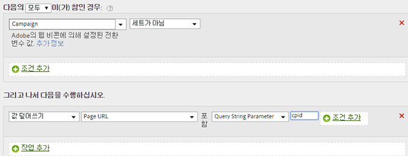

# 쿼리 문자열 매개 변수에서 캠페인 ID 채우기

쿼리 문자열 매개 변수를 사용하여 변수를 채울 수 있습니다.

대부분의 경우 플러그인을 사용하여 쿼리 문자열에서 변수를 채웁니다. 오타 또는 유사한 문제로 인해 값을 작성할 수 없는 경우 처리 규칙을 사용하여 변수를 채울 수 있습니다.

덮어쓰기 전에 값이 비어 있거나 예상된 값을 포함하고 있는지 항상 확인해야 합니다.

| 규칙 세트 | 값 |
|---|---|
| 조건 | 캠페인이 설정되지 않음 |
| 작업 | 캠페인 값을 쿼리 문자열 매개 변수 CPID로 덮어쓰기 |

예:

