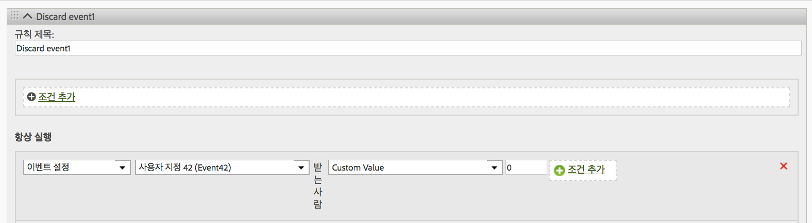

# 히트에서 이벤트 제거

페이지에서 변경 사항을 구현하지 않고 처리 규칙을 사용하여 조회수에서 이벤트를 제거/삭제하는 방법을 표시합니다.

## Remove an event from a hit {#topic_9548385BFE344FC08CA99718A24FC093}

페이지에서 변경 사항을 구현하지 않고 처리 규칙을 사용하여 조회수에서 이벤트를 제거/삭제하는 방법을 표시합니다.

아래 이미지에 표시된 것처럼 이벤트를 사용자 지정 값 0으로 설정하도록 처리 규칙을 구성하십시오.

