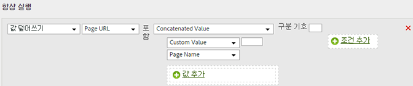

# 카테고리와 페이지 이름을 연결하여 하위 카테고리 추가

다른 값을 통합하는 연결 옵션을 사용하여 값을 채울 수 있습니다.

<table id="table_FF761C2011CD456B9A466C054A54FC30"> 
 <thead> 
  <tr> 
   <th colname="col1" class="entry"> 규칙 세트 </th> 
   <th colname="col2" class="entry"> 값 </th> 
  </tr> 
 </thead>
 <tbody> 
  <tr> 
   <td colname="col1"> 조건 </td> 
   <td colname="col2"> 없음(항상 실행) </td> 
  </tr> 
  <tr> 
   <td colname="col1"> 작업 </td> 
   <td colname="col2">하위 카테고리 값을 연결된 값으로 덮어쓰기 
카테고리 
 
페이지 이름 
 </td> 
  </tr> 
 </tbody> 
</table>

예:

