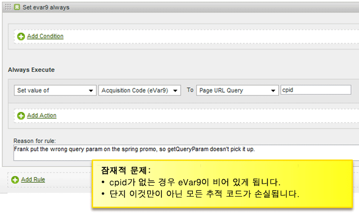
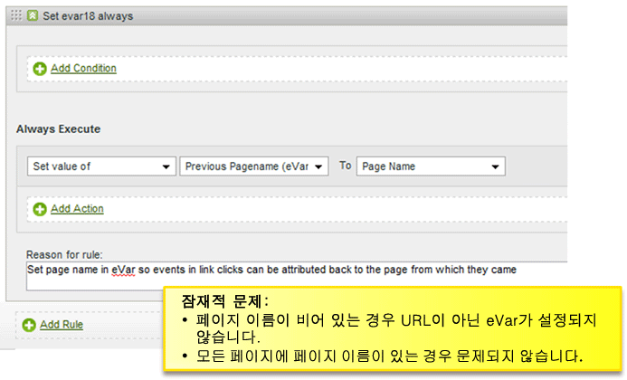
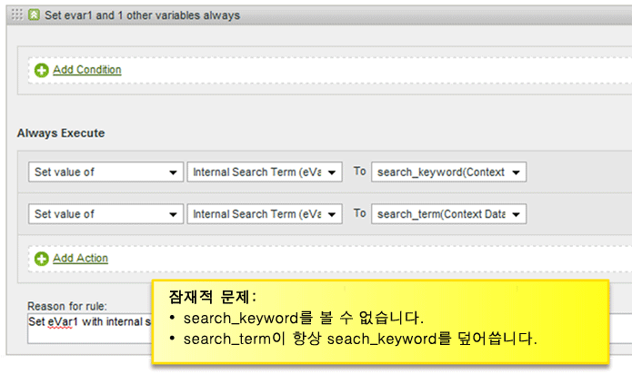
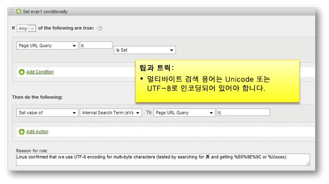
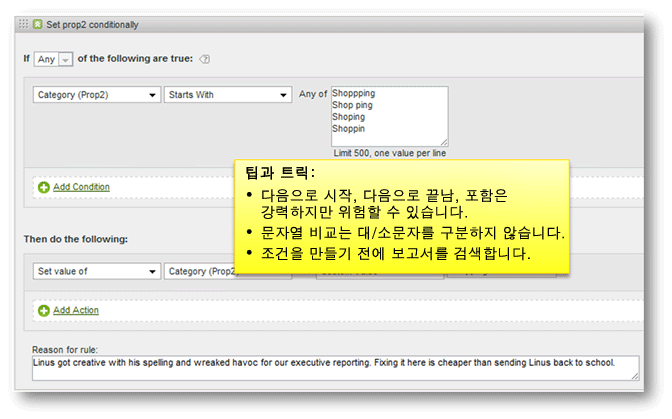

# 처리 규칙 팁과 트릭

이 섹션에는 처리 규칙을 테스트하기 위한 지침과 피해야 할 일반적인 실수 목록이 들어 있습니다.

## 처리 규칙 테스트 {#section_F092D2FECDE24082AE9FC6F8BE87F29F}

이 섹션에는 처리 규칙을 프로덕션에 배치하기 전에 처리 규칙을 테스트하는 데 도움을 주는 몇 가지 지침이 들어 있습니다.

**검색어를 읽는 규칙 테스트**

prop1이 "news"를 포함하는 경우처럼, 검색에 기반한 기준의 경우, prop 1 보고서로 이동하고 "news"를 검색하여 예상하지 않은 일치 항목이 있는지 확인하십시오.

**변수를 읽는 규칙 테스트**

Create a blank HTML page on your desktop, include the s_code from your site, and set the `s.account` variable to a dev report suite. 규칙이 참조, 참조 도메인 등에 기준할 경우 라이브 레퍼러 보고서에서 몇 가지 샘플 URL을 가져와서 `s.referrer` 변수를 이러한 값 중 하나로 설정하고 페이지를 로드합니다. 마찬가지로, 규칙이 페이지 URL 값에 기준하면 `s.pageURL`을 설정할 수 있습니다. 모든 변수에 이 동일한 프로세스를 사용할 수 있습니다.

**Dev 보고서 세트 사용**

dev 보고서 세트에 처리 규칙을 구성하여 올바르게 작동하는지 확인하는 것이 좋습니다. 가능한 경우 널리 배포하기 전에 작은 프로덕션 보고서 세트에 규칙을 복사하는 것이 좋습니다.

## 빈 값 확인 {#section_EE84A5525E26415787930723B0CAAE0F}

규칙을 만들 때 값이 빈 경우를 고려하십시오. 빈 값을 확인하는 조건을 추가하지 않으면 의도치 않게 변수를 빈 값으로 덮어쓸 수 있습니다.

처리 순서를 고려하는 것 또한 중요합니다. 다음 예에서는 페이지 이름이 없을 경우 이전 페이지 이름 사용자 지정 evar가 URL로 설정되어 나타납니다. 그러나 URL은 처리 규칙이 적용된 후 페이지 이름에 배치되므로, 이 경우 페이지 이름이 페이지에 설정되지 않으면 비어 있습니다.

## 값 덮어쓰기 피하기 {#section_49FCCA31E31A433EA2EF5EAF91443DAF}

다음 예에서는 두 개의 컨텍스트 데이터 변수가 사이트에 사용되어 search_keyword 검색어와 search_term 검색어를 캡처합니다. 그러나 구성에 기준하여 search_term이 빈 경우에도, search_keyword 값이 항상 덮어쓰기됩니다.

이 규칙을 내부 검색어를 작성하고, 선택적으로 두 값을 모두 유지하는 사용 사례가 있는 경우 두 값을 연결하기 전에 값에 대한 각 컨텍스트 데이터 변수를 테스트하도록 다시 구성해야 합니다.

## 검색어를 UTF-8 또는 유니코드로 인코딩 {#section_3BBBE1FB8FEA48589362452DE51DB575}

쿼리 문자열에서 가져온 검색어를 올바르게 인코딩해야 합니다. 그렇지 않으면 처리 규칙과 일치하지 않습니다.

## 다음으로 시작, 포함 및 다음으로 끝남 {#section_80CE853244FC435B844A09EA51868D8D}

올바른 일치 조건을 선택하여 올바르게 일치하는 가장 제한적인 조건을 찾습니다. 규칙을 만들기 전에 보고서에서 값을 검색하여 상관 없는 일치사항이 없음을 확인할 수 있습니다. 예를 들어 Prop2 보고서를 검색하여 이 규칙을 활성화하기 전에 이 조건과 일치하는 모든 위치를 찾으십시오.

