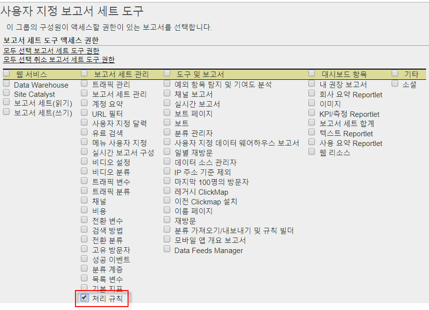
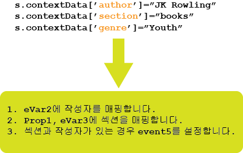

# 처리 규칙 개요

처리 규칙은 보고 기능으로 전송되어 데이터 수집을 단순화하고 컨텐츠를 관리합니다. 처리 규칙은 다음에 대한 인터페이스를 제공하여 IT 그룹 및 웹 개발자와의 상호 작용을 단순화하는 데 도움이 됩니다.

* 제품 개요 페이지의 이벤트 설정
* 쿼리 문자열 매개 변수로 캠페인 채우기
* 더 쉽게 보고할 수 있도록 prop에서 카테고리 및 페이지 이름 연결
* evar를 prop에 복사하여 경로 보기
* 철자가 틀린 사이트 섹션 정리
* 쿼리 문자열에서 eVar까지의 내부 검색어 또는 캠페인 ID 가져오기

>[!VIDEO](https://tv.adobe.com/embed/1181/16506/)

Adobe Summit에서 처리 규칙 개요 및 교육을 *보고 처리 규칙을 사용해야 하는 이유를 알아 보십시오.*

## 처리 규칙 사용을 위한 인증 받기 {#section_8A4846688050453784DAE4D89355169A}

2017년 4월 20일 이전에는, 모든 사용자(관리자 포함)가 시험에 통과하고 처리 규칙을 사용할 수 있도록 Adobe 고객 지원 센터에서 인증을 받아야 했습니다.

이제 관리자는 **기본적으로** 처리 규칙을 사용할 수 있는 권한이 있습니다. 시험은 더 이상 필요하지 않습니다. 관리자는 관리 도구 인터페이스를 통해 관리자가 아닌 사용자에게 이러한 권한을 부여할 수도 있습니다. 방법은 다음과 같습니다.

1. 아직 권한을 부여하지 않은 경우, 처리 규칙을 사용할 권한을 가져야 하는 비 관리자 사용자만 포함하는 [그룹을 만듭니다](../../../admin/user-management2/c-user-groups/groups.md).
1. [관리자가 아닌 사용자를 해당 그룹에 추가합니다](../../../admin/user-management2/c-user-management/t-add-user-to-group.md).
1. **[!UICONTROL Analytics]** &gt; **[!UICONTROL 관리]** &gt; **[!UICONTROL 사용자 관리]** &gt; **[!UICONTROL 그룹]** &gt; **[! Uicontrol[그룹 이름]]** &gt; **[!UICONTROL 편집]** &gt; **[!UICONTROL 보고서 액세스]** &gt; **[!UICONTROL 보고서 세트 도구]** &gt; **[!UICONTROL 사용자 지정]** &gt; **[!UICONTROL 보고서 세트 관리]**.
1. [!UICONTROL 처리 규칙] 옆의 확인란을 선택하고 **[!UICONTROL 확인을 클릭합니다]**.

>[!IMPORTANT]
>
>처리 규칙은 Analytics 데이터에 영구적으로 영향을 주므로, 처리 규칙 관리자는 Adobe Analytics에서 인증 교육을 받고, 보고서 세트용 데이터의 모든 소스 (표준 웹 사이트, 모바일 사이트, 모바일 앱, 데이터 삽입 API 등) 에 익숙해야 합니다. 다양한 플랫폼에서 입력한 컨텍스트 데이터 변수 및 표준 변수에 대한 지식은 데이터를 실수로 삭제하거나 변경하는 일이 없도록 하는 데 도움이 됩니다.

## 컨텍스트 데이터를 사용하여 데이터 수집 단순화 {#section_09EEA03612D24C15839631AA9E9668D8}

컨텍스트 데이터 변수는 처리 규칙에만 사용할 수 있는 새로운 유형의 변수입니다. 컨텍스트 데이터 변수를 사용하기 위해, 키/값 데이터 쌍이 구현에 의해 전송되며, 처리 규칙을 사용하여 표준 Analytics 변수에서 이러한 변수를 캡처합니다. 이를 통해 프로그래머가 어떤 prop 및/또는 eVar가 어떤 값을 포함해야 하는지 정확하게 이해할 필요가 없습니다.

구현 도움말에서 [컨텍스트 데이터 변수](https://marketing.adobe.com/resources/help/en_US/sc/implement/index.html?f=context_data_variables)를 참조하십시오.

## 처리 규칙을 사용하여 데이터 히트 및 이벤트 트리거 변환 {#section_8284E72E999244E091CD7FB1A22342B6}

처리 규칙은 들어오는 값을 모니터링하여 일반적인 오타를 변형하고 보고된 데이터를 기준으로 이벤트를 설정할 수 있습니다. Prop을 eVar에 복사하고, 보고서에 값을 연결하며, 이벤트를 설정할 수 있습니다.

## 보고에 컨텍스트 데이터 변수 사용 {#section_BD098BC503024A0B8703596628071134}

컨텍스트 데이터 변수가 구현 내에 정의된 경우 해당 변수를 eVar과 같은 변수에 복사해야 보고에 사용할 수 있습니다.

자세한 내용은 여기를 클릭하십시오.
