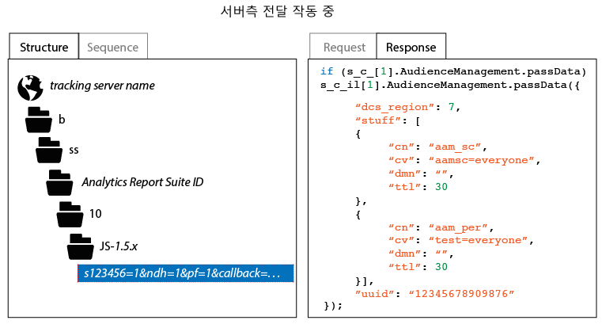

# 서버측 전달 구현을 확인하는 방법

서버 측 전달이 제대로 활성화되었는지 확인하려면 Analytics 추적 요청에서 HTTP 응답을 검사해야 합니다. 이 작업은 브라우저의 개발자 도구를 사용하거나 Charles Web Debugger와 같은 프록시 도구를 사용하여 수행할 수 있습니다. 다음 지시 사항은 서버 측 전달이 제대로 작동하도록 하기 위해 어떤 표시가 있어야 하는지를 보여줍니다.

서버 측 전달의 상태를 확인하려면 다음을 수행하십시오.

1. 업데이트 된 AppMeasurement 코드가 포함된 테스트 페이지를 로드합니다.
1. 브라우저의 디버깅 도구나 프록시 소프트웨어를 사용하여 Analytics 추적 요청의 HTTP 응답을 검사합니다('b/ss'가 포함된 경로를 선택하여 쉽게 필터링할 수 있습니다.).
1. HTTP 응답을 검사합니다. 응답에 Audience Manager 데이터가 있으면(아래 그림 참조) 서버 측 전달이 작동하고 있습니다.

>[!CAUTION]
>
>If the response contains the key value pair `"status":"SUCCESS"` or a 2 x 2 image, then server-side forwarding * is not* configured correctly. ID 서비스가 올바르게 배포되고, 앱 측정 모듈이 배포되었고, 해당 보고서 세트가 올바른 IMS 조직에 매핑되었으며, 서버측 전달이 Analytics 관리 콘솔에서 활성화되었는지 확인하십시오.

>[!MORE_LIKE_THIS]
>
>* [Charles Web Debugger](https://www.charlesproxy.com/)

