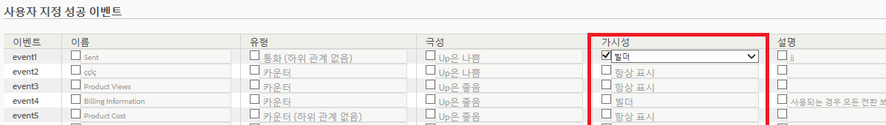

# 성공 이벤트 구성

성공 이벤트를 구성하는 방법을 설명하는 단계입니다.

1. **[!UICONTROL Analytics]** &gt; **[!UICONTROL 관리]** &gt; **[!UICONTROL 보고서 세트를 클릭합니다]**.
1. 보고서 세트를 선택합니다.
1. Click **[!UICONTROL Edit Settings]** &gt; **[!UICONTROL Conversion]** &gt; **[!UICONTROL Success Events]**.

   

1. **이름** 열에서 각 항목 옆의 확인란을 선택하여 편집을 활성화한 다음 원하는 이름을 지정합니다.
1. **유형** 열에서 각 항목 옆의 확인란을 선택하여 드롭다운 목록을 활성화하고 원하는 유형을 선택합니다.

   >[!NOTE]
   >
   >Before you change an event type, see [Change event type](../../../admin/admin/c-success-events/event-type.md#concept_2A6FCC19E7FC429DBDFA65BC640BD448).

   이 요소에 대한 자세한 내용은 [성공 이벤트 페이지 - 설명](../../../admin/admin/c-success-events/success-event.md#section_681ECEC981694CABBDBF00E18165B447)을 참조하십시오.

1. **[!UICONTROL 극성]** 열에서 이 지표에 대한 증가 트렌드가 좋은 것인지 나쁜 것인지를 지정합니다.
1. **[!UICONTROL 가시성]** 열에서 표준 (내장) 지표, 사용자 지정 이벤트 및 내장 이벤트를 메뉴, 지표 선택기, 계산된 지표 빌더 및 세그먼트 빌더에서 숨길 수 있습니다.

   이 설정은 해당 지표 또는 이벤트의 데이터 수집에는 영향을 주지 않습니다. 사용자 인터페이스에서의 가시성에만 영향을 줍니다. [자세히...](../../../admin/admin/metric-visibility.md#concept_A85EB68D27534C4581AF1DCF5702DDE5) 1. 설명을 제공합니다.
1. 이벤트를 항상 기록할 것인지 여부를 확인합니다.
1. [기여도 지표를 활성화하거나 비활성화합니다](/help/components/c-variables/c-metrics/metrics-participation.md).

   >[!NOTE]
   >
   >최대 100 개의 사용자 지정 이벤트에 대한 기여도를 활성화할 수 있습니다. 그 외에도 [계산된 지표](https://marketing.adobe.com/resources/help/en_US/analytics/calcmetrics/participation_metric.html) 빌더에서 기여도 지표를 만들 수 있습니다.

1. **[!UICONTROL 저장을 클릭합니다]**.

