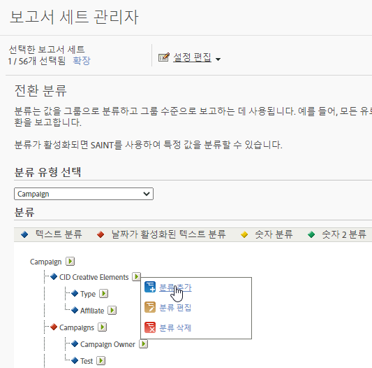

# 전환 분류

분류는 값을 그룹으로 분류하고 그룹 수준으로 보고하는 데 사용됩니다. 예를 들어 모든 유료 검색 캠페인을 *팝 뮤직 용어* 같은 카테고리로 분류하고 인스턴스(클릭스루라고도 함) 같은 지표와 관련한 해당 카테고리의 성공 및 성공 이벤트로의 전환을 보고합니다.

전환 분류를 사용하면 전환 변수를 분류할 수 있습니다. 한 번 분류하면, 키 데이터를 사용하여 생성할 수 있는 어떤 보고서도 관련 데이터 속성을 사용하여 생성할 수 있습니다.

분류를 활성화한 후에 [분류 가져오기](/help/components/classifications/importer/c-working-with-saint.md)를 사용하여 해당 분류에 특정 값을 할당할 수 있었습니다.

>[!WARNING]
>
>분류 이름을 바꾸면 분류 규칙 빌더에서 만든 기존 규칙에 문제가 [발생할 수 있습니다](/help/components/classifications/crb/classification-rule-builder.md). 분류 규칙이 있는 분류 이름을 변경하는 경우 이름이 변경된 분류를 가리키도록 각 규칙을 수정하십시오.

## 전환 분류 설명

| 요소 | 설명 |
| --- | --- |
|  이름  | 분류 이름입니다 |
| 활성화된 날짜(텍스트만) | 텍스트 분류가 캠페인 변수의 날짜 범위인지 여부를 나타냅니다. |
| 옵션(텍스트만) | 이 분류에 사용 가능한 분류 값 목록을 만듭니다. 캠페인 변수와 함께 옵션을 사용하여 캠페인 관리자에서 분류에 대해 지원되는 값 목록을 사용자에게 제공합니다. |
| 숫자 유형(숫자만) | 숫자 분류에서 숫자 유형을 지정합니다. 옵션에는 숫자, 백분율 및 통화가 포함됩니다. |

## 전환 분류 추가

관리자에서 전환 분류를 추가하는 방법을 설명하는 단계입니다.

1. **[!UICONTROL 관리]** > **[!UICONTROL 보고서 세트]**&#x200B;를 클릭합니다.
1. 보고서 세트 선택.
1. **[!UICONTROL 설정 편집]** > **[!UICONTROL 전환]** > **[!UICONTROL 전환 분류]**&#x200B;를 클릭합니다.
1. **[!UICONTROL 분류 유형 선택]** 드롭다운 목록에서 분류를 추가하려는 변수를 선택합니다.

   

1. **[!UICONTROL 분류 편집]** 아이콘으로 마우스를 가져간 다음 **[!UICONTROL 분류 추가]**&#x200B;를 선택합니다.
1. **[!UICONTROL 유형 선택]** 필드에서 변수에 추가하려는 분류 유형을 선택합니다.

   옵션에는 **[!UICONTROL 텍스트]** 및 **[!UICONTROL 숫자]**&#x200B;가 포함됩니다. 분류 유형에 대한 자세한 내용은 [분류에 대하여](/help/components/classifications/c-classifications.md)를 참조하십시오.
1. **[!UICONTROL 테스트 분류]** 대화 상자에서 원하는 대로 분류를 구성합니다.

1. **[!UICONTROL 드롭다운 목록]** 대화 상자에서, 옵션을 추가하거나 제거합니다.

   옵션을 추가하면 이 분류에 사용 가능한 분류 값 목록이 만들어집니다. 캠페인 변수와 함께 이 옵션을 사용하여 캠페인 관리자에서 분류에 대해 지원되는 값 목록을 사용자에게 제공할 수 있습니다. 거의 변경되지 않거나 절대 변경되지 않는 작은 수의 허용된 값이 있는 분류 차원에 대해 사용하십시오. 예를 들어, 실버, 골드 및 팬티엄과 같이 다양한 수준의 고객 충성도를 대상으로 하는 다양한 캠페인을 실행할 수 있습니다. 그런 다음 드롭다운 목록을 사용하여 수락되는 값만 세 수준과 일치하는 값이 되도록 할 수 있습니다. 다른 값을 사용하는 경우는 무시됩니다.

1. **[!UICONTROL 저장을 클릭합니다]**.

## 전환 분류 삭제

더 이상 필요하지 않은 전환 분류를 삭제합니다.

1. 세트 헤더에서 **[!UICONTROL 관리]** > **[!UICONTROL 보고서 세트]**&#x200B;를 클릭하여 보고서 세트 관리자를 엽니다.
1. 보고서 세트 선택.
1. **[!UICONTROL 설정 편집]** > **[!UICONTROL 전환]** > **[!UICONTROL 전환 분류]**&#x200B;를 클릭합니다.
1. **[!UICONTROL 분류 유형 선택]** 드롭다운 목록에서 분류를 삭제하려는 변수를 선택합니다.
1. **[!UICONTROL 분류 편집]** 아이콘으로 마우스를 가져간 다음 **[!UICONTROL 분류 삭제]**&#x200B;를 선택합니다.
1. 분류 삭제 대화 상자에서 **[!UICONTROL 삭제]**&#x200B;를 클릭합니다.
