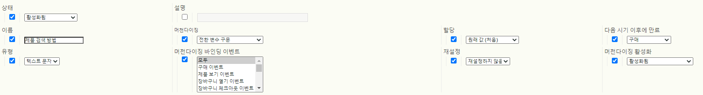
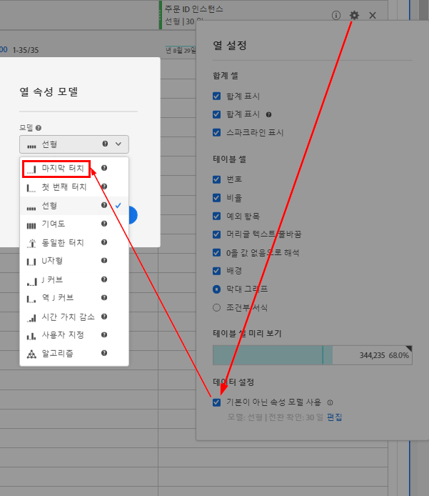

# 머천다이징 eVar 및 제품 검색 방법

이 매우 자세한 문서에서는 표준 eVar와 다르게 데이터를 처리하고 할당하는 머천다이징 eVar의 개념을 설명합니다. 또한 머천다이징 eVar가 제품 검색 방법과 어떻게 관련되는지를 설명합니다.

## 개요

머천다이징 eVar를 사용하면 *방문당/주문 당* 수준 대신 *제품당* 수준에서 eVar가 캡처하는 값에 성공적인 활동을 할당할 수 있습니다.

대부분의 소매 웹 사이트에는 제품을 찾는 여러 방법이 있지만 Adobe은 다음을 모든 소매 클라이언트가 Adobe Analytics에서 추적해야 하는 기본적인 제품 검색 방법으로 간주합니다.

* 내부 검색 키워드
* 내부 캠페인 추적 코드
* 머천다이징/찾아보기 카테고리
* 크로스셀링 링크

이 문서의 목적을 위해 다음과 같이 솔루션에 몇 개의 eVar를 매핑하겠습니다.

* eVar2: 내부 검색 키워드
* eVar3: 내부 캠페인 추적 코드
* eVar4: 머천다이징/찾아보기 카테고리
* eVar 5: 크로스셀링 링크

추가 eVar을 사용하여 서로 관련된 모든 제품 검색 방법의 성과를 측정할 수 있습니다. 위에서 설명한 검색 방법 외에도, eVar은 외부 웹 사이트의 제품 세부 사항 페이지에 대한 링크와 같이 비교에서 다른 검색 방법을 포함합니다.

* eVar1: 제품 검색 방법

이러한 변수 중 하나를 표준 eVar로 구성하는 대신 머천다이징 eVar로 구성합니다.

이러한 변수를 설정하는 방법을 보여주기 위해 방문자가 내부 키워드 검색 &quot;샌들&quot;을 사용하여 사이트에서 제품을 찾는 예를 보여 줍니다. 키워드 검색 결과 페이지에서 두 개 이상의 eVar에서 데이터를 캡처해야 합니다.

* `eVar2` 은 검색에 사용된 키워드(&quot;sandboys&quot;)와 같습니다
* `eVar1` 는 사용된 제품 검색 방법(&quot;내부 키워드 검색&quot;)과 같습니다.

이 두 변수를 이러한 특정 값과 동일하게 설정하면 방문자가 &quot;sandboes&quot;라는 내부 키워드 검색어를 사용하여 제품을 찾고 있음을 알 수 있습니다. 동시에 방문자가 제품을 찾기 위해 다른 제품 검색 방법을 사용하고 있지 않다는 것을 알고 있습니다(예: 방문자가 키워드 검색을 수행하는 동시에 제품 카테고리를 탐색하지 않습니다.). 적절한 제품당 할당이 수행되도록 하기 위해, 이렇게 사용되지 않는 방법은 내부 키워드 검색을 통해 찾은 제품을 찾는 크레딧을 받지 않습니다. 따라서 이러한 다른 검색 메서드와 연결된 eVar를 자동으로 &quot;검색 불가 메서드&quot; 값과 동일하게 설정하는 코드(예: AppMeasurement, AEP Web SDK 등)에 논리를 삽입해야 합니다.

예를 들어 사용자가 &quot;sandboes&quot; 키워드를 사용하여 제품을 검색할 때 Analytics 코드의 로직은 내부 키워드 검색 결과 페이지에서 변수를 다음과 동일하게 설정해야 합니다.

* eVar2=&quot;샌들&quot;: 내부 키워드 검색에서 &quot;sandes&quot; 키워드가 사용되었습니다.
* eVar1=&quot;내부 키워드 검색&quot;: &quot;internal 키워드 검색&quot; 검색 방법이 사용되었습니다.
* eVar3=&quot;비내부 캠페인&quot;: 내부 캠페인을 사용하여 검색 결과 페이지에 액세스하지 않았습니다.
* eVar4=&quot;비찾아보기&quot;: 검색 결과 페이지에서 찾아보기 카테고리에 액세스할 수 없습니다.
* eVar5=&quot;크로스셀 아님&quot;: 검색 결과 페이지에서 크로스셀 링크를 클릭하지 않았습니다

## 머천다이징 eVar 설정

머천다이징 eVar에 사용할 수 있는 다양한 설정은 다음과 같습니다. 다음 스크린샷은 보고서 세트 관리자에서 가져옵니다. [!UICONTROL Analytics] > [!UICONTROL 관리] > [!UICONTROL 보고서 세트] > [!UICONTROL 설정 편집] > [!UICONTROL 전환] > [!UICONTROL 전환 변수] > [!UICONTROL 새] 추가 > [!UICONTROL 머천다이징 활성화] 로 이동하여 액세스합니다.



표 아래 섹션에서 이러한 설정에 대한 자세한 내용을 살펴보십시오.

| 설정 | 설명 |
|--- | --- |
| 이름 | 변수와 연결되어야 하는 이름 또는 보고 차원입니다. `eVar1` 이(가) 제품 검색 방법을 캡처하려고 하는 경우 `eVar1`에 대한 이름 필드를 &quot;제품 검색 방법&quot;으로 설정해야 합니다. |
| 머천다이징 | 머천다이징 eVar 값을 캡처하는 데 사용할 구문 유형입니다 |
| 할당 | 성공적인 이벤트가 발생할 때 크레딧을 받아야 하는 머천다이징 eVar 값을 결정하는 데 도움이 됩니다. |
| 다음 시기 이후에 만료 | 기존 제품 및 머천다이징 eVar 바인딩이 더 이상 적용되지 않아야 하는 시기를 결정합니다. |
| 유형 | 머천다이징 eVar에서 수집되는 데이터의 유형입니다 |
| 머천다이징 바인딩 이벤트 | 제품이 머천다이징 eVar 값에 바인딩되어야 하는 시기를 결정하는 이벤트입니다 |
| 재설정 | 해당 시점에서 eVar에 대한 모든 백엔드 데이터를 재설정하는 트리거입니다 |
| 머천다이징 활성화 | eVar을 표준 eVar에서 머천다이징 eVar으로 전환하기 위해 &quot;활성화됨&quot;으로 설정해야 하는 플래그입니다 |

### 머천다이징 활성화

머천다이징 활성화 설정이 &quot;활성화됨&quot;으로 설정되면 아래에 설명된 모든 설정이 보고서 세트 관리자에 나타납니다. 머천다이징 활성화 설정이 &quot;비활성화&quot;로 설정되면 표준 eVar 설정만 사용할 수 있습니다.

### 머천다이징

이 옵션은 표준 eVar에 사용할 수 없습니다. [!UICONTROL 머천다이징] 설정을 사용하여 머천다이징 eVar 값을 캡처하는 방법으로 [!UICONTROL 전환 변수 구문] 또는 [!UICONTROL 제품 구문]을 선택할 수 있습니다.

**[!UICONTROL 전환 변수]** 구문은 자체 변수에서 eVar 값을 설정함을 의미합니다. 예를 들어 전환 변수 구문을 사용할 때 &quot;내부 키워드 검색&quot;의 `eVar1` 값이 페이지 코드(또는 AppMeasurement 코드, AEP 웹 SDK 코드 등) 내에서 다음과 같이 설정됩니다.

`s.eVar1="internal keyword search";`

그러나 **[!UICONTROL 제품 구문]**&#x200B;을 사용하면 eVar이 Adobe Analytics 제품 변수 내에서만 설정됩니다. Analytics 제품 변수는 제품당 6개의 서로 다른 부분으로 나뉘어져 있습니다.

`s.products="[category];[productID];[quantity];[revenue];[events];[eVars]"`

*  카테고리는 더 이상 사용되지 않는 기능이며, 제품 카테고리 성능을 추적하기 위한 실행 가능한 옵션으로 더 이상 권장되지 않습니다.  단순한 존재는 제품 변수의 대부분의 구현에서 단일 세미콜론이 변수 값의 productID 부분보다 우선하는 이유를 보여줍니다.
*  수량 및   수익은 제품 구매를 추적하는 경우 유용합니다.
*  이벤트는 수입(예: 배송, 할인 등)으로 계산되지 않는 사용자 지정 증분 또는 통화 이벤트 값을 기록하는 데 유용합니다.

제품 구문을 사용하도록 구성된 머천다이징 eVar는 products 변수의 최종 부분 내에서 설정됩니다. 예를 들어 방문자가 내부 키워드 검색을 사용하여 제품 ID &quot;12345&quot;을 찾는다고 가정합니다. 이 예에서 eVar1을 설정하는 제품 구문 기반 방법은 다음과 같습니다.

`s.products=";12345;;;;eVar1=internal keyword search";`

제품 변수의 수량, 매출 및 이벤트 부분에 대해 여전히 세미콜론으로 구분된 자리 표시자가 있습니다.  이러한 자리 표시자가 없으면 내부 키워드 검색의 `eVar1` 설정이 완전히 무시됩니다.

### 할당

머천다이징 eVar에 대한 &quot;할당&quot;이라는 용어는 특히 전환 변수 구문을 사용하는 머천다이징 eVar에 대해 잘못된 것입니다. 모든 표준 eVar에는 고유한 개별 할당 설정이 있을 수 있습니다. 하지만 전환 변수 구문이 있는 머천다이징 eVar는 보고서 세트 관리자에서 표시되는 할당 설정에 관계없이 &quot;가장 최근 (마지막)&quot; 할당 설정만 사용합니다.

이 설정의 역할을 이해하면 eVar 할당과 머천다이징 eVar 바인딩 간의 차이를 이해할 수 있습니다. 머천다이징 eVar의 경우 &quot;머천다이징 eVar 바인딩&quot;이 이 &quot;할당&quot; 설정에 더 적합한 이름입니다.

**표준 eVar 할당 설정**

이미지 요청에서 표준 구문을 사용하는 모든 eVar이 수집될 때마다 Adobe Analytics 처리 서버는 `post_evar` 열이라고 하는 다른 데이터베이스 열에 데이터를 삽입합니다. eVar는 지속되어야 하므로 - 대부분의 경우 현재 히트 이후 어느 시점에서 만료되므로 서버는 모든 후속 이미지 요청에서 이 `post_evar` 열을 설정합니다. 해당 eVar에 전달된 마지막 값과 동일하게 설정됩니다. 표준 eVar의 경우, 성공 이벤트가 발생하면 Adobe Analytics에서는 일반 eVar 열 대신 `post_evar` 열을 사용하여 이벤트에 대한 크레딧을 받아야 하는 eVar 값을 결정합니다.

표준 eVar의 경우 할당 설정은 특정 기간 동안 수집된 첫 번째 또는 마지막 eVar 값을 `post_evar` 열에 삽입할지 여부를 결정합니다. 표준 eVar에 대한 할당 설정이 &quot;원래 값(처음)&quot;과 같으면 방문자로부터 수집된 첫 번째 eVar 값이 모든 후속 이미지 요청에 대해 `post_evar` 열에 삽입됩니다. 이 작업은 eVar이 &quot;다음 시기 이후에 만료&quot; 설정에 따라 만료되기 전까지 이 방문자의 브라우저에서 전송되는 모든 향후 요청에 대해 계속됩니다.

표준 eVar의 할당 설정이 &quot;가장 최근 (마지막)&quot;과 같은 경우 방문자에서 수집된 가장 최근 eVar 값이 모든 후속 이미지 요청에 대해 `post_evar` 열에 채워집니다. &quot;가장 최근 (마지막)&quot; 할당은 이미지 요청에서 해당 eVar이 새 값으로 설정될 때마다 `post_evar` 값이 변경됨을 의미합니다. &quot;원래 값(첫 번째)&quot; 할당은 해당 eVar이 향후 이미지 요청에서 다른 값으로 설정될 수 있어도 `post_evar` 열이 히트 간에 변경되지 않음을 의미합니다.

**머천다이징 eVar 할당(바인딩) 설정**

앞에서 언급했듯이 전환 변수 구문이 있는 모든 머천다이징 eVar에는 &quot;가장 최근 (마지막)&quot; 할당만 있습니다.  이는 &quot;할당&quot; 설정이 실제로 머천다이징 eVar에 의미하는 것입니다. 일반적으로 이 설정은 방문자가 사이트를 계속 사용할 때 `post_evar` 열에 삽입되는 값을 결정하지 않습니다. 대신, 머천다이징 eVar에 대한 할당 설정은 제품에 바인딩되는 eVar 값과 이러한 제품이 바인딩된 eVar 값에 성공 이벤트를 다시 할당하는 방법을 결정합니다.

머천다이징 eVar의 할당(즉, 바인딩) 설정이 &quot;원래 값(첫 번째)&quot;과 동일하게 설정되면 어떻게 됩니까? `post_evar` 열과 함께 설정되고 이전에 post_evar 열의 해당 &quot;사전 처리된&quot; eVar에 바인딩되지 않은 모든 제품은 `post_evar` 열에 포함된 값에 바인딩됩니다. 보고서 세트 설정의 &quot;다음 시기 이후에 만료&quot; 설정 설정에 따라 eVar이 만료될 때까지 eVar 값과 제품 간의 이 바인딩은 변경되지 않습니다.

이미지 요청이 이미 바인딩된 제품을 가장 최근에 설정한 eVar 값에 바인딩하는 기준을 만족할 때마다 &quot;원래 값(처음)&quot; 설정은 Adobe Analytics 데이터 수집 서버에서 이러한 추가적인 시도를 무시하도록 합니다. 할당 (바인딩) 설정이 &quot;가장 최근 (마지막)&quot;과 동일한 머천다이징 eVar와 반대 상황이 발생합니다. 이미지 요청이 머천다이징 eVar에 제품을 바인딩하는 기준을 만족할 때마다 제품이 eVar에 전달된 가장 최근 값 또는 `post_evar` 열에 포함된 (항상) 값에 자신을 바인딩(및 다시 바인딩)합니다.

앞에서 언급한 바와 같이, 머천다이징 eVar를 사용하면 성공 이벤트를 방문/주문 단위로 할당하는 대신 제품 단위로 eVar 값에 할당할 수 있습니다. 따라서 바운드된 제품에 연결된 성공 이벤트(예: 장바구니 추가 또는 구매)가 있을 때마다 성공 이벤트는 해당 시점에 제품이 바인딩된 제품 및 머천다이징 eVar 값 모두에 크레딧을 제공합니다.

### 다음 시기 이후에 만료

머천다이징 eVar의 만료 설정을 사용하여

* 제품/eVar 바인딩이 모두 만료되는 시기 및

* eVar이 이미지 요청에 전달된 후 post_evar 열을 더 이상 자동으로 채우지 말아야 합니다.

eVar 만료은 성공 이벤트가 기록되거나 특정 기간이 경과할 때 발생할 수 있습니다. Adobe Analytics에서는 eVar당 한 번에 하나의 만료 설정만 허용합니다.

제품 검색 방법의 경우, 머천다이징 eVar의 만료를 설정하는 우수 사례는 다음과 같아야 합니다

* 사이트에서 자동으로 장바구니에서 제품을 제거하기 전에 제품이 사이트의 장바구니에 보관되는 시간입니다
* 또는 구매 이벤트가 발생하는 경우입니다.

두 설정 중 하나를 사용하면 방문자가 구입하는 모든 제품에는 해당 시점에 제품이 바인딩된 머천다이징 eVar 값에 할당된 주문/단위/매출 크레딧이 있습니다.

### 유형

eVar 유형 설정은 eVar에 삽입되는 데이터 유형을 결정합니다. 대부분의 경우 이 값은 &quot;텍스트&quot;와 같아야 합니다. 머천다이징 eVar에 &quot;카운터&quot;를 사용하는 경우는 거의 없습니다. 하지만 &quot;카운터&quot;를 사용하여 제품 별로 카운터 eVar 값에 성공을 할당할 수 있습니다.  &quot;카운터&quot; 유형을 사용하여 솔루션에 대해 논의하는 것은 이 문서의 범위를 벗어납니다.

### 머천다이징 바인딩 이벤트

머천다이징 바인딩 이벤트 설정을 사용하여 제품이 머천다이징 eVar 값에 바인딩되는 조건을 지정할 수 있습니다. 이러한 조건은 특정 성공 이벤트 또는 eVar의 실행에만 제한됩니다. 트래픽 변수(예: prop)를 실행해도 머천다이징 바인딩에는 영향을 주지 않습니다.

머천다이징 바인딩 이벤트 설정은 두 개 이상의 이벤트를 통해 제품을 eVar 값에 바인딩할 수 있습니다. 예:

* 제품 보기 이벤트 사용
* 장바구니 추가 이벤트를 통해
* 구매 이벤트 사용

기본적으로 이 설정은 제품과 동일한 이미지 요청에 다른 이벤트/eVar(머천다이징 또는 표준)가 포함될 때마다 제품을 머천다이징 eVar 값에 바인딩합니다.

### 재설정

재설정 설정을 사용하면 현재 Adobe Analytics 백엔드 데이터베이스에 `post_evar` 값이 있는 모든 방문자에 대한 모든 eVar 값을 즉시 &quot;만료&quot;할 수 있습니다. 또한 현재 제품/eVar 바인딩을 모두 제거합니다.

>[!IMPORTANT]
>Adobe은 재설정이 발생하는 시간부터 완전히 &quot;깨끗한 슬레이트&quot;로 eVar을 다시 시작하려는 경우가 아니라면 재설정 설정을 사용하지 않는 것이 좋습니다.

## 어떤 설정을 사용해야 합니까?

사용 가능한 여러 설정 조합 중에서 다음을 궁금해할 수 있습니다. 어떤 설정이 가장 좋습니까?

제품 ID 12345에 &quot;내부 키워드 검색&quot;을 바인딩하려면 제품 변수가 다음과 같이 설정됩니다.

`s.products=";12345;;;;eVar1=internal keyword search";`

productID 12345과 동시에 캡처되는 모든 성공 이벤트(장바구니 추가, 구매)는 제품 ID 12345 및 &quot;internal 키워드 검색&quot;의 `eVar1` 값에 모두 반영됩니다. 다른 `eVar1` 값이 제품 ID 12345과 연결된 성공 이벤트에 대한 크레딧을 받은 유일한 방법은 나중에 `eVar1`가 제품 변수(제품 ID 12345과 함께) 내의 **다른** 값으로 설정된 경우입니다. 예:

`s.products=";12345;;;;eVar1=internal campaign";`

이 구성은 제품 ID 12345의 바인딩을 &quot;internal 키워드 검색&quot;의 `eVar1` 값에서 &quot;internal campaign&quot;의 `eVar1` 값으로 변경합니다. 이 재바인딩은 제품 구문이 사용되고 eVar에 대한 할당(바인딩) 설정이 &quot;가장 최근 (마지막)&quot;으로 설정될 때마다 발생합니다. 할당(바인딩) 설정이 대신 &quot;원래 값(처음)&quot;으로 설정되면 어떻게 됩니까? 그런 다음 eVar1 을 제품 ID와 함께 &quot;내부 캠페인&quot;과 동일하게 설정하면 제품 ID12345 &quot;내부 캠페인&quot;의 eVar1 값에 다시 바인딩하지 않습니다. 바인딩은 원래 바인딩된 값인 &quot;내부 키워드 검색&quot;으로 유지됩니다.

### 제품 구문 사용의 과제

신중하게 계획하지 않으면 제품 구문을 사용할 때 몇 가지 문제가 발생할 수 있습니다. 웹 사이트에서 여러 eVar를 사용하여 제품 검색 방법을 추적하는 경우를 예로 들어 보겠습니다. 여기에서 특정 검색 방법 eVar 크레딧을 제공하기 위해 각 개별 제품 검색 방법 eVar을 동시에 설정해야 합니다(및 기타 검색 방법 eVar 크레딧은 크레딧을 받지 않음). 제품 구문은 이러한 시나리오에서 사용할 수 있지만, 배포할 결과 코드는 더 복잡합니다.

원래의 &quot;sandboes&quot; 예를 사용하고 제품 구문을 사용하도록 조정하는 경우(방문자가 &quot;sandal123&quot;의 키워드 용어를 사용하여 ID가 &quot;sandal123&quot;인 제품을 발견했다고 가정할 경우) 결과 제품 변수를 다음과 같이 설정해야 합니다.

`s.products=";sandal123;;;;eVar2=sandals|eVar1=internal search|eVar3=non-internal campaign|eVar4=non-browse|eVar5=non-cross-sell";`

이 예에서 products 변수의 구문은 긴 반면 이 변수는 &quot;sandal123&quot;이라는 제품 ID에 표시되는 각 eVar 값을 바인딩합니다. 그때부터 &quot;sandal123&quot; 제품과 동시에 캡처된 모든 성공 이벤트(예: 장바구니 추가, 구매)는 제품에 마지막으로 바인딩된 eVar 값에 반영됩니다.  이 코드 샘플은 위의 eVar가 &quot;sandal123&quot; 제품에 바인딩된 후에 &quot;sandal123&quot; 제품($79.95)의 1개 구매가 발생하는지 여부를 보여줍니다.

```
s.products=";sandal123;1;79.95";
s.events="purchase";
```

다음 값에는 모두 1개의 주문, 1개의 단위 및 그로 인한 매출 79.95달러가 있습니다.

* &quot;sandboes&quot;의 eVar2 값
* &quot;내부 키워드 검색&quot;의 eVar1 값
* &quot;비내부 캠페인&quot;의 eVar3 값
* eVar4 값 &quot;비찾아보기&quot;

이것은 문제가 아닌 올바른 속성입니다. 오히려 이 접근 방식의 주요 딜레마는 제품 검색 방법 eVar를 설정하는 방법과 시기를 결정하는 것입니다.

대부분의 경우 제품 구문의 경우 검색 방법이 실제로 사용된 페이지(예: 키워드 검색 결과 페이지, 검색 페이지, 내부 캠페인 랜딩 페이지 등)가 아니라 제품 세부 사항 페이지에서 제품 검색 방법 eVar를 설정해야 합니다. 방문자가 어느 정도 제품과 상호 작용할 때까지 제품이 진정으로 &quot;발견&quot;되지 않는다고 판단되는 것이 적절합니다. 따라서 여러 제품이(일반적으로) 해당 페이지에 표시되므로 이러한 eVar(제품 구문 사용)는 검색 방법 페이지에서 설정하지 않아야 합니다. 방문자가 상호 작용한 제품에만 검색 방법 값을 바인딩하려고 합니다.

또한 검색 방법 페이지를 보는 동안 방문자는 개별 제품 세부 사항 페이지로 이동하는 링크를 클릭하거나 검색 방법 페이지에서 직접 장바구니에 개별 제품을 추가할 수 있습니다. &quot;sandal&quot; 검색 키워드 예를 사용하는 경우, 방문자가 키워드 검색 결과 페이지에서 바로 장바구니에 &quot;sandal123&quot; 제품을 추가하는 경우 장바구니 추가(장바구니에 추가 버튼의 onClick 이벤트 등)를 캡처하기 위한 코드 장바구니 추가가 발생할 때 동적으로 생성되거나 페이지 코드 또는 태그 관리 시스템을 통해 직접 &quot;하드 코딩됨&quot;을 생성해야 합니다.  그러나 이러한 경우 실행할 코드는 다음과 같습니다.

```
s.linkTrackVars="products,events";
s.linkTrackEvents=s.events="scAdd";
s.products=";sandal123;;;;eVar2=sandals|eVar1=internal keyword search|eVar3=non-internal campaign|eVar4=non-browse|eVar5=non-cross-sell";
s.tl(true,"o","Cart Add")
```

이 코드는 위에 표시된 eVar 값을 &quot;sandal123&quot; 제품에 올바르게 바인딩합니다. 그러나 클릭 이벤트가 발생할 때 이러한 값을 적절히 설정하려면 개발자가 다음을 수행해야 합니다.

* 제품 검색 방법 eVar에 삽입해야 하는 값을 결정하는 검색 결과 페이지에 서버측 논리를 추가합니다.
* 구문 오류 없이 위에 표시된 전체 제품 변수를 어셈블합니다.

또한 방문자가 제품 세부 사항 페이지에 대한 링크를 클릭하여 제품을 &quot;찾기&quot;로 결정하는 경우 개발자는 다음을 수행해야 합니다.

* 검색 방법 페이지에서 제품 세부 사항(위에 표시)을 제품 세부 사항 페이지로 전달하십시오. * 이전 페이지에서 방금 전달한 항목에서 동일한 제품 변수 값을 어셈블합니다.

이 솔루션은 실행 불가능한 높은 수준의 복잡도를 필요로 합니다.

### 제품 구문이 유용한 경우

제품 구문은

* 동일한 제품 ID를 사용하는 여러 제품이 동시에 상호 작용하며,
* 이러한 제품에 연결할 eVar는 제품 ID당 다른 값을 가져야 합니다.

예를 들어, 많은 의류 제품에는 크기, 색상, 스타일 및 기타 모든 속성을 지정하는 &quot;하위 SKU&quot;가 있습니다. 이러한 속성은 단일 하위 제품과 동일한 상위 제품에 속하는 다른 제품을 구분합니다. 중간 크기의 파란색 티셔츠와 큰 빨간색 티셔츠를 구입하기로 결정한다고 가정해 보겠습니다. 두 셔츠 모두 &quot;tshirt123&quot;의 상위 제품 ID와 `eVar10`이(가) 하위 SKU를 캡처하도록 구성되어 있다고 가정합니다. 구매 확인 페이지에 설정된 변수는 다음과 같이 설정됩니다.

```
s.events='purchase';
s.products=';tshirt123;1;20;;eVar10=tshirt123-m-blue,;tshirt123;1;20;;eVar10=tshirt123-l-red"
```

이 경우 `eVar10`(childSKU) 값이 &quot;tshirt123-m-blue&quot; 및 &quot;tshirt123-l-red&quot;이면 제품 ID &quot;tshirt123&quot;의 해당 인스턴스를 구입할 때 크레딧을 받습니다.

### &quot;가장 최근&quot; 할당을 통한 과제

가장 최근 (마지막)&quot;의 할당(바인딩) 설정을 사용하여 추가 문제가 발생할 수 있습니다. 많은 웹 탐색 경험에서 방문자는 이미 보거나 장바구니에 추가한 제품을 &quot;다시 찾기&quot;합니다. 이러한 일은 일반적으로 후속 방문을 통해 또는 구매를 완료하기로 결정하기 직전에 발생합니다. 사이트를 처음 방문하는 동안 &quot;sandal123&quot; 제품을 &quot;sandal&quot;의 키워드 검색을 통해 찾았다고 가정해 봅시다. 키워드 검색 결과 페이지에서 바로 장바구니에 추가했습니다. 장바구니 추가를 캡처하는 코드는 다음과 같이 설정됩니다.

```
s.linkTrackVars="products,events";
s.linkTrackEvents=s.events="scAdd";
s.products=";sandal123;;;;eVar2=sandals|eVar1=internal keyword search|eVar3=non-internal campaign|eVar4=non-browse|eVar5=non-cross
```

따라서 이 이미지 요청에 표시되는 각 eVar 값은 &quot;sandal123&quot; 제품에 바인딩됩니다.

이제 방문자가 이 방문 중에 제품을 구매하지 않고 3일 후 사이트를 다시 방문한다고 가정합니다. 그들은 그들이 이미 카트에 &quot;샌들123&quot; 제품을 추가했다는 것을 압니다. 그러나 그들은 구매하기 전에 그것에 대해 더 배우고 싶어합니다. 방문자는 키워드 검색을 사용하여 제품을 찾는 대신 사이트를 탐색합니다. &quot;제품을 다시 찾기&quot; 바로 전에 &quot;womens > shoes > sandboards&quot; 머천다이징 검색 섹션에 이 종말이 됩니다. &quot;sandal123&quot; 제품에 대한 제품 세부 사항 페이지를 &quot;다시 찾기&quot;할 때, 변수는 다음과 같이 설정됩니다(페이지 로드 시).

```
s.events="prodView";
s.products=";sandal123;;;;eVar4=womens > shoes > sandals|eVar1=browse|eVar3=non-internal campaign|eVar2=non-search|eVar5=non-cross-sell";
```

&quot;가장 최근 (마지막)&quot;의 할당(바인딩) 설정을 사용하면 &quot;sandal123&quot; 제품이 원래 바인딩된 값과 완전히 다른 eVar 값에 다시 바인딩됩니다. 또한 방문자가 &quot;sandal123&quot; 구매를 완료하면, 모든 구매 크레딧이 원래 바운드된 값 대신 이러한 새로 바인딩된 eVar 값에 제공됩니다.

여기서 문제는 다음과 같습니다. 어떤 eVar 값이 구매에 대한 크레딧을 받아야 합니까? 방문자가 처음에 내부 키워드 검색을 통해 &quot;sandal123&quot; 제품을 발견했음을 잊지 마십시오. 그런 다음 검색 결과 페이지에서 바로 장바구니에 추가했습니다. 따라서 &quot;내부 키워드 검색&quot;의 eVar1 값(및 &quot;sandboes&quot;의 eVar2 값)은 구매에 대한 크레딧을 받아야 합니다. 하지만 할당(바인딩) 설정이 &quot;가장 최근(마지막)&quot;으로 설정되었습니다. 따라서 &quot;browse&quot;(및 &quot;womens > shoes > sandboes&quot;)의 eVar1 값이 대신 구매 크레딧을 받습니다. 이유는 방문자가 구매를 완료하기 전에 &quot;sandal123&quot;에 바인딩된 마지막 값이기 때문입니다.

이 문제에 대한 해결 방법은 머천다이징 eVar의 할당(바인딩) 설정을 &quot;가장 최근 (마지막)&quot;에서 &quot;원래 값(첫 번째)&quot;으로 변경하는 것입니다. 이 방법으로 &quot;sandal123&quot; 제품에 연결된 원래 eVar 값은 구매가 발생할 때 방문자가 제품을 &quot;재발견&quot;한 횟수에 관계없이 크레딧을 받습니다.

방문자가 장바구니에 제품을 추가하지만 구매하지 않는 경우, eVar 만료로 인해 새 검색 방법 값을 제품에 바인딩할 수 있습니다. eVar 만료은 자동으로 제거하기 전에 웹 사이트에서 제품을 장바구니에 유지할 수 있도록 허용하는 시간과 같아야 합니다.

### 전환 변수 구문 사용

제품 구문으로 돌아가겠습니다. &quot;전환 변수 구문&quot; 질문. Adobe은 제품 검색 방법 머천다이징 eVar를 수집하고 해당 값을 방문자가 발견한 제품에 바인딩하는 보다 쉬운 방법을 발견했습니다. 전환 변수 구문을 사용하면 클라이언트의 개발자가 담당하는 구현 작업이 줄어듭니다. 제품 구문 메서드보다 여전히 같거나 더 나은 정보를 제공합니다. 개발자는 제공된 배포 지침을 따라야 하며 나머지 코드는 Adobe AppMeasurement/AEP 웹 SDK 파일에 넣을 수 있습니다.

예를 들어 내부 키워드 검색 성능을 추적하기 위해 권장되는 솔루션을 살펴보겠습니다. 키워드 검색 결과 페이지에서 코드는 prop(예: prop4)과 다른 prop(예: prop5)을 통해 검색한 키워드를 캡처한다고 가정합니다. 이러한 prop은 검색에서 표시된 결과 수를 추적합니다. 검색 결과 페이지에서 Adobe Analytics 이미지 요청이 생성될 때마다 개발자가 배포한 데이터 레이어 개체(또는 페이지 코드)를 사용하여 위의 변수(prop)를 채웁니다.

AppMeasurement/AEP 웹 SDK 파일에 포함된 추가 로직은 동시에 설정해야 하는 나머지 변수(머천다이징 eVar/차원)를 채울 수 있습니다.\
예를 들어 새 방문자가 검색 결과 페이지에서 25개의 결과를 반환하는 &quot;sandboes&quot;에 대해 키워드 검색을 수행하는 경우, 실행할 코드(페이지 코드 또는 데이터 레이어 캡처를 통해)는 다음과 같습니다.

```
s.prop4="sandals";
s.prop5="25";
```

그런 다음 AppMeasurement/Analytics SDK 파일 내의 논리를 사용하여 이 코드 조각을 다음과 같이 자동으로 변환할 수 있습니다.

```
s.prop4="sandals";
s.prop5="25";
s.eVar2="sandals";
s.eVar1="internal keyword search";
s.eVar3="non-internal campaign";
s.eVar4="non-browse";
s.eVar5="non-cross sell";
```

페이지에서 페이지로 데이터를 전달하고 products 변수에 삽입할 다소 다루기 쉬운 문자열을 생성하려고 하면 걱정할 필요가 없습니다. 대신 개발자는 추적 솔루션(prop에 삽입되는 항목)의 일부를 구현하고 나머지 구현은 Adobe 컨설팅 팀이 제공하는 사용자 지정 코드에 그대로 둘 수 있습니다.

앞에서 설명한 바와 같이, 전환 변수 구문을 사용하는 모든 머천다이징 eVar에는 &quot;가장 최근(마지막)&quot;이라는 할당 설정이 있습니다. eVar이 어떤 값이든 같게 설정되면 해당 값은 모든 후속 히트(post_evar 열을 통해)에서 유지됩니다. 이 변수는 다른 값으로 설정되어 있거나 eVar이 만료될 때까지 지속됩니다. 따라서 eVar가 설정된 후 모든 제품이 그러한 eVar에 아직 바인딩되지 않은 경우 eVar에 전달된 &quot;가장 최근 (마지막)&quot; 값에 바인딩됩니다.

위의 예에서는 &quot;sandboes&quot;의 `eVar2` 값과 &quot;internal 키워드 search&quot;의 eVar1 값 등을 사용합니다. 키워드 검색이 수행된 후 표시되는 모든 페이지에서 지속됩니다. eVar가 다른 값으로 덮어쓰여질 때까지 지속됩니다. 방문자가 키워드 검색 결과 페이지에서 &quot;sandal123&quot; 제품 ID에 대한 제품 세부 사항 페이지에 대한 링크를 클릭한다고 가정해 보겠습니다.  그런 다음 &quot;sandal123&quot; 제품 ID(아직 바인딩되지 않은 경우)가 post_evar 열에 포함된 각 값 또는 이전(검색 결과) 페이지에서 수집된 eVar 값에 바인딩됩니다.

전환 변수 구문에 대해 다시 고려해야 할 사항이 한 가지 더 있습니다. eVar 값을 제품에 바인딩하려면 바인딩 이벤트를 설정해야 합니다. Adobe Analytics 이미지 요청에서 제품(제품 변수)과 함께 머천다이징 eVar(자체 변수)를 설정하기만 해도 eVar 값이 제품에 반드시 바인딩되지는 않습니다.  대신 보고서 세트 관리자에서 설정된 머천다이징 바인딩 이벤트 설정이 eVar 값을 제품에 바인딩하는 기준을 결정합니다

제품 상호 작용이 발생할 때마다 제품 검색 방법 eVar 값을 제품에 바인딩하려고 하므로 - 제품이 &quot;발견됨&quot;임을 의미하므로 발생할 수 있는 가장 일반적인 &quot;검색된 제품&quot; 상호 작용이 제품 보기(방문자가 제품 세부 사항 페이지로 이동할 때) 또는 장바구니 추가(방문자가 제품 검색 방법 페이지에서 직접 장바구니에 제품을 추가할 때)라고 가정하는 것이 안전합니다.

따라서 이러한 두 이벤트(prodView, scAdd)를 &quot;기본적인&quot; 머천다이징 바인딩 이벤트로 선택할 수 있습니다.
다음은 이러한 바인딩 이벤트 중 하나가 이미지 요청에 포함되어 있을 때 발생하는 작업입니다. 동일한 요청(제품 변수 내)에 포함되어 있고 머천다이징 eVar에 연결되어 있지 않은 모든 제품 ID는 머천다이징 eVar(post_evar 열)에 전달된 가장 최근 값에 바인딩됩니다. 이 원래 바인딩이 수행된 후 이러한 제품을 다시 바인딩하려는 시도는 할당(바인딩) 설정이 &quot;원래 값(처음)&quot;과 동일하게 설정되면 무시됩니다.

### 우수 사례 설정

모범 사례 설정은 다음과 같습니다. 최상의 결과를 사용하여 제품 검색 방법을 쉽게 구현할 수 있습니다. Adobe은 클라이언트가 각 제품 검색 방법 머천다이징 eVar(일반적으로)를 다음과 같이 구성할 것을 권장합니다.

* 머천다이징이 활성화됨: 활성화됨
* 머천다이징 [구문]: 전환 변수 구문
* 할당 [바인딩]: 원래 값(처음)
* 다음 시기 이후에 만료: 자동으로 제거되기 전에 장바구니에 제품을 유지하는 시간(예: 14일, 30일 등)  해당 시간이 없으면 &quot;구매&quot; 이벤트 후 만료됩니다
* 유형: 텍스트
* 머천다이징 바인딩 이벤트:  제품 보기, 장바구니 추가 및 구매

## 바인딩 이벤트가 실제로 수행하는 작업

결합 이벤트가 제품 변수와 동일한 서버 호출에 포함된 경우 이후 열의 머천다이징 eVar(전환 변수 구문 사용) 값이 products 변수에 바인딩됩니다. 앞의 예를 기반으로, 하나의 서버 호출에 다음 머천다이징 eVar 값이 포함되어 있다고 가정하십시오.

```
s.eVar2="sandals";
s.eVar1="internal keyword search";
s.eVar3="non-internal campaign";
s.eVar4="non-browse";
s.eVar5="non-cross sell";
```

앞에서 설명한 대로 위의 eVar는 각각의 post_evar 열을 통해 현재 히트를 넘어서까지 지속됩니다. 따라서 Adobe 서버가 위의 eVar를 다음과 같이 변환합니다.

```
post_eVar2="sandals";
post_eVar1="internal keyword search";
post_eVar3="non-internal campaign";
post_eVar4="non-browse";
post_eVar5="non-cross sell";
```

이러한 이후 열은 Adobe의 데이터베이스에 저장되고 처음에 설정된 현재 히트 이후에 유지됩니다. 이렇게 하면 만료 또는 변수 재설정이 발생하지 않는다고 가정합니다.  Adobe의 서버에는 바인딩 이벤트와 products 변수를 모두 포함하는 향후 서버 호출을 처리할 때 이러한 post_evar 값이 &quot;available&quot;입니다.

발생하는 바인딩은 이러한 post_evar 값과 products 변수의 콘텐츠 사이에만 적용됩니다. 결합 이벤트가 eVar 또는 products 변수에 반드시 &quot;바인딩&quot;되지는 않습니다. Adobe 서버에 post_evar 값을 제품에 바인딩하도록 지시하는 &quot;catalyst&quot;입니다.

향후 히트에서 다음 변수가 설정된다고 가정하십시오.

```
s.products=";sandals123"
s.events="prodView";
```

post_evar 열에서 Adobe 처리 서버는 이 히트를 다음과 같이 봅니다.

```
s.products=";sandals123"
s.events="prodView";
post_eVar2="sandals";
post_eVar1="internal keyword search";
post_eVar3="non-internal campaign";
post_eVar4="non-browse";
post_eVar5="non-cross sell";
```

eVar1, eVar2, eVar3, eVar4 및 eVar5가 `prodView`을 결합 이벤트로 사용하도록 구성되어 있다고 가정합니다. 이러한 eVar 중 어느 하나라도 prodView를 바인딩 이벤트로 사용하도록 구성되지 않은 경우 해당(잘못 구성된) eVar과 제품 변수 간의 바인딩이 발생하지 않습니다.

바인딩하면 post_products 열의 값에서 볼 수 있는 매우 흥미로운 결과가 생성됩니다. 바인딩은 다음과 같이 위의 코드를 변환하고 몇 개의 이후 열을 설정합니다.

```
post_events="prodView"
post_products=";sandals123;;;;eVar2=sandals|eVar1=internal keyword search|eVar3=non-internal campaign|eVar4=non-browse|eVar5=non-cross-sell"
```

post_products 열에 포함된 값이 익숙할 수 있습니다. 이 문서에서 위로 스크롤하여 아래에 표시된 대로 이 post_products 값과 s.products 값을 비교합니다.  post_products 열은 제품 변수 구문을 사용하여 설정됩니다.

즉, 바인딩은 전환 변수 구문 eVar 값을 제품 구문을 통해 제품 변수로 &quot;복사&quot;합니다. 이 복사 작업은 제품 변수와 바인딩 이벤트(eVar 구성을 통해 설정)가 동일한 요청에 포함되어 있는 경우에만 수행됩니다. 이 시점에서 post_eVar 열에 포함된 값은 제품에 바인딩됩니다. 이 바인딩은 post_products 열에 저장된 제품 구문을 통해 표시됩니다.

## 머천다이징 eVar, 인스턴스 지표 및 Attribution IQ

Analytics 서버 호출에서 표준 eVar을 전송하면 post_evar 열의 값이 항상 해당 값에 속하는 인스턴스를 가져옵니다. 인스턴스는 eVar이 이미지 요청에서 특정 값과 동일하게 설정된 횟수를 나타냅니다.

예를 들어 `eVar10`이 [!UICONTROL 마지막 터치] 속성이 있는 표준 eVar라고 가정해 보겠습니다. 페이지에서 `s.eVar10="hello world"`을 설정하면 Adobe이 히트를 처리할 때 &quot;hello world&quot;라는 값이 post_evar10 열로 전달됩니다. 인스턴스 지표는 `hello world`의 각 개별 `eVar10` 설정에 대해 &quot;1&quot;과 같습니다. post_evar 열에 값이 있는 경우 인스턴스가 항상 기록되지는 않습니다. 오히려 post_evar 열은 인스턴스가 기록될 때 인스턴스를 가져오는 값을 결정합니다.

머천다이징 eVar의 인스턴스는 eVar이 수집하는 값에 속성을 제공합니다. 하지만 이는 머천다이징 eVar 값에 연결된 제품이 동시에 &quot;상호 작용&quot;되었을 때만 발생합니다.

예를 들어 `s.eVar1="Internal Keyword Search"` 을 단독으로 설정해도 인스턴스 지표 크레딧이 &quot;내부 키워드 검색&quot;의 eVar1 값에 부여되지 않습니다. 이 시점에서 인스턴스 ID가 기록됩니다. 그러나 제품이 `eVar1` 과 동시에 &quot;내부 키워드 검색&quot; 값에 연결되어 있지 않으면 인스턴스가 지정되지 않음 버킷으로 계산됩니다. 즉, &quot;내부 키워드 검색&quot;의 `eVar1` 값이 인스턴스를 가져올 수 있습니다. 하지만 이 문제는 &quot;내부 키워드 검색&quot; 값에 바인딩된 제품이 동일한 이미지 요청의 products 변수에 표시되는 경우에만 발생합니다.

요약하면 추가 구성 없이 머천다이징 eVar에 대한 기본 인스턴스 지표는 유용하지 않습니다. 다행히도, Adobe은 [Attribution IQ](https://experienceleague.adobe.com/docs/analytics/analyze/analysis-workspace/attribution/overview.html?lang=en)을 발표했습니다. Adobe Analytics에서 수집하는 사용자 지정 지표에 대해 여러 속성 모델을 적용할 수 있습니다. 이러한 속성 모델을 적용하는 지표는 post_evar 열에 포함된 값이나 특정 제품에 바인딩된 값을 사용하지 않습니다. 대신, 이 지표들은 이미지 요청 자체를 통해 전달되는 값(또는 Adobe Analytics 처리 규칙을 통해 캡처되는 값)만 사용합니다. Attribution IQ의 기능을 사용하여 전환 변수 구문을 사용하는 모든 머천다이징 eVar에 대해 정확하게 인스턴스 지표를 가져올 수 있습니다.



머천다이징 eVar에 대한 인스턴스 지표를 보고서에 추가할 때 적절한 Attribution IQ 모델은 &quot;마지막 터치&quot; 모델이 됩니다. 이 경우에는 모델에 대한 전환 확인 기간 설정이 중요하지 않습니다. 이유는 &quot;강제&quot; 마지막 터치 속성 모델이 요청을 통해 전달되는 각 개별 값에 항상 인스턴스 크레딧을 제공하기 때문입니다. 이는 eVar의 실제 속성/바인딩 설정이 &quot;가장 최근 (마지막)&quot;과 &quot;원래 값(처음)&quot;으로 설정되는지의 여부와 관계없이 적용됩니다.
