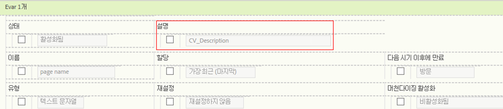

# 사용자 지정 보고서 설명

eVar, prop, 분류 및 이벤트에 대한 사용자 지정 보고서 설명을 입력할 수 있습니다. 설명은 모든 최종 사용자에게 표시됩니다.

**[!UICONTROL Analytics]** &gt; **[!UICONTROL 관리]** &gt; **[!UICONTROL 보고서 세트]** &gt; **[!UICONTROL 설정 편집]** &gt; **[!UICONTROL *변수*]**

>[!NOTE]
>
>대부분의 기존 분류에 대해 설명을 추가할 수 있지만 현재 모바일 분류에 대해서는 추가할 수 없습니다.

1. 보고서 설명을 입력합니다. 최대 문자 수는 255개입니다.
1. **[!UICONTROL 저장을 클릭합니다]**.

설명은 두 곳에 표시됩니다.

* 해당 보고서의 제목 표시줄에:

   

* 왼쪽 탐색 창에서 마우스로 보고서를 가리키면 툴팁으로:

   

