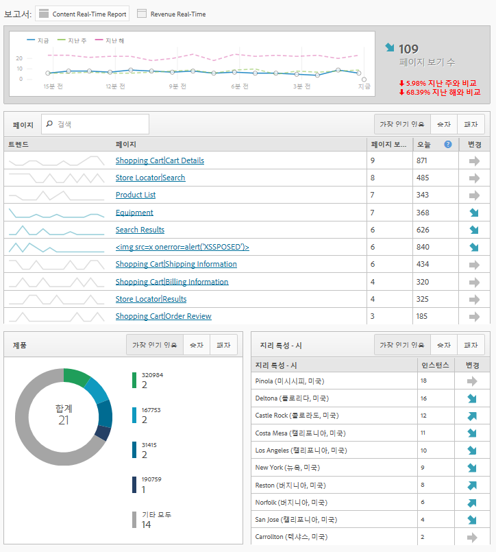

# 실시간 보고서

웹 페이지 트래픽을 표시하며 실시간으로 페이지 보기 수의 등급을 지정합니다. 비즈니스 상의 결정에 기준으로 사용할 유용한 데이터를 제공합니다.

>[!NOTE]실시간 보고서는 추가적인 구현이나 태깅이 필요하지 않으며, Adobe Analytics의 기존 구현을 활용합니다. 실시간 보고서를 구성하려면 실시간 [보고서 구성을 참조하십시오](/help/admin/admin/realtime/t-realtime-admin.md).

**[!UICONTROL Site Metrics]** > **[!UICONTROL Real-Time]**

실시간 답변은 다음과 같습니다.내 사이트의 트렌드 분석 내용과 그 이유 마케터는 마케팅 컨텐츠 및 캠페인의 성과를 신속하게 대응하고 능동적으로 관리할 수 있습니다. 보고된 실시간 데이터는 2분 미만이고 분 단위로 자동 업데이트됩니다.

대시보드에는 동적 뉴스 및 소매 웹 사이트의 트래픽 및 페이지 보기 트렌드를 시각적으로 보고하는 Adobe Analytics 빈도가 높은 지표 및 사이트 분석이 포함되어 있습니다. 실시간은 모음이 발생하자 마자 분 단위로 데이터의 트렌드를 파악합니다. 컨텐츠의 실시간 상관 관계와 추적 및 일부 전환을 사용하여 데이터를 수집하고 자동 업데이트 UI로 스트리밍합니다.

가장 일반적인 두 가지 사용 시나리오에는 스토리를 사용자 활동 변경 사항으로 승격/강등하려는 게시자와 새 제품 라인의 시작을 추적하려는 마케터가 포함됩니다.

관리자는

* 기존 차원이나 분류와 지표를 사용하여 보고서 세트당 최대 3개의 실시간 보고서를 만들 수 있습니다. 보조 차원을 사용하여 기본 차원과의 상관 관계를 지정하거나 분류할 수 있습니다.
* 1개의 사이트 전체 지표 이외에 보고서당 3개의 차원(또는 분류)(기본 하나와 보조 두 개)을 추가할 수 있습니다.
* 사용자 지정 이벤트, 장바구니 이벤트 또는 인스턴스를 사용합니다.
* 최대 2시간 동안의 내역 실시간 데이터를 보고 이 설정을 수정합니다.

   * 지난 15분:1분 세부기간
   * 지난 30분:1분 세부기간
   * 지난 1시간:2분 세부기간
   * 지난 2시간:4분 세부기간

* 예를 들어 지난 주의 값을 지난 해의 값과 비교합니다(오늘 합계뿐만 아니라).

지속성 개념이 없으므로 eVar(전환 지표)는 지원되지 않는다는 점을 염두에 두십시오. 전환 지표를 선택할 수 있을 때 전환 지표는 차원과 동일한 페이지에서 설정되어 있을 경우에만 작동합니다. 자세한 내용은 실시간 보고서 설정에서 캡처한 경고 [메시지를 참조하십시오](/help/admin/admin/realtime/t-realtime-admin.md).

실시간 보고서 설정 및 보기는 관리자 또는 &quot;모든 보고서 액세스&quot; 및 &quot;고급 보고&quot; 권한 그룹의 모든 사용자로 제한됩니다. 하지만 실시간 기능은 권한을 준수합니다. 예를 들어 매출액을 볼 수 있는 권한이 없는 경우 매출 데이터가 포함된 실시간 보고서를 볼 수 없습니다.

## Data Latency as a Result of A4T Configuration {#section_806CE36354FC4C539A0DED9266A5C704}

Adobe Target에서 A4T 통합이 활성화되면 Adobe Analytics에서 5-10분 추가 지연이 발생합니다. 이 지연 증가를 사용하면 Analytics 및 Target의 데이터를 동일한 히트에 저장할 수 있으므로, 테스트를 페이지 및 사이트 섹션별로 분류할 수 있습니다.

이러한 증가는 라이브 스트림 및 실시간 보고를 비롯한 모든 Adobe Analytics 서비스 및 도구에 반영되며 다음 시나리오에 적용됩니다.

* 라이브 스트림, 실시간 보고서 및 API 요청 및 트래픽 변수에 대한 현재 데이터의 경우 보충 데이터 ID가 있는 히트만 지연됩니다.
* 전환 지표, 완료된 데이터 및 데이터 피드에 대한 현재 데이터의 경우 모든 히트가 추가로 5-7분 지연됩니다.

이 통합을 완전히 구현하지 않았더라도 ID 서비스를 구현하면 추가적인 지연 시간이 발생하기 시작합니다.
