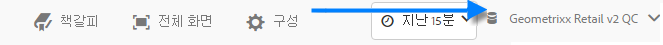
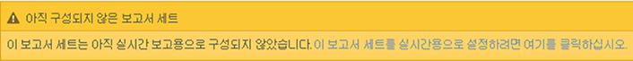
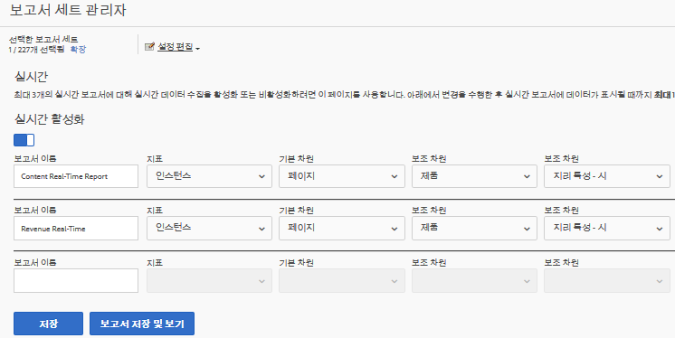
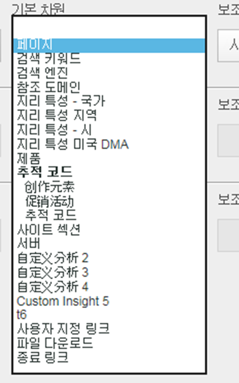
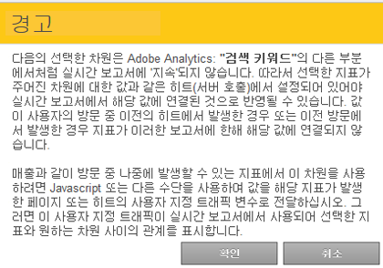

# 실시간 보고서 구성

실시간 보고서를 설정하는 관리 단계입니다.

Reports &amp; Analytics 내에서 실시간 보고서를 설정하는 절차에는 보고서 세트를 선택하는 것과 이 보고서 세트에 대해 최대 3개의 보고서를 구성하는 일로 이루어집니다.

1. 실시간 보고서를 활성화할 보고서 세트를 선택합니다.

   > **[!UICONTROL Analytics]** > **[!UICONTROL Reports]** > **[!UICONTROL View All Reports > Site Metrics]** > **[!UICONTROL Real-Time]** 로 이동하고 맨 위의 드롭다운에서 보고서 세트를 선택합니다.

   

   실시간 보고에 대해 설정되지 않은 보고서 세트에 대한 실시간 보고서를 보려고 하면 보고서 세트를 설정할 수 있다는 메시지가 표시됩니다.

   

1. (톱니바퀴 **[!UICONTROL Configure]** 아이콘)을 클릭하여 [!UICONTROL Report Suite Manager]실행합니다.

   ( **[!UICONTROL Analytics]** > **[!UICONTROL Admin > Report Suites]** > **[!UICONTROL Edit Settings]** > **[!UICONTROL Real-Time]**&#x200B;아래에서도 사용할 수 있습니다.)

1. 설정을 **[!UICONTROL Enable Real-Time]** 켜세요.
1. 최대 3개의 보고서(보고서당 지표 한 개와 차원 또는 분류 세 개가 있음)에 대한 실시간 데이터 수집을 설정합니다.

   

   지원되는 실시간 지표 및 차원에 대한 자세한 내용은 [지원되는 지표 및 차원](/help/admin/admin/realtime/realtime-metrics.md)을 참조하십시오.

   분류를 생성한 경우, 분류가 정의된 차원 아래에 분류가 들여 써진 채로 표시됩니다.

   

   >[!NOTE]
   >
   >현재 Adobe에서는 각 차원에 대해 다른 분류가 선택되어 있더라도 하나의 실시간 보고서에 대해 중복 차원 활성화를 지원하지 않습니다.

   분류에 대한 자세한 내용은 [분류에 대하여](/help/components/c-classifications2/c-classifications.md)를 참조하십시오.

   >[!NOTE]
   >
   >검색 키워드나 제품과 같은 일부 차원은 Adobe Analytics의 다른 곳에서 지속되지만 실시간에서는 지속되지 않습니다. 지속되지 않는 지표를 선택하면 다음 경고가 표시됩니다.

   

1. Click **[!UICONTROL Save]** or **[!UICONTROL Save and View Report]**.

   이 초기 보고서 설정 후 데이터 스트리밍이 시작되는 데에는 최대 20까지 소요될 수 있습니다. 그때부터는 데이터를 즉시 사용할 수 있습니다. 실시간 보고서 보기에 대한 자세한 내용은 [실시간 보고서 실행](https://docs.adobe.com/content/help/en/analytics/analyze/reports-analytics/t-running-report-types.html)을 참조하십시오.

1. 기본적으로 실시간 보고서에 대한 액세스 권한은 모든 사용자에게 있습니다.
