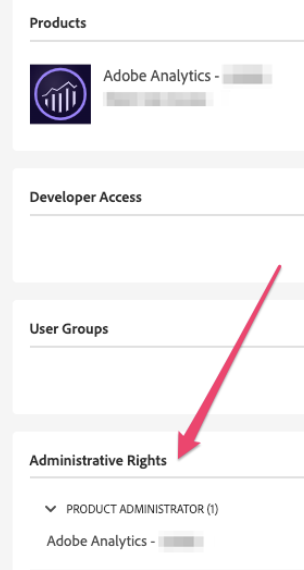
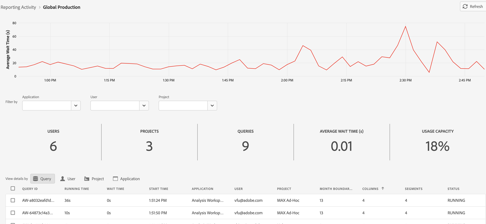

# 활동 관리자 보고

>[!NOTE]
>
>이 기능은 현재 Beta 테스트가 실시되고 있습니다.

[!UICONTROL 보고 활동 관리자]를 사용하면 조직의 각 보고서 세트에 대한 보고 용량을 확인할 수 있습니다. 관리자는 보고 사용량에 대해 상세한 가시성을 제공하며 최대 보고 시간 동안 발생할 수 있는 용량 문제를 쉽게 진단하고 해결할 수 있도록 해 줍니다.

조직이 보고 요청 용량 한도에 도달하고 보고 성능이 저하되는 경우, 이제 Adobe 고객 관리 센터 또는 엔지니어링의 개입 없이 보고 관련 문제를 자가 진단할 수 있습니다. 하나의 인터페이스 내에서 보고 대기열을 손쉽게 관리하고 즉각적인 조치를 취해 사용자 경험을 개선할 수 있습니다. 이 도구는:

* 보고서 세트 전체에 걸쳐 실시간으로 현재 보고 용량에 대해 알려 줍니다.
* 대기열에 있거나 진행 중인지 여부에 관계없이 현재 보고 요청에 대해 상세한 보고서 쿼리 정보를 제공합니다.
* 용량을 확보하기 위해 일부 보고 요청의 우선 순위를 지정하고 다른 보고 요청을 취소하여 보고 대기열을 최적화하도록 해 줍니다. 즉, 이 보고가 지금 필요한지, 아니면 더 긴급한 보고를 위해 취소해야 하는지 등의 질문을 실시간으로 제기할 수 있습니다.

## 보고 활동 관리자 액세스

Adobe Analytics에서 관리자 권한으로 **[!UICONTROL 관리]** > **[!UICONTROL 보고 활동 관리자]**&#x200B;로 이동합니다.

## 권한

보고 활동을 관리하려면 Adobe Admin Console의 Analytics 제품 관리자 권한이 필요합니다.

## 보고서 대기열 보기

[!UICONTROL 보고 활동] 관리자 개요 페이지를 열면 활성화된 기본 보고서 세트 목록이 표시됩니다.

| UI 요소 | 설명 |
| --- | --- |
| **[!UICONTROL 보고서 세트]** | 기본 보고서 세트 (보고 활동을 모니터링 중인 기본 보고서 세트) |
| **[!UICONTROL 가상 보고서 세트]** | 이 기본 보고서 세트에 공급되는 모든 가상 보고서 세트를 표시합니다. 가상 보고서 세트는 적용된 필터링 및 세분화의 추가적인 수준으로 인해 보고 요청을 더욱 복잡하게 합니다. 가상 보고서 세트에서 오는 모든 요청은 결합되고 기본 보고서 세트로 내려옵니다.
예를 들어 5개의 VRS에서 10개의 요청이 들어오는 경우 기본 수준 보고서 세트의 요청 수는 50개입니다. 이러한 방식으로 매우 빠르게 용량에 도달할 수 있습니다. |
| **[!UICONTROL 사용 용량]** | 실시간으로 보고서 세트의 보고 용량이 얼마나 사용되고 있는지를 백분율로 표시합니다. |
| **[!UICONTROL 상태]** | 네 가지 가능한 상태 표시기는 다음과 같습니다. <ul><li>**빨간색 - [!UICONTROL 최대 용량]**: 보고서 세트가 보고 용량 측면에서 최대치를 초과했습니다. (100%) </li><li>**노란색 - [!UICONTROL 용량에 가까워짐]**: 이 보고서 세트가 최대 용량에 도달할 위험이 있습니다. (90% - 99%)</li><li>**녹색 - [!UICONTROL 사용 가능]**: 보고 용량이 충분합니다. (0% - 89%)</li><li>**회색 - [!UICONTROL 보류 중인 상태/활성화되지 않음]**: 보고서 용량을 사용할 수 없습니다.</li></ul> |

{style=&quot;table-layout:auto&quot;}

### 기타 보고 활동 작업

* 결과를 새로 고치려면 오른쪽 상단의 **[!UICONTROL 새로 고침]**&#x200B;을 클릭합니다.
* 이 보고서 세트를 즐겨찾기에 추가하려면 보고서 세트 이름 왼쪽에 있는 별 아이콘을 클릭합니다.
* 즐겨찾기를 표시하려면 왼쪽 상단의 **[!UICONTROL 즐겨찾기]**&#x200B;를 확인 표시합니다.
* 검색 창에서 이름 또는 ID로 보고서 세트를 검색합니다.
* 상태별로 보고서 세트를 필터링합니다.

## 개별 보고서 세트에 대한 보고 활동 보기

세부 정보를 보려는 보고서 세트의 제목 링크를 클릭합니다.

### 선 그래프

선 그래프는 선택한 보고서 세트에 대한 지난 2시간 동안의 보고 활동을 보여 줍니다.

* x축은 지난 2시간 동안의 보고 용량 데이터를 보여 줍니다.
* y축은 쿼리의 평균 대기 시간을 초 단위로 표시합니다.
* 선 차트 위로 마우스를 가져가면 특정 시점 및 해당 시점의 평균 대기 시간을 볼 수 있습니다.

   

### 필터링

애플리케이션(아래 표의 목록 참조), 사용자 및 프로젝트별로 표를 필터링할 수 있습니다.

### 요약 번호

요약 번호에는 다음 정보가 표시됩니다.

| 요약 번호 | 설명 |
| --- | --- |
| [!UICONTROL 사용자] 참조 | 현재 이 보고서 세트에 보고 요청을 보내고 있는 사용자 수입니다. |
| [!UICONTROL 프로젝트] | 작업 영역 프로젝트, Report Builder 통합 문서 등 |
| [!UICONTROL 쿼리] | 현재 실행 중인 쿼리 수입니다. |
| [!UICONTROL 평균 대기 시간] | 실행 중인 모든 쿼리의 평균 대기 시간입니다. |
| [!UICONTROL 사용 용량] | 이 보고서 세트의 현재 사용 용량입니다. |

{style=&quot;table-layout:auto&quot;}

### 표

아래의 자세한 표에는 다음이 표시됩니다. 보고서 세트의 세부 정보.

| 열 | 설명 |
| --- | --- |
| [!UICONTROL 쿼리 ID] | 문제 해결을 위해 사용할 수 있습니다. |
| [!UICONTROL 실행 시간] | 쿼리가 실행된 시간입니다. |
| [!UICONTROL 대기 시간] | 쿼리가 처리되기 전에 대기한 시간입니다. 일반적으로 용량이 충분할 때 “0”입니다. |
| [!UICONTROL 시작 시간] | 쿼리가 처리를 시작한 시간(관리자의 현지 시간)입니다. |
| [!UICONTROL 애플리케이션] | [!UICONTROL 보고 활동 관리자]에서 지원하는 애플리케이션은 다음과 같습니다. <ul><li>Analysis Workspace UI</li><li>Workspace 예약된 프로젝트</li><li>Report Builder</li><li>빌더 UI: 세그먼트, 계산된 지표, 주석, 대상자 등</li><li>1.4 또는 2.0 API의 API 호출</li><li>지능형 경고</li></ul> |
| [!UICONTROL 사용자] | 쿼리를 시작한 사용자입니다. |
| [!UICONTROL 프로젝트] | 저장된 Workspace 프로젝트 이름, API 보고서 ID 등입니다. (메타데이터는 다양한 애플리케이션에 따라 다를 수 있습니다.) |
| [!UICONTROL 월 경계] | 요청이 교차하는 월간 경계 수입니다. 이로 인해 요청의 복잡성이 가중됩니다. |
| [!UICONTROL 열] | 요청의 복잡성을 측정하기 위한 Workspace의 지표 및 분류 수입니다. |
| [!UICONTROL 세그먼트] | 이 요청에 적용되는 세그먼트 수입니다. 이로 인해 요청의 복잡성이 가중됩니다. |
| [!UICONTROL 상태] | 상태 표시기: <ul><li>**실행 중**: 현재 요청을 처리 중입니다.</li><li>**보류 중**: 요청이 처리되기를 대기하고 있습니다.</li></ul> |

{style=&quot;table-layout:auto&quot;}

## 보고 요청 취소

요청을 취소하려면

1. 표에서 하나 이상의 **[!UICONTROL 쿼리 ID]** 왼쪽에 있는 확인란을 선택하고 하단의 **[!UICONTROL 요청 취소]**&#x200B;를 클릭합니다. ([!UICONTROL 사용자], [!UICONTROL 프로젝트] 또는[!UICONTROL 애플리케이션]별로 세부 정보를 확인하여 요청을 일괄 취소할 수도 있습니다.)
1. 표시되는 **[!UICONTROL x 쿼리 취소]** 창에서 필요한 경우 취소 메시지를 수정할 수 있습니다.
1. **[!UICONTROL 계속]**&#x200B;을 클릭합니다.

   

예를 들어 Workspace의 애플리케이션 사용자는 프로젝트에 다음 알림이 표시되는 것을 볼 수 있습니다.

## FAQ

| 질문 | 답변 |
| --- | --- |
| 보고 용량을 추가로 구매할 수 있습니까? | 이 기능은 가까운 시일 내에 사용할 수 있습니다. |

{style=&quot;table-layout:auto&quot;}
