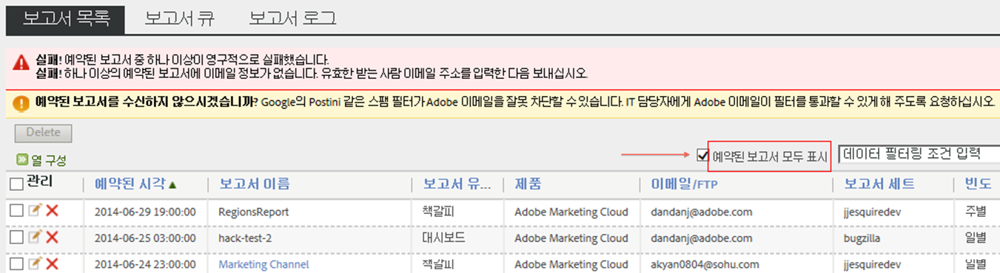
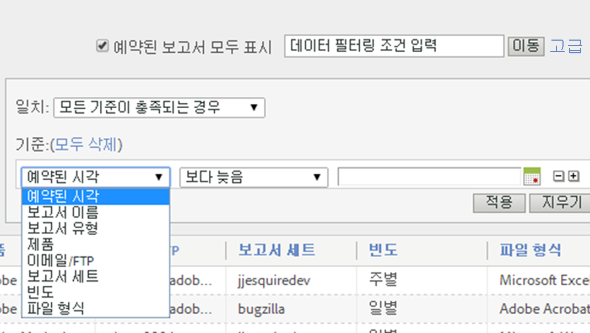
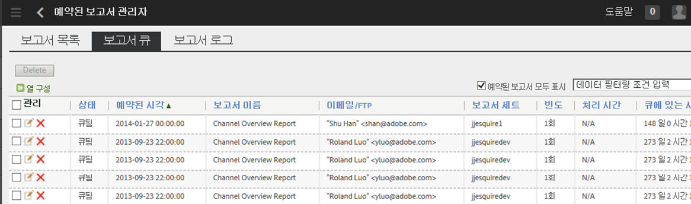
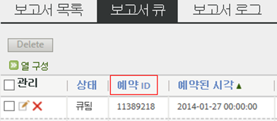

# 예약된 보고서 큐

관리자 수준 사용자가 조직 전체에서 예약된 보고서를 보고 관리할 수 있습니다.

**[!UICONTROL Analytics]** &gt; **[!UICONTROL 구성 요소]** &gt; **[!UICONTROL 예약된 보고서]**

예약된 보고서 관리자에는 다음과 같은 관리 수준 기능들이 있습니다.

* 조직에서 [예약된 보고서를 모두 표시](../../admin/admin/scheduled-reports-admin.md#section_3F167CAAEEC24140B476CF95B7402690)하는 옵션.
* 조직 전체에 적용되는 [고급 필터링 기능](../../admin/admin/scheduled-reports-admin.md#section_206A52A85DE84947AAB3AD082FBF6275).
* 보고 서버에서의 실행을 위해 큐에 있는 모든 보고서를 나열하는 새로운 [보고서 큐](../../admin/admin/scheduled-reports-admin.md#section_03C866115D354BB182E90BF4D52F1E0B) 탭.
* 보고서 큐 인터페이스에서 [예약 ID](../../admin/admin/scheduled-reports-admin.md#section_568B70F4228C4229977CB85D2DCD53A1) 노출.

## 예약된 보고서 모두 표시 {#section_3F167CAAEEC24140B476CF95B7402690}

**[!UICONTROL 보고서 목록]** 탭에서 개인적으로 예약한 보고서 이외에, 조직에서 **예약된 보고서를 모두 표시[!UICONTROL 할 수 있습니다.]**

>[!NOTE]
>
>**[!UICONTROL 보고서 이름]** 열에는 예약되는 보고서의 이름이 표시되며 **[!UICONTROL , 파일 이름]** 열에는 고급 배달 옵션에서 설정한 사용자 지정 파일 이름이 표시됩니다. 이렇게 되면, 동일한 보고서 유형의 보고서를 여러 개 예약하고, 각각에 대해 사용자 지정된 이름을 지정하는 경우, 예약된 보고서 관리자에 파일 이름은 서로 다르지만 보고서 이름은 동일한 항목이 여러 개 표시됩니다. 이것은 예약되는 백엔드 보고서가 동일하기 때문이며, 따라서 보고서 이름 열에는 사용자 지정된 파일 이름(설정대로)을 제외한 모두 파일 이름에 대해 동일한 보고서 이름이 표시됩니다.

## 고급 필터링 기능 {#section_206A52A85DE84947AAB3AD082FBF6275}

For example, if you wanted to filter on all reports that are scheduled hourly, you would specify **[!UICONTROL Frequency equals Hourly]** in the **[!UICONTROL Advanced]** filter and click **[!UICONTROL Apply]**:

## 보고서 큐 {#section_03C866115D354BB182E90BF4D52F1E0B}

이 큐를 사용하면 큐를 "막고 있는" 모든 예약된 보고서를 관리하고 경우에 따라 삭제할 수도 있습니다. (일반적으로, 보고서는 4시간 후 시간이 초과됩니다.)

보고서 큐를 사용하면 "예약된 보고서를 한 번 건너뛸" 수 있습니다. **[!UICONTROL 관리]열의 파란색 아이콘을 클릭하면 됩니다.**

## 예약 ID {#section_568B70F4228C4229977CB85D2DCD53A1}

보고서 큐 인터페이스에 **[!UICONTROL 예약 ID]가 노출되어 있으면 예약된 보고서의 문제 해결을 위해 클라이언트 지원팀에 문의해야 할 때 도움이 됩니다.**

