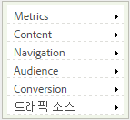
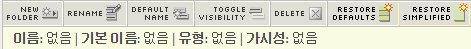

# 간소화된 보고서 메뉴

보고 및 분석에서 간소화된 보고서 메뉴를 구현하는 단계입니다.

간소화된 Adobe Reports &amp; Analytics 메뉴에서는 안에 구조가 변경된 폴더와 관련하여 간소화된 대체 메뉴를 적용하도록 선택할 수 있습니다. 간소화된 메뉴에는 기본적으로 다음 옵션이 표시됩니다.

> [!NOTE] 간소화된 메뉴를 적용하면 기본 메뉴 구조에 수행한 모든 사용자 지정이 제거됩니다. 조직에 있는 모든 Marketing Reports &amp; Analytics 사용자에 대해 간소화된 메뉴 구조를 구현하기도 합니다. 이 새로운 메뉴는 기존 메뉴 구조의 사용자 지정 내용으로 되돌릴 수 없으므로 이 메뉴를 구현하기 전에 먼저 영향(기존 메뉴 구조와 관련하여 개발된 교육 등)을 신중하게 고려하십시오.

1. Navigate to **[!UICONTROL Analytics]** &gt; **[!UICONTROL Admin]** &gt; **[!UICONTROL Report Suites]** to open the Report Suite Manager.
1. 간소화된 메뉴 구조를 구현할 보고서 세트를 선택합니다.
1. Go to **[!UICONTROL Edit settings]** &gt; **[!UICONTROL General]** &gt; **[!UICONTROL Customize Menus]**.
1. Click **[!UICONTROL Restore Simplified]** to implement the simplified menu structure.

   

1. To go back to the (non-customized) default menu, click **[!UICONTROL Restore Defaults]**.
