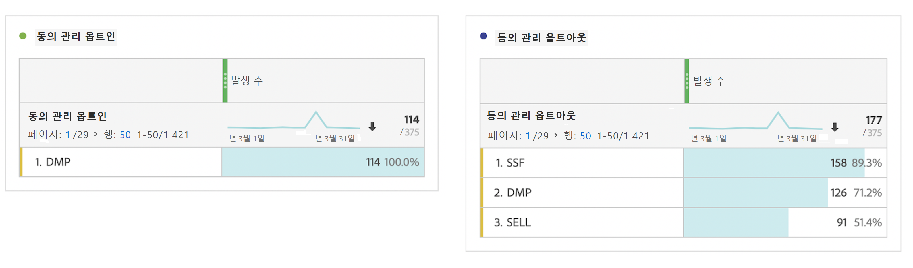

# 개인 정보 보호 보고 변수

개인 정보 보호 데이터 관리에 대한 추가 지원을 제공하기 위해 특정 컨텍스트 데이터 변수와 함께 예약된 변수 세트를 사용할 수 있습니다.
이러한 개인 정보 보호 보고 변수는 각 분석 히트에서 개인 정보 상태를 캡처하는 사용하기 쉬운 프레임워크를 제공합니다.

## 변수

* 동의 관리 옵트아웃
   * 예약된 변수: 목록 Prop
   * 유형: 쉼표로 구분된 문자열
   * 다음 포함:
      * `contextData.['cm.ssf']=1` SSF로 표시됨
      * `contextData.['opt.dmp']=N` DMP로 표시됨
      * `contextData.['opt.sell']=N` SELL로 표시됨

* 동의 관리 옵트인
   * 예약된 변수: 목록 Prop
   * 유형: 쉼표로 구분된 문자열
   * 다음 포함:
      * `contextData.['opt.dmp']=Y` DMP로 표시됨
      * `contextData.['opt.sell']=Y` SELL로 표시됨

## 보고

Analytics 관리 콘솔에서 사용할 수 있는 새로운 개인 정보 설정을 통해 개인 정보 보호 보고 변수를 활성화할 수 있습니다.

각 보고서 세트는 다음과 같이 구성할 수 있습니다.
1. Reports &amp; Analytics에서 **[!UICONTROL Admin > Report Suites]**&#x200B;을 클릭합니다.
1. 미디어 데이터를 수집하는 보고서 세트를 선택한 다음 **[!UICONTROL Edit Settings > Privacy Management]**&#x200B;를 클릭합니다 .

   

1. **[!UICONTROL Enable Data Privacy Reports]** 단추를 클릭합니다.

   > [!NOTE] 이러한 변수를 활성화하면 해제할 수 없습니다.

   

1. 활성화되면 확인 메시지가 표시됩니다.

   

1. 이제 예약된 변수를 Reports &amp; Analytics 및 작업 공간에서 분석할 수 있습니다. 동의 관리 옵트아웃 및 동의 관리 옵트인을 참조하십시오.

   

## 구현

개인 정보 보호 보고 관리 예약 변수와 함께 작동하도록 3개의 컨텍스트 데이터 변수가 미리 정의되어 있습니다.  이러한 변수의 설정을 관리하고 유지하는 방법은 각 구현 엔지니어에게 달려 있습니다.

컨텍스트 데이터 변수 구현에 대한 일반적인 지침은 [컨텍스트 데이터 변수](https://docs.adobe.com/help/ko-KR/analytics/implementation/javascript-implementation/variables-analytics-reporting/context-data-variables.html)를 참조하십시오.

### SSF

* 컨텍스트 데이터: `contextData.['cm.ssf']`
* 허용된 값:
   * 1 - 값 &quot;1&quot;을 전송할 때 서버 측 전달이 옵트아웃 상태임을 나타냅니다. 이 변수와 함께 &quot;1&quot; 값을 지정하면 Adobe Audience Manager와의 이 히트의 공유를 차단합니다. [AAM ePrivacy 규정 준수](https://docs.adobe.com/help/ko-KR/analytics/integration/audience-analytics/audience-analytics-workflow/ssf-gdpr.html)를 참조하십시오.
   * 0 - 선택 사항입니다. 타겟 마케팅에 동의한 고객에 대해 값 &quot;0&quot;을 사용합니다. 변수를 설정하지 않아도 동일한 결과가 생성됩니다.

### DMP

* 컨텍스트 데이터: `contextData.['opt.dmp']`
* 허용된 값:
   * N - 값 &quot;N&quot;을 전송할 때 소비자가 데이터 관리 플랫폼에 대한 공유를 거부함을 나타냅니다.  **참고**: 2020년 1월 15일부터 이 변수를 &quot;N&quot;으로 설정하면 AAM에 대한 이 히트의 서버측 공유가 차단됩니다.
   * Y - 값 &quot;Y&quot;를 전송할 때 소비자가 데이터 관리 플랫폼에 공유하도록 선택함을 나타냅니다.

### SELL

* 컨텍스트 데이터: `contextData.['opt.sell']`
* 허용된 값:
   * N - 값 &quot;N&quot;을 전송할 때, 이는 소비자가 데이터 공유 또는 판매를 제3자에게 거절함을 나타냅니다.
   * Y - 값 &quot;Y&quot;를 전송할 때, 이는 소비자가 데이터 공유 또는 판매를 제3자에게 선택함을 나타냅니다.
