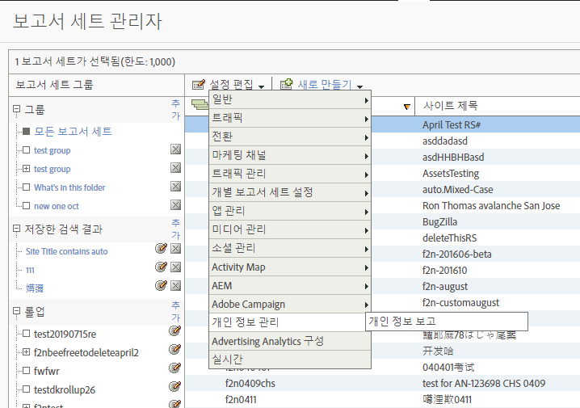
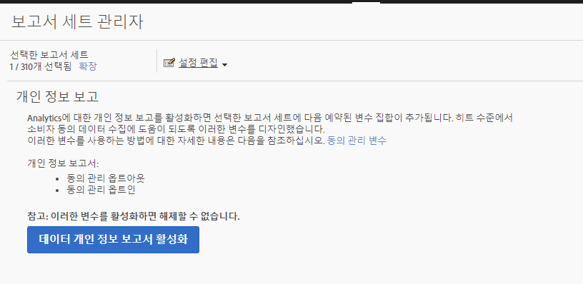
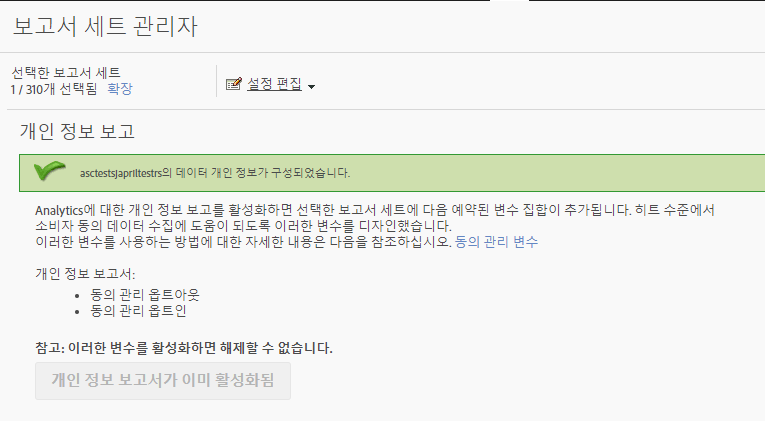
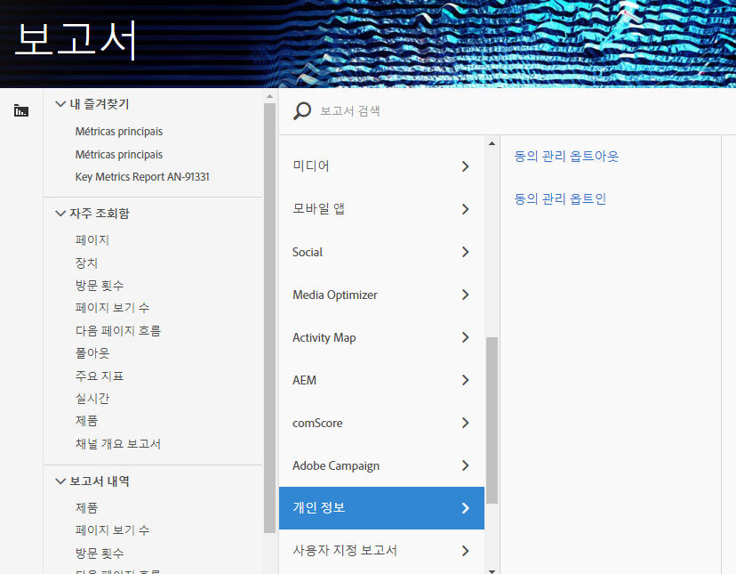

# 개인 정보 보고 변수

개인 정보 데이터 관리에 대한 추가 지원을 제공하기 위해 특정 컨텍스트 데이터 변수와 함께 예약된 변수 세트를 사용할 수 있습니다.
이러한 개인 정보 보고 변수는 각 분석 히트에서 개인 정보 상태를 캡처하는 사용하기 쉬운 프레임워크를 제공합니다.

## 변수

* 동의 관리 옵트아웃
   * 예약된 변수:목록 Prop
   * 유형:쉼표로 구분된 문자열
   * 다음 포함:
      * `contextData.['cm.ssf']=1` ssf로 표시
      * `contextData.['opt.dmp']=N` dmp로 표시
      * `contextData.['opt.sell']=N` sell로 표시

* 동의 관리 옵트인
   * 예약된 변수:목록 Prop
   * 유형:쉼표로 구분된 문자열
   * 다음 포함:
      * `contextData.['opt.dmp']=Y` dmp로 표시
      * `contextData.['opt.sell']=Y` sell로 표시

## 보고

Analytics 관리 콘솔에서 사용할 수 있는 새로운 개인 정보 설정을 통해 개인 정보 보고 변수를 활성화할 수 있습니다.

각 보고서 세트는 다음과 같이 구성할 수 있습니다.
1. In Reports &amp; Analytics click **[!UICONTROL Admin &gt; Report Suites.]**
1. Select the report suite(s) where you are collecting media data and click **[!UICONTROL Edit Settings &gt; Privacy Management.]**

   

1. 데이터 개인 **[!UICONTROL 정보 보고서 활성화]** 단추를 클릭합니다. **** 참고:활성화한 후에는 이러한 변수를 끌 수 없습니다.

   

1. 활성화되면 확인 메시지가 표시됩니다.

   

1. 이제 예약된 변수를 보고에 사용할 수 있습니다.  동의 관리 옵트아웃 및 동의 관리 옵트인을 참조하십시오.

   

## 구현

개인 정보 보고 관리 예약 변수와 함께 작동하도록 3개의 컨텍스트 데이터 변수가 미리 정의되어 있습니다.  이러한 변수의 설정을 관리하고 유지하는 방법은 각 구현 엔지니어에게 달려 있습니다.

컨텍스트 [데이터](https://docs.adobe.com/help/en/analytics/implementation/javascript-implementation/variables-analytics-reporting/context-data-variables.html) 변수 구현에 대한 일반적인 지침은 컨텍스트 데이터 변수를 참조하십시오.

### SSF

* 컨텍스트 데이터: `contextData.['cm.ssf']`
* 허용된 값:
   * 1 - 값 "1"을 전송할 때 서버 측 전달이 옵트아웃 상태임을 나타냅니다. 이 변수와 함께 "1" 값을 지정하면 Adobe Audience Manager와의 이 히트의 공유를 차단합니다. AAM [ePrivacy 규정 준수를 참조하십시오.](https://docs.adobe.com/help/en/analytics/integration/audience-analytics/audience-analytics-workflow/ssf-gdpr.html)
   * 이 매개 변수에는 다른 값이 허용되지 않습니다.

### DMP

* 컨텍스트 데이터: `contextData.['opt.dmp']`
* 허용된 값:
   * N - 값 "N"을 전송할 때 소비자가 데이터 관리 플랫폼에 대한 공유를 거부함을 나타냅니다. **** 참고:이 변수를 "N"으로 설정하면 현재 AAM에 대한 공유를 차단하지 않지만, AAM 기능에 대한 차단 호출이 2020년 초에 추가됩니다. 현재 Adobe에서는 히트가 AAM으로 전송되지 않도록 `c.cm.ssf=1` 및 `c.opt.dmp=N` 둘 다 설정하는 것이 좋습니다.
   * Y - 값 "Y"를 전송할 때 소비자가 데이터 관리 플랫폼에 공유하도록 선택함을 나타냅니다.

### 판매

* 컨텍스트 데이터: `contextData.['opt.sell']`
* 허용된 값:
   * N - 값 "N"을 전송할 때, 이는 소비자가 데이터 공유 또는 판매를 제3자에게 거절함을 나타냅니다.
   * Y - 값 "Y"를 전송할 때, 이는 소비자가 데이터 공유 또는 판매를 제3자에게 선택함을 나타냅니다.
