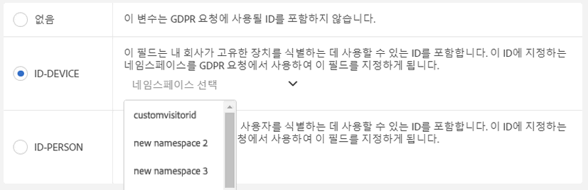
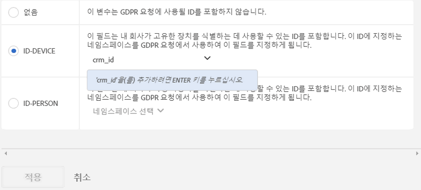

# Analytics 변수의 GDPR 레이블

## 데이터에 레이블을 지정하는 이유{#section_A075CDF3AD0744BD8CEB41CE3FB7BFB3}

대부분의 Adobe 고객은 GDPR 법률을 검토하고 GDPR을 준수하도록 데이터를 처리하는 방법에 대해 자체적인 결론을 내리는 법률 팀을 보유하고 있습니다. 법률 해석은 회사마다 다를 수 있으며, 원하는 데이터 처리 설정도 고객마다 다를 수 있습니다. 고객마다 GDPR 데이터 처리에 대한 환경 설정과 데이터 세트가 다르므로, Adobe에서는 Adobe 고객이 데이터 제어자로서 고유한 데이터의 GDPR 데이터 처리에 대해 원하는 설정을 사용자 지정할 수 있도록 합니다. 그러면 각 고유 고객이 자신의 브랜드 및 고유 데이터 세트에 가장 적합한 방식으로 GDPR 요청을 처리할 수 있습니다.

Adobe Analytics는 그 민감도 및 계약 제한 사항에 따라 데이터를 레이블링하는 도구를 제공합니다. 레이블은 중요하며 다음과 같은 작업에 유용합니다. (1) 데이터 주제를 식별, (2) 액세스 요청의 일부로서 반환할 데이터를 판별, (3) 삭제 요청의 일부로서 삭제해야 하는 데이터 필드 식별

어떤 변수/필드에 어떤 레이블을 적용해야 하는지 파악하려면, 먼저 Analytics 데이터에서 캡처 중인 [ID를 파악하고](../../admin/c-data-governance/gdpr-analytics-ids.md#concept_1BC4CA94B559481F8B08776DA100B23E) GDPR 요청에 사용할 ID를 결정해야 합니다.

Adobe Analytics GDPR 구현은 ID 데이터, 중요 데이터 및 데이터 거버넌스에 대해 다음 레이블을 지원합니다.

## DULE 레이블 {#section_B2E78130957647338495EF37DE21D6BC}

>[!NOTE]
>
>DULE (Data Usage Labeling &amp; Enforcement) 프레임워크는 모든 Adobe 솔루션/서비스/플랫폼에서 통일된 방법으로 Adobe Experience Cloud의 데이터에 대한 메타데이터를 캡처, 전달 및 사용할 수 있도록 설계되었습니다. 메타데이터를 통해 데이터 제어자는 개인 정보에 해당하는 데이터, 중요 데이터, 데이터와 연관된 계약 제한 사항을 나타낼 수 있습니다. 이 초기 릴리스에서 Analytics는 GDPR과 관련된 DULE 레이블만 노출합니다. 다른 Adobe 제품은 DULE 레이블에 대한 지원을 구현하므로 이후 릴리스에서는 제품 간에 공유되는 데이터가 법적으로 허용된 방식으로만 사용되도록 하는 계약 레이블과 추가 중요 데이터 레이블이 도입될 것입니다.

## ID 데이터 레이블(DULE) {#section_D7F4E4B60D6D40BEBC86B7004EF42AFF}

ID 데이터의 "I" 레이블은 특정 개인을 식별하거나 특정 개인에게 연락할 수 있는 데이터를 범주화하는 데 사용됩니다.

<table id="table_6B5368D714424E52835D5DFE189BD080"> 
 <thead> 
  <tr> 
   <th colname="col1" class="entry"> 레이블 </th> 
   <th colname="col2" class="entry"> 정의 </th> 
   <th colname="col3" class="entry"> 기타 요구 사항 </th> 
  </tr>
 </thead>
 <tbody> 
  <tr> 
   <td colname="col1"> <p>I1 </p> </td> 
   <td colname="col2"> <p><b> 직접 식별 가능</b>: 이름 또는 이메일 주소처럼 개인을 식별할 수 있거나 개인과 직접 연락할 수 있는 데이터입니다. </p> </td> 
   <td colname="col3"> 
    <ul id="ul_4E2AD59D119E40D28B869D0BB63B9FD9"> 
     <li id="li_AC3E99B57E3A4AE2A12BE219680AFC58">이벤트에 대해 설정할 수 없음 </li> 
     <li id="li_BB66992863C8402F8D58656293F31E71">머천다이징 eVars에 대해 설정할 수 없음 </li> 
    </ul> </td> 
  </tr> 
  <tr> 
   <td colname="col1"> <p>I2 </p> </td> 
   <td colname="col2"> <p><b>간접 식별 가능</b>: 다른 데이터와의 조합에 사용하여 개인 또는 장치를 식별하거나 개인 또는 장치와 직접 연결할 수 있는 데이터입니다. </p> <p>개인을 자체적으로 식별할 수는 없지만, 다른 정보(소유하고 있거나 소유하고 있지 않은 정보)와 결합하여 누군가를 식별할 수 있습니다. 예를 들어 고객 충성도 번호 또는 회사의 CRM 시스템에서 사용되며 각 고객에 대해 고유한 ID가 있습니다. </p> </td> 
   <td colname="col3"> 
    <ul id="ul_A0EF0F3DC5804D4FBE228946D697ABEB"> 
     <li id="li_A592EA6DA82C4D8C80E03F02ADF4E20E">이벤트에 대해 설정할 수 없음 </li> 
     <li id="li_46CE7B1E84884CDAB356A6DF89397849">머천다이징 eVars에 대해 설정할 수 없음 </li> 
    </ul> </td> 
  </tr> 
 </tbody> 
</table>

## 중요 데이터 레이블(DULE) {#section_533E1406F3F24A01B51D94139B94CAEC}

중요 데이터 "S" 레이블은 지리 데이터와 같은 중요 데이터를 범주화하는 데 사용됩니다. 추가 민감한 데이터 레이블은 다른 유형의 민감한 정보를 식별하기 위해 나중에 도입됩니다.

<table id="table_A778A508620545CCB37830E5CF1C75B7"> 
 <thead> 
  <tr> 
   <th colname="col1" class="entry"> 레이블 </th> 
   <th colname="col2" class="entry"> 정의 </th> 
  </tr>
 </thead>
 <tbody> 
  <tr> 
   <td colname="col1"> <p>S1 </p> </td> 
   <td colname="col2"> <p> 장치의 정확한 위치를 판별하는 데 사용할 수 있는 위도 및 경도와 관련된 정확한 지리적 위치 데이터입니다(100m 이내). </p> </td> 
  </tr> 
  <tr> 
   <td colname="col1"> <p>S2 </p> </td> 
   <td colname="col2"> <p> 광범위하게 정의된 가상 울타리 영역을 판단하는 데 사용할 수 있는 지리적 위치 데이터입니다. </p> </td> 
  </tr> 
 </tbody> 
</table>

## 데이터 거버넌스 레이블(GDPR) {#section_0C7F9EC4BB414A6D915C69F1D3259F1B}

데이터 거버넌스 레이블은 규정 및 기업 정책을 준수하도록 개인 정보 보호 관련 고려 사항 및 계약 조건을 반영하여 데이터를 분류하는 기능을 제공합니다.

**GDPR 액세스 레이블**

<table id="table_663EFF43A454498386F7F3E60875E0F8"> 
 <thead> 
  <tr> 
   <th colname="col1" class="entry"> 레이블 </th> 
   <th colname="col2" class="entry"> 정의 </th> 
   <th colname="col3" class="entry"> 기타 요구 사항 </th> 
  </tr>
 </thead>
 <tbody> 
  <tr> 
   <td colname="col1"> <p>없음 </p> </td> 
   <td colname="col2"> <p>이 변수에 GDPR 액세스 요청의 일부로 데이터 주체에게 반환되는 데이터에 포함해야 하는 데이터가 포함되지 않은 경우 이 옵션을 선택합니다. </p> </td> 
   <td colname="col3"> </td> 
  </tr> 
  <tr> 
   <td colname="col1"> <p>ACC-ALL </p> </td> 
   <td colname="col2"> <p>이 필드의 값은 <u>모든</u> GDPR 액세스 요청에 포함해야 합니다. </p> <p>이 히트가 여러 개인이 공유한 장치에서 발생한 경우, 이 레이블을 적용하면 사용자가 데이터 컨트롤러로서 공유된 장치에 액세스한 개별 사용자와 이 필드의 데이터를 공유하는 것을 허용한다는 것을 나타냅니다. </p> </td> 
   <td colname="col3"> <p>모든 GDPR 요청에 대해 이 레이블이 있는 필드가 반환됨 </p> </td> 
  </tr> 
  <tr> 
   <td colname="col1"> <p>ACC-PERSON </p> </td> 
   <td colname="col2"> <p> 이 필드의 값은 ID-PERSON 필드의 값과 일치하는 GDPR 요청 ID에 의해 확인된 대로 Adobe에서 히트가 데이터 주체에서 온 것임을 합리적으로 확신할 수 있을 때 GDPR 요청 ID에 대해서만 포함해야 합니다. </p> </td> 
   <td colname="col3"> <p>이 보고서 세트 내의 일부 변수에 ID-PERSON 레이블이 설정되어 있어야 하며 해당 ID를 사용하여 요청을 제출해야 합니다. 그렇지 않으면 이 레이블이 적용되지 않습니다. </p> </td> 
  </tr> 
 </tbody> 
</table>

다른 레이블을 수신하는 변수는 거의 없는 반면 액세스 레이블은 많은 변수에 적용될 것입니다. 하지만 수집한 데이터 중 어느 데이터를 데이터 주체와 공유해야 하는지는 법률 팀과 논의하여 결정해야 합니다.

**GDPR 삭제 레이블**

<table id="table_59DFCE4D90214CB5972BDDE5B7391B4D"> 
 <thead> 
  <tr> 
   <th colname="col1" class="entry"> 레이블 </th> 
   <th colname="col2" class="entry"> 정의 </th> 
   <th colname="col3" class="entry"> 기타 요구 사항 </th> 
  </tr>
 </thead>
 <tbody> 
  <tr> 
   <td colname="col1"> </td> 
   <td colname="col2"> <p>이러한 삭제 레이블은 다른 레이블과 달리 함께 사용할 수 있습니다. 둘 중 하나 또는 둘 다 선택하거나 아무것도 선택하지 않을 수 있습니다. 없음 레이블은 삭제 옵션 중 하나를 선택하지 않음으로써 간단하게 없음이 표시되므로 별도로 필요하지 않습니다. </p> </td> 
   <td colname="col3"> <p>삭제 레이블은 히트를 데이터 주체(즉, 데이터 주체를 식별할 수 있는 주체)와 연결할 수 있는 값이 포함된 필드에만 필요합니다. </p> <p> 기타 개인 정보(즐겨찾기, 탐색/구입 내역, 건강 상태 등)는 데이터 주체와의 연결이 끊어지므로 삭제할 필요가 없습니다. </p> </td> 
  </tr> 
  <tr> 
   <td colname="col1"> <p>DEL-DEVICE </p> </td> 
   <td colname="col2"> <p>GDPR 삭제 요청의 경우, 이 필드의 값은 지정된 ID-DEVICE가 히트에 있는 요청에 대해서만 익명 처리되어야 합니다. </p> <p>삭제되지 않는 다른 히트에서 동일한 값이 발생하는 경우 그러한 다른 인스턴스는 변경되지 않습니다. 이 경우 이 필드에서 고유 카운트를 계산하는 보고서의 카운트가 변경됩니다. 공유된 장치에서는 이렇게 하면 데이터 주체 외에 다른 개인에 대한 식별자가 제거될 수 있습니다. </p> <p>이 필드에 ID-DEVICE 레이블이 있고 이 필드의 값이 GDPR 요청에 대한 ID로 사용된 경우에는 카운트가 변경되지 않습니다. </p> </td> 
   <td colname="col3"> 
    <ul id="ul_45C3A09E1F05492B97C3F3DEA7C78FBC"> 
     <li id="li_BAB277F92F284ADE9D7B6839BDD716E2">I1 또는 I2 또는 S1 레이블도 필요함 </li> 
     <li id="li_6DDFC0571457489CBA9D76F547247F20">이벤트에 대해 설정할 수 없음 </li> 
     <li id="li_E79C6DFC6C58478EAA1504E3820D512C">머천다이징 eVars에 대해 설정할 수 없음 </li> 
     <li id="li_B78E273212E447D49D0707E174B66DEC">분류에 대해 설정할 수 없음 </li> 
     <li id="li_F0F52D0DE7454557A6A97063C1FBC372">ID-DEVICE를 사용하여 요청을 제출하거나 expandIDs를 true로 설정해야 합니다. 그렇지 않으면 이 레이블이 적용되지 않습니다. </li> 
    </ul> </td> 
  </tr> 
  <tr> 
   <td colname="col1"> <p>DEL-PERSON </p> </td> 
   <td colname="col2"> <p>GDPR 삭제 요청의 경우, 이 필드의 값은 지정된 ID-PERSON이 히트에 있는 요청에 대해서만 익명 처리되어야 합니다. </p> <p>삭제되지 않는 다른 히트에서 동일한 값이 발생하는 경우 그러한 다른 값은 변경되지 않습니다. 이 경우 이 필드에서 고유 카운트를 계산하는 보고서의 카운트가 변경됩니다. 이 필드에 ID-PERSON 레이블이 있고 이 필드의 값이 GDPR 요청에 대한 ID로 사용된 경우에는 카운트가 변경되지 않습니다. </p> </td> 
   <td colname="col3"> 
    <ul id="ul_6722E42E036E47B4B5E17DC213636D51"> 
     <li id="li_6C1A64FF68AF428A827D8C6C33E22970">I1 또는 I2 또는 S1 레이블도 필요함 </li> 
     <li id="li_8053533FFE874EE795C8B6043A4F73B3">이벤트에 대해 설정할 수 없음 </li> 
     <li id="li_D6700CF4D03E44DDA83C4DDBB5B70CC3">머천다이징 eVars에 대해 설정할 수 없음 </li> 
     <li id="li_B6C2B15484B344889DBF29B62E2EA8FD">분류에 대해 설정할 수 없음 </li> 
     <li id="li_3BBD0C27D9644C2B9618457A0BFC15EF">이 보고서 세트 내의 일부 변수에 ID-PERSON 레이블이 설정되어 있어야 하며 해당 ID를 사용하여 요청을 제출해야 합니다. 그렇지 않으면 이 레이블이 적용되지 않습니다. </li> 
    </ul> </td> 
  </tr> 
 </tbody> 
</table>

**GDPR ID 레이블**

<table id="table_F6BBC868457443A19A7B693BD6C55B4B"> 
 <thead> 
  <tr> 
   <th colname="col1" class="entry"> 레이블 </th> 
   <th colname="col2" class="entry"> 정의 </th> 
   <th colname="col3" class="entry"> 기타 요구 사항 </th> 
  </tr>
 </thead>
 <tbody> 
  <tr> 
   <td colname="col1"> <p>없음 </p> </td> 
   <td colname="col2"> <p>이 변수에는 GDPR 요청에 사용할 ID가 포함되어 있지 않습니다. </p> </td> 
   <td colname="col3"> <p>이 필드에 GDPR API 또는 UI를 통해 액세스 또는 삭제 요청을 제출할 때 사용할 ID가 포함된 경우에만 이러한 다른 레이블 중 하나를 설정해야 합니다. </p> </td> 
  </tr> 
  <tr> 
   <td colname="col1"> <p>ID-DEVICE </p> </td> 
   <td colname="col2"> <p>이 필드에는 GDPR 요청에 대해 장치를 식별하는 데 사용할 수 있는 ID가 포함되어 있지만 공유 장치의 서로 다른 사용자를 구별할 수 없습니다. </p> <p>ID(I1/I2 레이블의 용도)가 포함된 모든 변수에 이 레이블을 지정할 필요는 없습니다. 이 변수에 저장된 ID를 사용하여 GDPR 요청을 제출하고 이 변수에서 지정된 ID를 검색하려는 경우 이 레이블을 사용합니다. </p> </td> 
   <td colname="col3"> 
    <ul id="ul_618019CB8FCA4A5C94C47636240197B2"> 
     <li id="li_0E5ADED36FF24A348FDD434E2CC8C8EE">I1 또는 I2 레이블도 필요함 </li> 
     <li id="li_20BCFF07B2BF468C8E0D477C10B2EF9F">이벤트에 대해 설정할 수 없음 </li> 
     <li id="li_0BD73EEF4184475D8E97878CF8DBEB90">머천다이징 eVars에 대해 설정할 수 없음 </li> 
     <li id="li_129851035C4A4BF0922296B4C3BEE39B">분류에 대해 설정할 수 없음 </li> 
    </ul> </td> 
  </tr> 
  <tr> 
   <td colname="col1"> <p>ID-PERSON </p> </td> 
   <td colname="col2"> <p>이 필드에는 GDPR 요청에 대해 인증된 사용자(특정 사용자)를 식별하는 데 사용할 수 있는 ID가 포함됩니다. </p> <p>ID(I1/I2 레이블의 용도)가 포함된 모든 변수에 이 레이블을 지정할 필요는 없습니다. 이 변수에 저장된 ID를 사용하여 GDPR 요청을 제출하고 이 변수에서 지정된 ID를 검색하려는 경우 이 레이블을 사용합니다. </p> </td> 
   <td colname="col3"> 
    <ul id="ul_0C7EEC8FCB5C4BCDA5D48F3C98770A67"> 
     <li id="li_2E781AE8D7A046A7996C7300CA854B86">I1 또는 I2 레이블도 필요함 </li> 
     <li id="li_EB4C6430C218405DAAE81DEE010DCAA2">이벤트에 대해 설정할 수 없음 </li> 
     <li id="li_05AA67B45974474F9DA520E8B877BA11">머천다이징 eVars에 대해 설정할 수 없음 </li> 
     <li id="li_8A6BF4B40ED249289EAD46FE1C755FB0">분류에 대해 설정할 수 없음 </li> 
    </ul> </td> 
  </tr> 
 </tbody> 
</table>

## 변수에 ID-DEVICE 또는 ID-PERSON으로 레이블을 지정할 때 네임스페이스 제공 {#section_F0A47AF8DA384A26BD56032D0ABFD2D7}

변수에 ID-DEVICE 또는 ID-PERSON으로 레이블을 지정할 때 네임스페이스를 제공하라는 메시지가 표시됩니다. 이전에 정의된 네임스페이스를 사용하거나 새 네임스페이스를 정의할 수 있습니다.

**이전에 정의한 네임스페이스 사용**

로그인 회사의 모든 보고서 세트에 있는 다른 변수에 ID 레이블을 이전에 할당한 경우 이러한 기존 네임스페이스 중 하나를 선택할 수 있습니다. 이 변수에 이 네임스페이스로 이미 레이블이 지정된 다른 변수와 동일한 유형의 ID가 포함되어 있고 요청을 제출할 때 이 변수를 모두 검색하려면 네임스페이스를 다시 사용해야 합니다.

1. **[!UICONTROL 네임스페이스 선택]을 클릭하고 기존 네임스페이스 중 하나를 선택합니다.**
1. **[!UICONTROL 적용을 클릭합니다]**.



**새 네임스페이스 정의**

새 네임스페이스를 정의할 수도 있습니다. 네임스페이스 문자열을 영숫자와 밑줄, 대시 및 공백으로 제한하는 것이 좋습니다. 이 문자열은 소문자로 변환됩니다.

1. **[!UICONTROL 네임스페이스 선택]을 클릭하고 네임스페이스 제목을 입력합니다.**

   

1. **[!UICONTROL Enter]키를 눌러 이 네임스페이스를 추가합니다.** 현재는 [적용] 단추만 활성화됩니다.
1. **[!UICONTROL 적용을 클릭합니다]**.

네임스페이스로 지정하는 문자열은 GDPR API를 통해 요청을 "네임스페이스" 매개 변수 값으로 제출할 때 사용해야 하는 것과 동일한 문자열입니다. 그러면 이 요청은 Adobe Analytics가 이 네임스페이스를 공유하는 모든 보고서 세트의 모든 변수에서 요청으로 지정한 ID를 검색하도록 합니다.

ID(I1/I2 레이블의 용도)가 포함된 모든 변수에 ID-DEVICE 또는 ID-PERSON 레이블을 지정할 필요는 없습니다. 이 변수에 저장된 ID를 사용하여 GDPR 요청을 제출하고 지정된 ID에 대해 이 변수를 검색하려는 경우 이 레이블을 사용합니다. 예를 들어, eVar1에 이메일 주소를 포함할 수 있고 eVar2에 로그인 사용자 이름을 포함할 수 있지만 사용자 이름만 사용하여 요청을 제출하는 경우 eVar1을 I1, ACC-PERSON, DEL-PERSON으로 레이블 지정할 수 있지만, eVar2는 "user name" 네임스페이스와 함께 I2, ACC-PERSON, DEL-PERSON, ID-PERSON으로 레이블 지정할 수 있습니다. 다음과 같은 사용자 섹션 JSON 블록과 함께 요청을 제출할 수 있습니다.

```
{
     "namespace": "user name",
     "type": "analytics",
     "value": "rocketman123"
}
```

동일한 보고서 세트 내의 다른 변수에 동일한 네임스페이스를 사용할 수 있습니다. 예를 들어, 일부 사용자 지정 구현은 prop 및 eVar에 모두 CRM-ID를 저장합니다. CRM-ID가 항상 이 중 하나(예: eVar)에서 발생하고 나머지 변수(prop)에서는 가끔 발생하며, eVar에서 발생하지 않으면 prop에서도 발생하지 않는 경우에는 Adobe에서 해당 eVar에서만 ID를 검색하므로 eVar에만 ID 레이블과 네임스페이스가 필요합니다. 그러나 CRM-ID가 한 변수에서 가끔 발생하고 다른 변수에서도 가끔 발생하면 두 변수 모두 동일한 네임스페이스를 가져야 하며, Adobe에서는 두 변수에서 이 네임스페이스와 함께 GDPR 요청의 일부로 지정된 ID의 발생을 검색합니다. 이러한 모든 변수에는 DEL 레이블이 있어야 하므로 값이 어디에서 발생하더라도 익명이 아닙니다.

다른 예로는 가끔 eVar1을 통해 전송되는 CRM ID와 가끔 prop7을 통해 전송되는 CRM ID가 있을 수 있습니다. 그런 경우 eVar1의 값(있는 경우)을 eVar3에 복사하는 처리 규칙이 있습니다. 그렇지 않으면 prop7의 값을 eVar3로 복사합니다. 이 시나리오에서는 eVar3에 항상 CRM ID가 포함되므로 eVar3에만 ID-PERSON 레이블이 필요합니다.

## 변수 유형 및 변수 유형이 지원하는 GDPR/DULE 레이블 {#section_CE7C3EDE1344466A98BC45E394B40762}

GDPR/DULE 레이블은 Analytics 변수의 네 가지 광범위한 클래스에 영향을 줍니다. 모든 변수가 모든 레이블을 지원하는 것은 아닙니다. 다음 표는 레이블을 지원하는 변수와 지원하지 않는 변수를 보여 줍니다.

<table id="table_95D4416B3A8A40C28B2610D0003456E6"> 
 <thead> 
  <tr> 
   <th colname="col1" class="entry"> 변수 유형 </th> 
   <th colname="col2" class="entry"> 지원되는 레이블 </th> 
   <th colname="col3" class="entry"> 지원되지 않는 레이블 </th> 
  </tr>
 </thead>
 <tbody> 
  <tr> 
   <td colname="col1"> 
    <ul id="ul_0615B545A5AD43F2A6F25698A47AAD3E"> 
     <li id="li_A4B3E8E241B149C99F2A71B21227AD72">사용자 지정 성공 이벤트 </li> 
     <li id="li_8AEF688AE9B8426C82D199E4B195330D">머천다이징 eVars </li> 
     <li id="li_DFFCA65DCC6146AEB6D47476B4D4CC3B">다중 값 변수(mvVars) </li> 
     <li id="li_3192D08B12C249D1AAA8AAEEDE2FD7D7">계층 변수 </li> 
    </ul> </td> 
   <td colname="col2"> <p>S1/S2 </p> <p>ACC-ALL, ACC-PERSON </p> </td> 
   <td colname="col3"> <p>I1/I2 </p> <p>ID-DEVICE, ID-PERSON </p> <p>DEL-DEVICE, DEL-PERSON </p> </td> 
  </tr> 
  <tr> 
   <td colname="col1"> <p>분류 </p> </td> 
   <td colname="col2"> <p>I1/I2, S1/S2 </p> <p>ACC-ALL, ACC-PERSON </p> </td> 
   <td colname="col3"> <p>ID-DEVICE, ID-PERSON </p> <p>DEL-DEVICE, DEL-PERSON </p> </td> 
  </tr> 
  <tr> 
   <td colname="col1"> 
    <ul id="ul_1C2FD4D606664965A88F10818E1C11A9"> 
     <li id="li_590975F5C7304317B22C80B20718E914">트래픽 변수(Prop) </li> 
     <li id="li_6E614B7036994434BFDA71A4424529A0">상거래 변수(비머천다이징 eVar) </li> 
    </ul> </td> 
   <td colname="col2"> <p>모든 레이블 </p> </td> 
   <td colname="col3"> - </td> 
  </tr> 
  <tr> 
   <td colname="col1"> <p>대부분의 다른 변수 </p> <p><i>(예외 사항은 아래 표 참조)</i> </p> </td> 
   <td colname="col2"> <p>ACC-ALL, ACC-PERSON </p> </td> 
   <td colname="col3"> <p>I1/I2, S1/S2 </p> <p>ID-DEVICE, ID-PERSON </p> <p>DEL-DEVICE, DEL-PERSON </p> </td> 
  </tr> 
 </tbody> 
</table>

## ACC-ALL/ACC-PERSON 이외의 레이블을 지정할 수 있는 변수/수정됨 {#section_4FA003003D1B4E2EBCFCDB1A7CD4A824}

<table id="table_0972910DB2D7473588F23EA47988381D"> 
 <thead> 
  <tr> 
   <th colname="col1" class="entry"> 그룹 </th> 
   <th colname="col2" class="entry"> 변수 </th> 
   <th colname="col3" class="entry"> 수정 가능한 레이블 </th> 
   <th colname="col4" class="entry"> 댓글 </th> 
  </tr>
 </thead>
 <tbody> 
  <tr> 
   <td colname="col1" morerows="1"> 
    <ul id="ul_62FA1BAA3B9245909509566D8C03F900"> 
     <li id="li_38F7C4E18ECB42C292370713F502B8EB">전환 치수 </li> 
     <li id="li_41CB61F927CB4402AAB4A62E219CD153">사용자 지정 트래픽 차원 </li> 
    </ul> </td> 
   <td colname="col2"> <p>분류를 제외한 모든 변수 </p> </td> 
   <td colname="col3"> <p>모든 </p> </td> 
   <td colname="col4"> </td> 
  </tr> 
  <tr> 
   <td colname="col2"> <p>분류 </p> </td> 
   <td colname="col3"> <p>없음/I1/I2 </p> <p>없음/S1/S2 </p> </td> 
   <td colname="col4"> </td> 
  </tr> 
  <tr> 
   <td colname="col1"> <p>전환 이벤트 </p> </td> 
   <td colname="col2"> <p>모든 </p> </td> 
   <td colname="col3"> <p>없음/S1/S2 </p> </td> 
   <td colname="col4"> </td> 
  </tr> 
  <tr> 
   <td colname="col1"> <p>솔루션 차원 및 이벤트 </p> </td> 
   <td colname="col2"> <p>Activity Map 링크, </p> <p>Activity Map 페이지 </p> </td> 
   <td colname="col3"> <p>없음/I1/I2 </p> <p>없음/DEL-DEVICE/DEL-PERSON </p> </td> 
   <td colname="col4"> <p>변수에는 직접 또는 간접적으로 식별 가능한 데이터가 포함될 수 있는 URL 매개 변수가 포함될 수 있습니다. 구현에서 이러한 변수에 있는 직접 또는 간접적으로 식별 가능한 데이터를 수집하지 않는 경우 ID 또는 삭제 레이블이 필요하지 않습니다. </p> <p>삭제하면 URL 매개 변수가 지워지지만, 기본 URL은 그대로 유지됩니다. </p> </td> 
  </tr> 
  <tr> 
   <td colname="col1"> <p>데이터 처리 차원 </p> </td> 
   <td colname="col2"> <p>사용자 지정 방문자 ID </p> </td> 
   <td colname="col3"> <p>ID-DEVICE/ID-PERSON </p> <p>DEL-DEVICE/DEL-PERSON </p> </td> 
   <td colname="col4"> <p>ID 또는 DEL 레이블은 제거할 수 없지만 ([없음] 로 설정) 사용자 지정 ID 구현에 따라 장치 또는 사람 변형이 되도록 변경할 수 있습니다. </p> <p>사용자 지정 방문자 ID를 사용하지 않는 경우에는 설정이 중요하지 않습니다. </p> </td> 
  </tr> 
  <tr> 
   <td colname="col1" morerows="1"> 
    <ul id="ul_5EB0193732D44A20AEA08CE9DFE01DBD"> 
     <li id="li_F70D969F83314A94BD8567449968EE2F">표준 차원 </li> 
     <li id="li_6046764B19FF4679B51E55671C2C0ADB">데이터 처리 차원 </li> 
    </ul> </td> 
   <td colname="col2"> <p>IP 주소 </p> <p>IP 주소 2 </p> </td> 
   <td colname="col3"> <p>DEL-DEVICE/DEL-PERSON </p> </td> 
   <td colname="col4"> <p>DEL 레이블은 제거할 수 없지만, DEL-DEVICE 또는 DEL-PERSON 또는 둘 다로 변경할 수 있습니다. </p> </td> 
  </tr> 
  <tr> 
   <td colname="col2"> <p>ClickMap 작업(기존) </p> <p>ClickMap 컨텍스트(기존) </p> <p>페이지, </p> <p>페이지 URL, </p> <p>원래 시작 페이지 URL, </p> <p>Referrer, </p> <p>시작 페이지 URL 방문 </p> </td> 
   <td colname="col3"> <p>없음/I1/I2 </p> <p>없음/DEL-DEVICE/DEL-PERSON </p> </td> 
   <td colname="col4"> <p>변수에는 직접 또는 간접적으로 식별 가능한 데이터가 포함될 수 있는 URL 매개 변수가 포함될 수 있습니다. 구현에서 이러한 변수에 있는 직접 또는 간접적으로 식별 가능한 데이터를 수집하지 않는 경우 ID 또는 삭제 레이블이 필요하지 않습니다. </p> <p>삭제하면 URL 매개 변수가 지워지지만, 기본 URL은 그대로 유지됩니다. </p> </td> 
  </tr> 
 </tbody> 
</table>

## 삭제 처리 {#section_F3DEE591671A4B16A8E043F91C137ECB}

GDPR 삭제 요청에 대한 Adobe Analytics 지원은 보고에 미치는 영향을 최소화하도록 설계되었습니다. 대부분의 경우 보고서에 표시된 지표는 변경되지 않아야 합니다. GDPR 삭제 전에 실행된 기록 보고서는 삭제가 수행된 후 실행된 동일한 보고서와 일치합니다. 이 작업은 보고된 값이 일관되게 유지될 수 있도록 식별할 수 없는 데이터를 그대로 두면서 데이터 주체에서 삭제된 데이터를 완전히 분리하여 수행됩니다.

다음 표는 다양한 변수가 "삭제"되는 방법을 설명합니다. 이는 완전한 목록이 아닙니다.

<table id="table_A329C2E2645F4685BC208826D070A5F6"> 
 <thead> 
  <tr> 
   <th colname="col1" class="entry"> 변수 </th> 
   <th colname="col2" class="entry"> 삭제 방법 </th> 
  </tr>
 </thead>
 <tbody> 
  <tr> 
   <td colname="col1"> <p>• 트래픽 변수(Prop) </p> <p>• 상거래 변수(eVar) </p> </td> 
   <td colname="col2"> <p>기존 값은 "GDPR-356396D55C4F9C7AB3FBB2F2FA223482" 형식의 새 값으로 대체됩니다. 여기서 "GDPR-" 접두사 다음의 32자리 16진수 값은 암호학적으로 강력한 128비트 의사 난수입니다. 기본적으로 임의의 문자열로 대체되기 때문에 이 새 값에서 원래 값을 결정할 방법이 없으며 원래 값을 판별하는 새 값을 도출하는 방법이 없습니다. </p> <p>지정된 변수의 경우, 대체되는 값과 동일한 값이 동일한 GDPR 요청의 일부로 삭제되는 다른 히트 내에 있으면 해당 값의 모든 인스턴스가 동일한 새 값으로 대체됩니다. </p> <p>값의 일부 인스턴스가 하나의 삭제 요청으로 대체되고 이후 요청이 원래 값의 다른(새) 인스턴스를 삭제하는 경우 새 대체 값은 원래 대체 값과 달라집니다. </p> </td> 
  </tr> 
  <tr> 
   <td colname="col1"> <p>구매 ID </p> </td> 
   <td colname="col2"> <p>기존 값은 "G-7588FCD8642718EC50" 형식의 새 값으로 대체됩니다. 여기서 "G-" 접두사 다음의 18자리 16진수는 암호학적으로 강력한 128비트 의사 난수의 처음 18자리입니다. 트래픽 및 상거래 변수의 삭제에 적용되는 모든 주석도 여기에 적용됩니다. </p> <p>구매 ID는 트랜잭션 ID로, 누군가가 구매 확인 페이지를 새로 고침하는 경우와 같이 구매가 두 번 결제되지 않도록 하는 것이 주 목적입니다. ID 자체는 구매가 기록된 자신의 DB 행에 구매를 연결할 수 있습니다. 대부분의 경우 이 ID를 삭제할 필요가 없으므로 기본적으로 삭제되지 않습니다. 사용자 고유의 데이터에 대한 GDPR 삭제 요청 후에도 구매를 다시 사용자에게 연결할 수 있는 경우 이 방문자의 Analytics 데이터를 구매자에게 다시 연결할 수 없도록 이 필드를 삭제해야 할 수 있습니다. </p> </td> 
  </tr> 
  <tr> 
   <td colname="col1"> <p>방문자 ID </p> </td> 
   <td colname="col2"> <p>값은 128비트 정수이며 암호화적으로 강력한 128비트 의사 난수 값으로 대체됩니다. </p> </td> 
  </tr> 
  <tr> 
   <td colname="col1"> <p>• MCID </p> <p>• 사용자 지정 방문자 ID </p> <p>• IP 주소 </p> <p>• IP 주소 2 </p> </td> 
   <td colname="col2"> <p>값이 지워졌습니다(변수 유형에 따라 빈 문자열 또는 0으로 설정). </p> </td> 
  </tr> 
  <tr> 
   <td colname="col1"> <p>• ClickMap 작업(기존) </p> <p>• ClickMap 컨텍스트(기존) </p> <p>• 페이지 </p> <p>• 페이지 URL </p> <p>• 원래 시작 페이지 URL </p> <p>• Referrer </p> <p>• 시작 페이지 URL 방문 </p> </td> 
   <td colname="col2"> <p>URL 매개 변수는 삭제/제거됩니다. 값이 URL과 유사하지 않으면 값은 지워집니다(빈 문자열로 설정됨). </p> </td> 
  </tr> 
  <tr> 
   <td colname="col1"> <p>• 위도 </p> <p>• 경도 </p> </td> 
   <td colname="col2"> <p>정밀도는 1km 정도로 감소합니다. </p> </td> 
  </tr> 
 </tbody> 
</table>

## 예상 삭제 레이블을 지원하지 않는 변수 {#section_956B766EFFEC427E87E6CFF3A4217E86}

이 섹션은 삭제를 지원하지 않는 Analytics 변수에 대한 정보를 명확하게 확인하기 위한 것입니다. 간혹 변수에 포함된 데이터 유형을 이해하지 못하고 변수 이름을 기반으로 잘못된 가정을 하는 비 Analytics 사용자(예: 법률 팀)가 이러한 변수를 삭제하는 경우가 있습니다. 다음은 이러한 변수 중 일부 목록이며 삭제가 필요하지 않은 이유 또는 특정 삭제 레이블이 필요하지 않은 이유입니다.

<table id="table_6FECF3D654514862912D371E6BE4143B"> 
 <thead> 
  <tr> 
   <th colname="col1" class="entry"> 변수 </th> 
   <th colname="col2" class="entry"> 설명 </th> 
  </tr>
 </thead>
 <tbody> 
  <tr> 
   <td colname="col1"> <p>새 방문자 ID </p> </td> 
   <td colname="col2"> <p>새 방문자 ID는 지정된 방문객 ID가 처음 표시될 때 true인 부울입니다. 방문자 ID가 익명 처리되면 삭제할 필요가 없습니다. 익명 처리 후에는 이 익명 ID를 처음 표시된 순간과 일치하게 됩니다. </p> </td> 
  </tr> 
  <tr> 
   <td colname="col1"> <p>우편 번호 </p> <p>지역 우편 번호 </p> </td> 
   <td colname="col2"> <p>우편 번호는 미국에서 시작되는 히트에 대해서만 설정됩니다. EU에서 발생한 히트에 대해서는 설정되지 않습니다. 설정된 경우에도 데이터 주체를 다시 식별하기 어려운 광범위한 지리적 영역만 제공합니다. </p> </td> 
  </tr> 
  <tr> 
   <td colname="col1"> <p>지역 위도 </p> <p>지역 경도 </p> </td> 
   <td colname="col2"> <p>이는 IP 주소에서 파생된 대략적인 위치를 제공합니다. 정확성은 일반적으로 실제 위치의 수십 킬로미터 내에 있는 우편 번호 정확성과 비슷합니다. </p> </td> 
  </tr> 
  <tr> 
   <td colname="col1"> <p>사용자 에이전트 </p> </td> 
   <td colname="col2"> <p>사용자 에이전트는 사용된 브라우저의 버전을 식별합니다. </p> </td> 
  </tr> 
  <tr> 
   <td colname="col1"> <p>사용자 ID </p> </td> 
   <td colname="col2"> <p> 데이터를 포함하는 Analytics 보고서 세트를 (숫자로) 지정합니다. </p> </td> 
  </tr> 
  <tr> 
   <td colname="col1"> <p>보고서 세트 ID </p> </td> 
   <td colname="col2"> <p> 데이터를 포함하는 Analytics 보고서 세트의 이름을 지정합니다. </p> </td> 
  </tr> 
  <tr> 
   <td colname="col1"> <p>Visitor ID </p> <p>MCID / ECID </p> </td> 
   <td colname="col2"> <p> 여기에는 DEL-DEVICE 레이블이 있지만 DEL-PERSON 레이블을 추가할 수 없습니다. 각 요청에 <a href="../../admin/c-data-governance/gdpr-id-expansion.md#concept_917A5666010A4E6BA599FE372DADD1BD" format="dita" scope="local"> ID 확장</a>을 지정하는 경우 ID-PERSON을 사용하는 모든 삭제 요청에 대해 이러한 ID가 자동으로 삭제됩니다. </p> <p>ID 확장을 사용하지 않고 이러한 쿠키 ID가 Prop 또는 eVar에 일치하는 ID가 포함된 히트에 익명으로 표시되도록 하려면 실제로 사람을 식별하는 경우에도 Prop 또는 eVar에 ID-DEVICE 레이블을 지정하여 이 라벨링 제한을 해결할 수 있습니다(모든 DEL-PERSON 레이블도 DEL-DEVICE 레이블로 변경해야 함). 이 경우, 방문자 ID 또는 ECID의 일부 인스턴스만 익명으로 처리되고 있으므로 고유 방문자 카운트가 기록 보고에서 변경됩니다. </p> </td> 
  </tr> 
  <tr> 
   <td colname="col1"> <p>AMO ID </p> </td> 
   <td colname="col2"> <p> Adobe Advertising Cloud ID는 수정할 수 없는 del 장치 레이블이 있는 솔루션 변수입니다. 방문자 ID 및 MCID와 마찬가지로 쿠키에서 채워집니다. 다른 ID가 삭제될 때마다 히트에서 삭제해야 합니다. 자세한 내용은 해당 변수에 대한 설명을 참조하십시오. </p> </td> 
  </tr> 
 </tbody> 
</table>

## 액세스 요청에 대한 날짜 필드 {#section_6678FB4FF42B481C9B78E64F61782397}

타임스탬프를 포함하는 다음과 같은 5개의 표준 변수가 있습니다.

<table id="table_49A9255366254F799E1682C30CBD98EB"> 
 <thead> 
  <tr> 
   <th colname="col1" class="entry"> 타임스탬프 </th> 
   <th colname="col2" class="entry"> 정의 </th> 
  </tr>
 </thead>
 <tbody> 
  <tr> 
   <td colname="col1"> <p>Hit Time UTC </p> </td> 
   <td colname="col2"> <p>Adobe Analytics가 히트를 받는 시간입니다. </p> </td> 
  </tr> 
  <tr> 
   <td colname="col1"> <p>Custom Hit Time UTC </p> </td> 
   <td colname="col2"> <p>일부 모바일 애플리케이션 및 기타 구현에서 발생한 히트가 수신된 시간보다 이전일 수 있습니다. 예를 들어 히트가 수신되었을 때 네트워크 연결을 사용할 수 없는 경우에는 애플리케이션이 히트를 보유하고 연결을 사용할 수 있게 되면 해당 히트를 보낼 수 있습니다. </p> </td> 
  </tr> 
  <tr> 
   <td colname="col1"> <p>Date Time </p> </td> 
   <td colname="col2"> <p>Custom Hit Time UTC와 동일한 값이지만 GMT가 아닌 보고서 제품군의 시간대에 있습니다.</p> </td> 
  </tr> 
  <tr> 
   <td colname="col1"> <p>First Hit Time GMT </p> </td> 
   <td colname="col2"> <p>첫 번째 히트의 Custom Hit Time UTC 값은 이 히트의 방문자 ID 값에 대해 수신된 첫 번째 히트입니다. </p> </td> 
  </tr> 
  <tr> 
   <td colname="col1"> <p>Visit Start Time UTC </p> </td> 
   <td colname="col2"> <p>첫 번째 히트의 Custom Hit Time UTC 값은 이 방문자 ID의 현재 방문에 대해 수신된 첫 번째 히트입니다.</p> </td> 
  </tr> 
 </tbody> 
</table>

GDPR 액세스 요청에 대해 반환되는 파일을 생성하는 코드는 처음 세 개의 타임스탬프 변수 중 하나 이상이 액세스 요청에 포함되어야 합니다(요청 유형에 적용되는 ACC 레이블 있음). 이러한 항목이 포함되지 않은 경우 Custom Hit Time UTC는 ACC-ALL 레이블이 있는 것처럼 처리됩니다.

GDPR 액세스 요청에 대해 반환된 히트 레벨 CSV 파일은 unix 타임스탬프에서 이러한 필드의 값을 YYYY-MM-DD HH:MM:SS 형식의 날짜/시간 필드로 변환합니다(예: 2018-05-01 13:49:22). 요약 HTML 파일에서 이러한 타임스탬프 값은 이러한 필드에 대해 발생하는 고유한 값의 수를 줄이기 위해 날짜 YYYY-MM-DD만 포함하도록 잘립니다.
