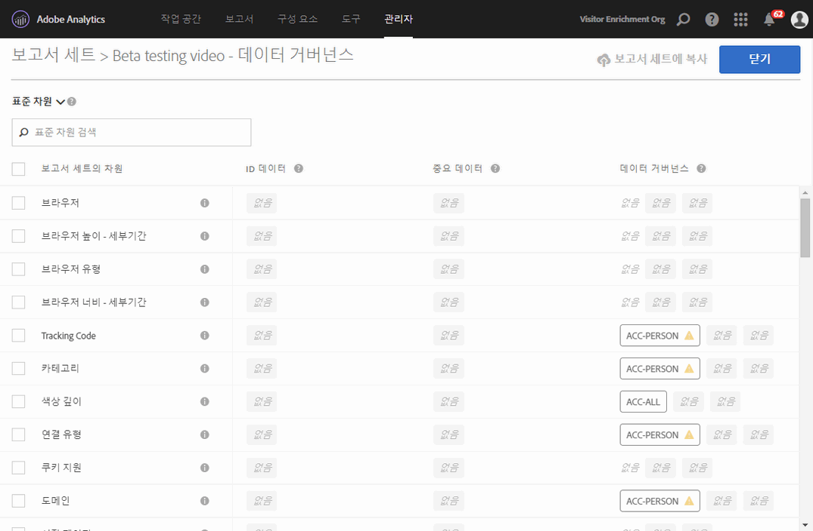
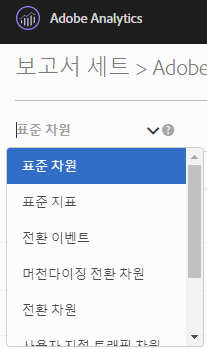
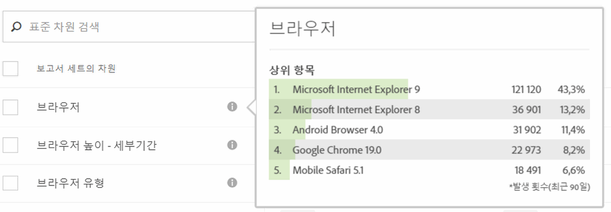
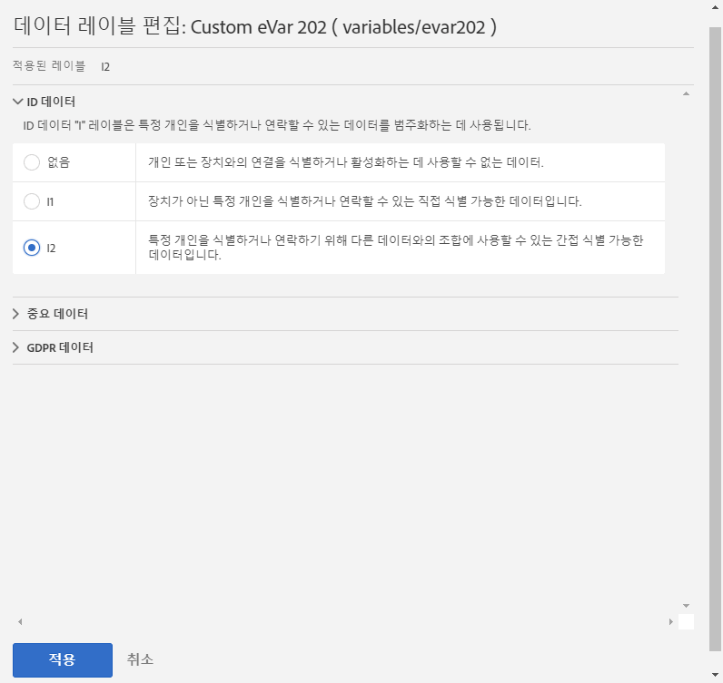
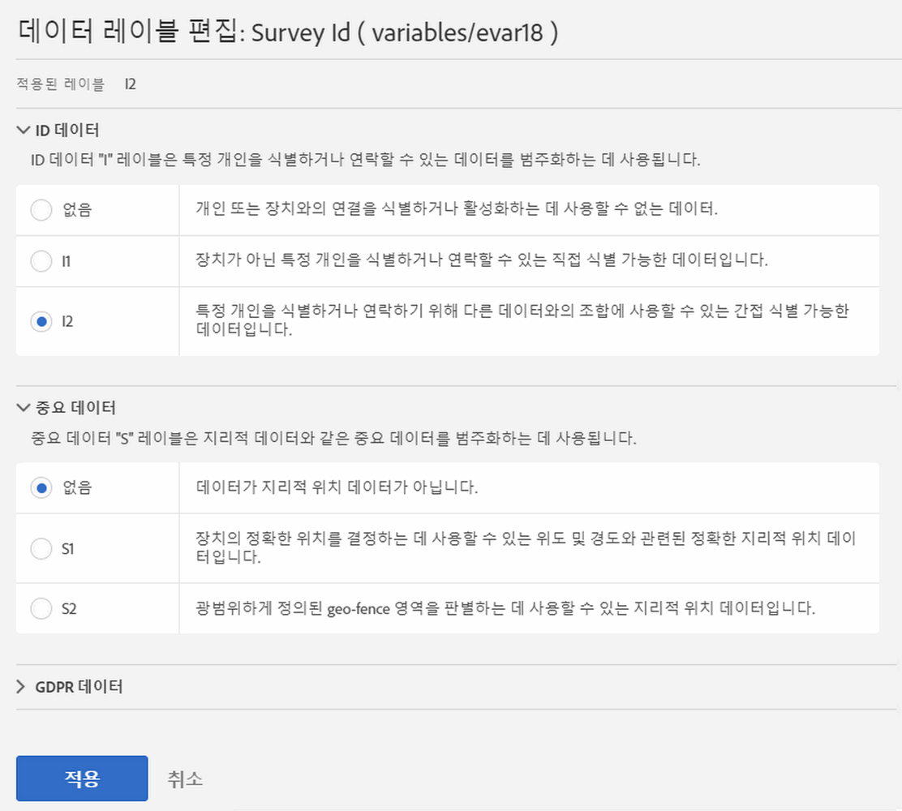
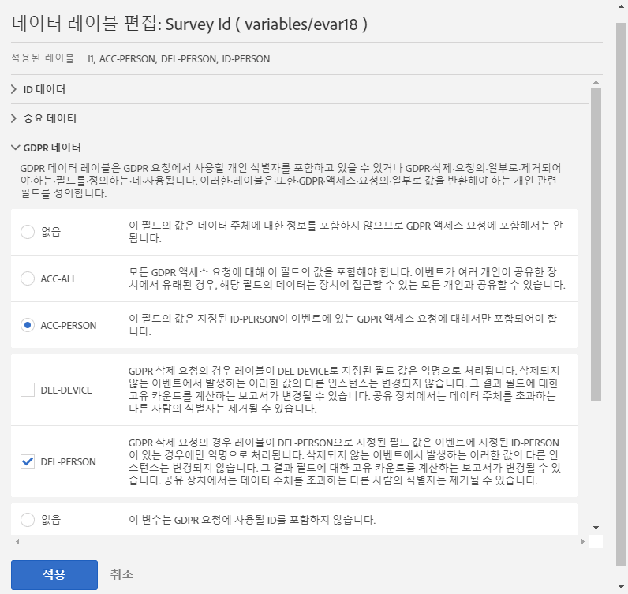
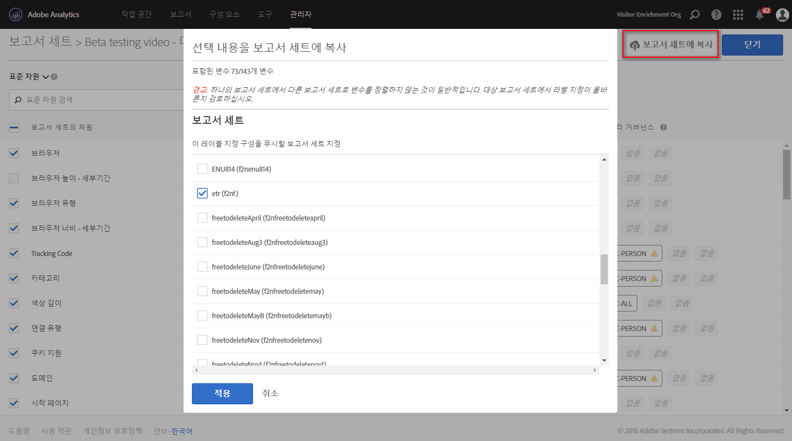

# 보고서 세트 데이터 레이블 지정

보고서 세트 데이터에 레이블을 지정하는 것은 지정된 보고서 세트의 각 변수에 ID, 감도 및 데이터 거버넌스 레이블을 지정하는 것을 의미합니다. 먼저 레이블 및 해당 정의를 숙지하십시오.

>[!NOTE]
>
>새 보고서 세트가 만들어질 때마다 또는 기존 보고서 세트 내에서 새 변수가 활성화될 때마다 레이블을 검토해야 한다는 점에 유의하십시오. 또한, 새로운 솔루션 통합이 활성화된 경우 레이블 지정이 필요할 수 있는 새로운 변수를 노출할 수 있으므로 레이블 지정을 검토해야 할 수 있습니다. 모바일 앱 또는 웹 사이트를 재구현하면 기존 변수가 사용되는 방식이 변경될 수 있으며, 이로 인해 레이블 업데이트가 필요할 수도 있습니다.

## 보고서 세트 레이블 지정 또는 편집 {#section_39F829F35A274EACA532E2F6FF392996}

**예**: 데이터 제어자는 해당 GDPR 요청을 처리하기 위해 데이터 주체의 이메일 주소와 쿠키 ID를 수집하도록 계획합니다. 이러한 쿠키 ID는 Adobe Analytics의 보고서 세트에 저장됩니다. 이메일 주소 및 쿠키 ID에 대한 레이블을 작성하려면 Analytics에서 Adobe Cloud Platform의 DULE(Data Usage Labeling &amp; Enforcement) 프레임워크를 사용해야 합니다.

1. In Analytics, navigate to **[!UICONTROL Admin]** &gt; **[!UICONTROL Data Governance]** &gt; **[!UICONTROL[select report suite].]** 

1. 레이블을 지정할 변수 그룹을 선택합니다.

   

   * **표준 차원**(Adobe Analytics의 기본 차원)
   * **표준 지표**(Adobe Analytics의 기본 지표)
   * **전환 이벤트**(사용자 지정 성공 이벤트)
   * **머천다이징 전환 차원**(머천다이징 eVars)
   * **전환 차원**(비머천다이징 eVar)
   * **사용자 지정 트래픽 차원**(props)
   * **솔루션 차원 및 이벤트**(모바일, 비디오, 활동 맵 등과 같은 솔루션과 관련된 차원/이벤트 및 Adobe Campaign, Adobe Experience Manager, Advertising Cloud 등과 같은 솔루션과의 통합)
   * **데이터 처리 차원**(Adobe Analytics UI를 통해 보고에 직접 표시되지는 않지만 데이터 피드 및/또는 데이터 웨어하우스 요청을 통해 사용할 수 있는 변수)

1. (선택 사항) 각 변수 옆에 있는 정보(i) 아이콘을 클릭하면 최근 90일 동안의 가장 일반적인 값을 더 잘 파악할 수 있습니다. (이 기능은 Analytics UI에서 사용할 수 없으므로 데이터 처리 차원에 사용할 수 없습니다.)

   

1. 확인란을 클릭하여 하나 이상의 변수를 선택한 다음 오른쪽에 있는 **[!UICONTROL 편집]아이콘을 선택하여 하나 이상의 변수를 편집합니다.**

   

1. **ID 데이터** 레이블 대화 상자가 자동으로 열립니다. 이러한 레이블은 자체적으로 사용하거나 다른 데이터와 함께 사용하여 개인을 식별하거나 개인과 직접 연락할 수 있는 데이터를 분류합니다. 이러한 옵션에 대한 자세한 내용은 [ID 데이터 레이블(DULE)](../../admin/c-data-governance/gdpr-labels.md#section_B2E78130957647338495EF37DE21D6BC)을 참조하십시오.

   >[!NOTE]
   >
   >DULE (Data Usage Labeling &amp; Enforcement) 프레임워크는 Adobe Experience Cloud에서 데이터에 대한 메타데이터를 캡처, 커뮤니케이션 및 사용할 수 있도록 솔루션/서비스/플랫폼에 통일된 방법을 제공하기 위해 고안되었습니다. 메타데이터를 통해 데이터 제어자는 개인 정보에 해당하는 데이터, 중요 데이터, 데이터와 연관된 계약 제한 사항을 나타낼 수 있습니다.

   

1. **중요 데이터** 섹션을 열고 지리적 위치 데이터를 분류하는 중요 데이터 레이블을 설정합니다. 이러한 옵션에 대한 자세한 내용은 [중요 데이터 레이블(DULE)](../../admin/c-data-governance/gdpr-labels.md#section_533E1406F3F24A01B51D94139B94CAEC)을 참조하십시오.

   

1. GDPR 데이터 섹션을 열어 **데이터 거버넌스** 레이블을 설정합니다. 이 섹션을 사용하여 GDPR 액세스 및 삭제 요청에 대해 각 변수를 처리하는 방법을 Adobe에 지시하고, 이러한 요청에 대한 데이터 주체 ID를 찾기 위해 스캔해야 하는 변수를 정의합니다. 이러한 옵션에 대한 자세한 내용은 [데이터 거버넌스 레이블(DULE)](../../admin/c-data-governance/gdpr-labels.md#section_0C7F9EC4BB414A6D915C69F1D3259F1B)을 참조하십시오.

   

1. 모든 레이블 지정을 완료한 후 **[!UICONTROL 적용]을 클릭합니다.**

## 보고서 세트에 레이블 복사{#section_7C6FDAFF049F4126B84F6261F72668EE} 

동일한 DULE/GDPR 설정을 둘 이상의 보고서 세트에 적용하려는 경우 다음 단계를 따를 수 있습니다.

1. 변수 그룹(표준 차원, 전환 차원 등)을 선택합니다. 복사하려는 변수가 포함되어 있습니다. 한 번에 하나의 변수 그룹에 대한 레이블만 복사할 수 있습니다.
1. 이 그룹에서 변수 중 일부 또는 전체를 선택합니다.
1. 데이터 거버넌스 대화 상자의 오른쪽 맨 위에 있는 **[!UICONTROL 보고서 세트에 레이블 복사를 클릭합니다.]**

   

1. **[!UICONTROL 모두 선택]을 선택하여 선택된 변수의 레이블을 모든 보고서 세트에 복사하거나 레이블을 복사할 개별 보고서 세트를 선택합니다.**

   >[!IMPORTANT]
   >
   >선택한 모든 보고서 세트를 Experience Cloud 조직에 매핑해야 합니다.

   변수 또는 변수 세트에 대한 레이블을 다른 보고서 세트에 복사하면 복사본이 대상 보고서 세트의 해당 위치에 있는 변수로 이동합니다. 표준 차원, 표준 지표, 솔루션 차원 및 이벤트, 데이터 처리 차원의 경우 레이블이 대상 보고서 세트에서 **동일한 이름**&#x200B;을 가진 변수에 복사됩니다.

   그러나 전환 변수(eVars), 머천다이징 전환 차원 및 사용자 지정 트래픽 차원(props)의 경우 대상 보고서 세트에서 **숫자가 같은** 변수에 복사됩니다. 예를 들어 eVar12는 모든 대상 보고서 세트의 eVar12에 복사됩니다. 이러한 변수의 이름은 복사본 대상을 판별할 때 무시됩니다. 해당 변수가 대상 보고서 세트에서 활성화되지 않은 경우 해당 변수에 대한 복사가 실패합니다.

   변수에 대해 정의된 분류 레이블을 복사할 때 대상 보고서 세트에서 복사하는 분류와 동일한 이름을 가진 해당 변수의 분류에 레이블이 복사됩니다. 그렇지 않으면 해당 분류 레이블에 대한 복사가 실패합니다.

   레이블 세트가 적용된 후 상태 메시지가 표시됩니다. 상태 메시지에는 복사가 실패한 대상 변수 또는 분류와 해당 보고서 세트의 이름이 포함됩니다.

   >[!IMPORTANT]
   >
   >레이블이 올바르게 복사되었는지 확인하려면 항상 대상 보고서 세트를 확인해야 합니다. 이는 ID 또는 DEL 레이블이 있는 변수에 특히 중요합니다.

1. **[!UICONTROL 적용을 클릭합니다]**.

