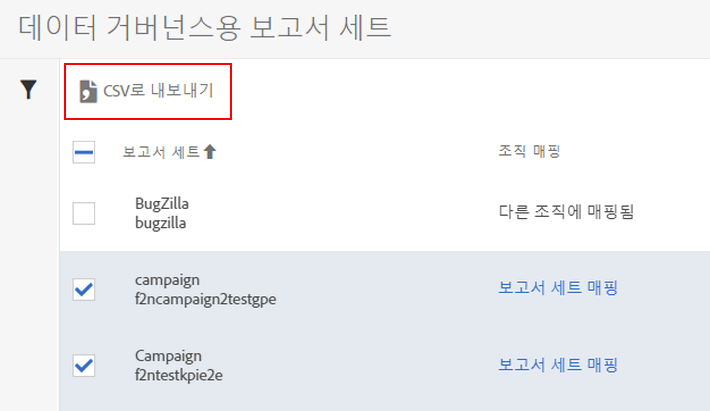

# 보고서 세트의 데이터 거버넌스 설정 보기/관리

관리 도구의 데이터 거버넌스 대화 상자는 데이터 거버넌스에 대해 구성된 보고서 세트, 해당 보고서 세트가 Experience Cloud 조직에 매핑되었는지 여부 및 데이터 보존 정책이 이 보고서 세트에 적용되어 있는지 여부에 대한 개요를 제공합니다.

1. Adobe Experience Cloud에 로그인합니다.
1. **[!UICONTROL Analytics]** &gt; **[!UICONTROL 관리]** &gt; **[!UICONTROL 데이터 거버넌스]**&#x200B;로 이동합니다.

   로그인 회사의 일부인 모든 보고서 세트가 표시됩니다.

   

<table id="table_448292730FF0475E9DCB731882F9A29B"> 
 <thead> 
  <tr> 
   <th colname="col1" class="entry"> 설정 </th> 
   <th colname="col2" class="entry"> 설명 </th> 
  </tr> 
 </thead>
 <tbody> 
  <tr> 
   <td colname="col1"> 
보고서 세트 
 </td> 
   <td colname="col2"> 
첫 번째 줄에는 친숙한 보고서 세트 이름이 나열됩니다. 두 번째 줄에는 보고서 세트의 내부 이름이 있습니다. 보고서 세트에 대한 레이블을 지정할 수 있는 경우 첫 번째 줄은 레이블 지정 페이지로 이동하는 클릭 가능한 링크가 됩니다. 
 </td> 
  </tr> 
  <tr> 
   <td colname="col1"> 
조직 매핑 
 </td> 
   <td colname="col2"> 
    <ul id="ul_EF8F613B0C5E42D19DB60BD0C89C114B"> 
     <li id="li_B35EE88555F547EFBF55ADE9D0C9EC3B"><b>매핑됨</b>: 이 보고서 세트는 로그인한 Analytics 로그인 회사와 동일한 Experience Cloud 조직에 이미 매핑되었습니다. 이 설정이 있는 보고서 세트만 레이블을 지정할 수 있습니다. </li> 
     <li id="li_4E800BF80CFF477BAA091EF272D9071C"><b>보고서 세트 매핑</b>: 이 링크를 클릭하면 Experience Cloud 조직에 <a href="https://marketing.adobe.com/resources/help/en_US/mcloud/report-suite-mapping.html">보고서 세트를 매핑</a>할 수 있습니다. 
즉, 사용자가 보고서 세트를 찾고 이를 해당 조직에 지정해야 하는 Experience Cloud 조직 - 보고서 세트 매핑 관리 페이지로 리디렉션됩니다. 완료되면 이 데이터 거버넌스 UI로 다시 이동됩니다. 
 </li> 
     <li id="li_FF825A65D089487BBF5FCB0D74D41CD7"></b>다른 조직에 매핑됨<b>: 다른 Experience Cloud 조직이 이 보고서 세트를 해당 조직에 이미 매핑했습니다. </b></li> 
    </ul> </td> 
  </tr> 
  <tr> 
   <td colname="col1"> 
데이터 보존 정책 
 </td> 
   <td colname="col2"> 
Analytics 데이터 개인 정보 보호 구현을 위해서는 데이터 보존 정책이 적용되어 있어야 합니다. 
 
이 설정은 다음 사항을 표시합니다. 
 
    <ul> 
     <li>이 보고서 세트에 대한 데이터 보존 정책이 적용됩니다. </li> 
     <li>Adobe가 데이터를 삭제하기 전에 데이터를 보존하는 시간입니다. 기본 데이터 보존 기간은 25개월입니다. </li> 
    </ul> 
참고: 데이터 보존 기간이 설정되지 않은 경우 Adobe Analytics에서 데이터 개인 정보 보호 API에 대한 요청 처리, 즉 최종 사용자로부터 받은 액세스 또는 삭제 요청 처리를 지원할 수 없습니다. 데이터 보존 기간을 설정하려면 Customer Success Manager에 문의하십시오. 
 </td> 
  </tr> 
  <tr> 
   <td colname="col1"> 
그룹 
 </td> 
   <td colname="col2"> 
그룹화 기능은 현재 구현되지 않았습니다. 
 </td> 
  </tr> 
  <tr> 
   <td colname="col1"> 
왼쪽 사이드바 
 </td> 
   <td colname="col2"> 
깔때기 아이콘을 클릭하여 사이드바를 열거나 닫습니다. 
 
조직 매핑 섹션에는 설명된 각 카테고리에 속하는 보고서 세트 수가 표시됩니다. 
 
데이터 보존 정책 섹션에는 조직에 대해 현재 적용된 고유한 각 데이터 보존 정책과 해당 보존 정책에 지정된 보고서 세트 수가 표시됩니다. 
 </td> 
  </tr> 
  <tr> 
   <td colname="col1"> 
CSV로 내보내기 
 </td> 
   <td colname="col2"> 
하나 이상의 보고서 세트 옆 확인란에 표시를 하면 CSV로 내보내기 옵션이 표시됩니다. 이 옵션을 사용하면 선택한 모든 보고서 세트의 모든 변수에 대한 현재 레이블 정의가 모두 들어 있는 CSV 파일을 다운로드할 수 있습니다. 
 
해당 법률 팀에서 레이블 지정 선택 사항을 검토하는 것이 좋으며, 이 옵션을 사용하면 이러한 검토가 용이해집니다. 데이터 거버넌스 UI에 로그인하는 동안 검토를 수행할 필요 없이 .CSV 파일을 공유할 수 있습니다. 
 
 
 </td> 
  </tr> 
 </tbody> 
</table>

