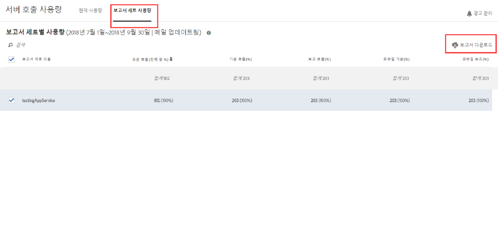
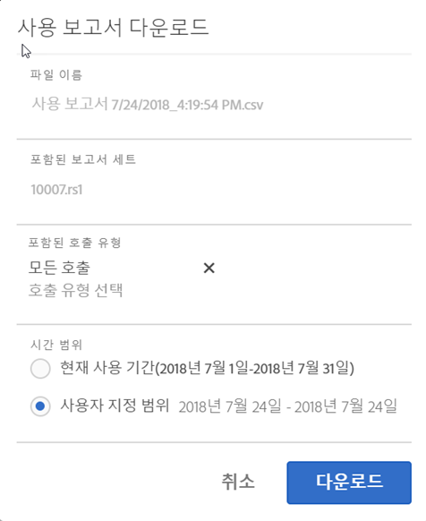

# 보고서 세트 사용량 보기

보고서 세트 사용량 탭은 현재 사용 기간 동안 청구 회사에 연결된 모든 로그인 회사의 각 보고서 세트에 서버 사용량 데이터를 제공합니다.

**[!UICONTROL Analytics]** &gt; **[!UICONTROL 관리]** &gt; **[!UICONTROL 서버 호출 사용량]** &gt; **[!UICONTROL 보고서 세트 사용량]**

>[!IMPORTANT]
>
>If a report suite is not [linked to an Experience Cloud Organization](https://marketing.adobe.com/resources/help/en_US/mcloud/report-suite-mapping.html), its usage data will not be reflected in this dashboard. 또한 청구 ID는 Experience Cloud Orgs에 연결될 수 있습니다. 조직과 청구 ID 간의 관계가 항상 1:1인 것은 아닙니다.

보고서 세트 사용량 대시보드

* Experience Cloud 조직의 각 보고서 세트에 대한 현재 사용 기간의 서버 호출 사용량(모든 호출, 기본, 보조, 모바일 기본, 모바일 보조)을 표시합니다.
* 서버 호출 범주별 전체 사용량의 백분율을 표시합니다.
* 매일 업데이트됩니다.
* 다운로드 가능합니다.
* **[!UICONTROL 경고 관리]UI에 액세스할 수 있습니다.**

| 열 | 정의 |
|--- |--- |
| 보고서 세트 이름 | 보고서 세트의 친숙한 이름 |
| 모든 호출 수(총 수의 %) | 현재 사용 기간에 발생한 모든 서버 호출 수입니다. |
| 기본 호출 수(%) | 현재 사용 기간에 발생한 모든 기본 서버 호출 수(및 합계의 백분율)입니다. |
| 보조 호출 수(%) | 현재 사용 기간에 발생한 모든 보조 서버 호출 수(및 합계의 백분율)입니다. |
| 모바일 기본 호출 수(%) | 현재 사용 기간에 발생한 모든 모바일 기본 서버 호출 수(및 합계의 백분율)입니다. |
| 모바일 보조 호출 수(%) | 현재 사용 기간에 발생한 모든 모바일 보조 서버 호출 수(및 합계의 백분율)입니다. |

## 사용량 보고서 다운로드 {#section_D7345660B5E043CD8850954216509A3D}

이 옵션을 사용하면 현재 사용량 데이터 및 현재 사용 기간 이전까지의 데이터(2015년 1월 1일부터)를 다운로드할 수 있습니다. 보고서는 .csv 파일로 다운로드됩니다.

1. 하나 이상의 보고서 세트를 선택합니다.
1. **[!UICONTROL 보고서 다운로드를 클릭합니다]**.

   

| 보고서 요소 | 설명 |
|--- |--- |
| 파일 이름 | Hardcoded name: Usage Report `day and time of report creation.csv` |
| 포함된 보고서 세트 | 보고서 서버 사용량 페이지에서 선택한 모든 보고서 세트는 이 목록에 포함됩니다. |
| 포함된 호출 유형 | 모든 호출(기본값), 기본, 보조, 모바일 기본, 모바일 보조의 조합을 지정합니다. |
| 시간 범위 | 현재 사용 기간을 선택하거나 사용자 지정 범위를 선택할 수 있습니다.  사용자 지정 범위에 대해 범위 시작 및 범위 종료를 지정합니다.  **참고:** 2015 년 1 월 이전에는 사용 데이터를 다운로드할  수 없습니다. |

1. ****&#x200B;다운로드를 클릭합니다.

다운로드한. csv 파일의 모습을 스크린샷으로 보여줍니다. 보고서 세트 ID에 대한 열이 포함되어 있습니다. 보고서 세트 ID는 영숫자 문자만 포함할 수 있는 고유 ID를 지정합니다. 보고서 세트를 만든 후에는 이 ID를 변경할 수 없습니다.

