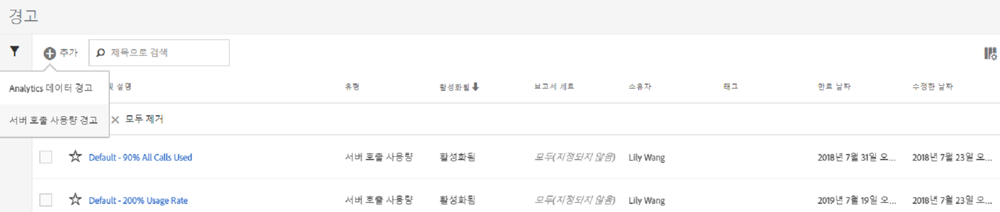
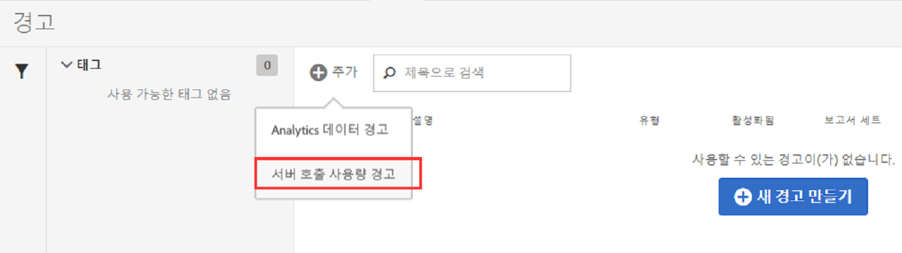
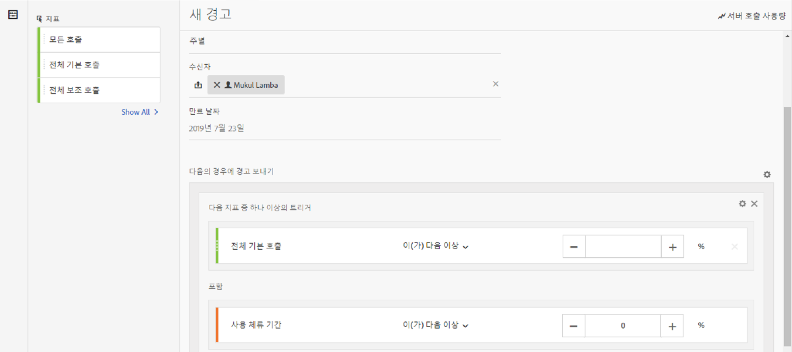
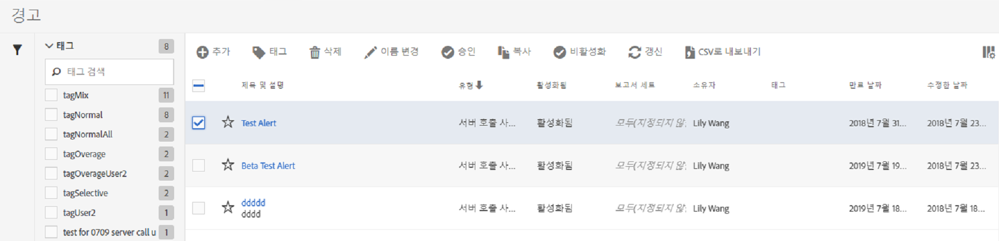

# 서버 호출 사용량 경고

경고를 설정하면 청구 회사의 모든 로그인 회사에 있는 모든 보고서 세트에 적용됩니다.

## 개요

**[!UICONTROL 서버 호출 사용량 경고라는]** 새 경고 카테고리는 기존 [경고 관리](https://marketing.adobe.com/resources/help/en_US/analytics/analysis-workspace/intellligent_alerts.html) 사용자 인터페이스의 일부입니다.

It is pre-populated with **1 default alert** that appears within any login company that has access to the Server Call Usage feature. 이 경고는 다음 조건 중 하나가 만족되는 경우 모든 로그인 회사의 관리자에게 해결된 알림을 트리거합니다.

* 귀사에 부여된 서버 호출 유형에 대해 100%"보다 크거나 같은" "모든" 서버 호출 사용량 또는
* 귀사에 부여된 서버 호출 유형에 대해 90%"보다 크거나 같은" "모든" 서버 호출 사용량 또는
* 귀사에 부여된 서버 호출 유형에 대해 75%"보다 크거나 같은" "모든" 서버 호출 사용량 및 "소비된 사용 기간"이 사용 기간의 75%"보다 작거나 같음"

다음 두 가지 방법으로 서버 호출 사용량 경고에 액세스할 수 있습니다.

* 현재 사용량 탭 또는 보고서 세트 사용량 탭의 오른쪽 상단 모서리에 있는 **[!UICONTROL 경고 관리]를 클릭하거나**
* Navigate to **[!UICONTROL Components]** &gt; **[!UICONTROL Alerts]** in Adobe Analytics.

## 서버 호출 사용량 경고 작성 {#section_2A2882C6D48D47C1944D52FB7C766BEC}

추가 경고를 작성하려면 다음을 수행하십시오.

1. **[!UICONTROL + 추가를]** 클릭하고 **[!UICONTROL 서버 호출 사용량 경고를 선택합니다]**.

   

1. 경고를 정의합니다.

   

   * **title**: 수사적 이름을 지정합니다. 이름 없이 경고를 저장할 수 없습니다.
   * **시간 세부기간**: 경고가 선택되는 빈도를 나타냅니다. *현재 주별 세분기간만 지원합니다.* 즉, 경고가 주별로 확인되며, 현재 사용 기간에서 데이터를 다시 확인함을 의미합니다.
   * **받는**&#x200B;사람: 경고에서 지정된 임계값을 트리거할 때 이메일을 받아야 하는 조직의 모든 사람을 지정합니다.
   * **만료 날짜**: 기본적으로 만료 날짜는 경고 작성 날짜로부터 1 년입니다.
   * **다음의 경우에 경고 보내기**:

      * 이러한 지표 트리거는
서버 호출/s 유형을 지표로 추가하고, 수정자 및 임계값을 선택하여 경고 임계값을 지정합니다.
         * 위 또는 같음
         * 아래 또는 같음
      * With
specify the threshold and condition (is above or equals or is are or equals or equals or equals) used period spent.

1. **[!UICONTROL 저장을 클릭합니다]**.

## 서버 호출 사용량 경고 관리 {#section_8FF98170763C4B5CBEC6DD43F893177A}

경고를 관리하려면 다음을 수행하십시오.

1. 한 개 이상의 경고 옆에 있는 확인란을 선택합니다. 경고 관리 작업 맨 위에 표시됩니다.
1. 다음 작업을 한 개 이상 완료합니다.

   | Action | 정의 |
   |--- |--- |
   | + 추가 | [+ 추가](../../admin/c-server-call-usage/scu-alerts.md)를 클릭하여 [!UICONTROL 경고 빌더]에 액세스합니다. |
   | 태그 | 경고를 쉽게 사용할 수 있도록 구성하기 위해 태그를 지정합니다. |
   | 삭제 | 기본 경고를 제외한 모든 경고를 삭제할 수 있습니다. |
   | 이름 변경 | 기본 경고를 제외한 모든 경고의 이름을 바꿀 수 있습니다. |
   | 승인 | 경고를 승인하여 "공식적"으로 만듭니다. |
   | 활성화/비활성화 | 기본 경고를 포함하여 모든 경고를 활성화하거나 비활성화할 수 있습니다. |
   | 갱신 | 한 개 이상의 경고를 선택한 경우 갱신할 수 있습니다. 이렇게 하면 원래 만료 날짜와 상관없이 [!UICONTROL 갱신]을 클릭한 날로부터 1년으로 만료 날짜가 연장됩니다. |
   | CSV로 내보내기 | [사용량 보고서 다운로드](../../admin/c-server-call-usage/report-suite-usage.md)를 참조하십시오. |

