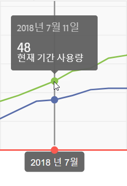
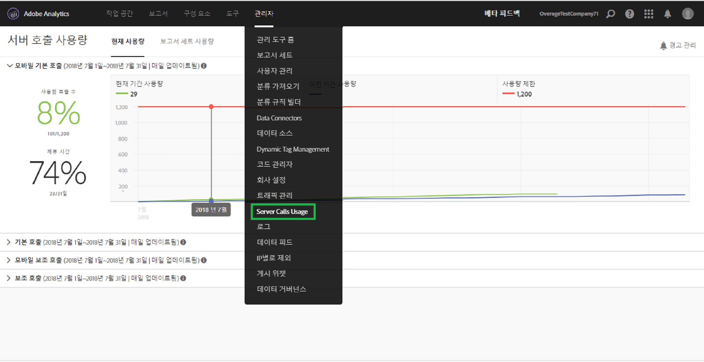

# 현재 서버 호출 사용 보기

**[!UICONTROL Analytics]** &gt; **[!UICONTROL 관리]** &gt; **[!UICONTROL 서버 호출 사용량]** &gt; **[!UICONTROL 현재 사용량]**

>[!IMPORTANT]
>
>표시되는 사용 및 약정 번호는 모든 로그인 회사 및 보고서 세트에서 누적됩니다.

현재 사용량 대시보드

* 각 서버 호출 유형에 대한 서버 호출 사용량 및 약정 분류를 표시합니다. 이 보기는 고객마다 다를 수 있으며 계약에 포함된 것과 일치합니다. 예를 들어 4개의 별도 서버 호출 유형(웹 기본 및 보조와 모바일 기본 및 보조)에 등록했을 수 있습니다. 이 경우 이 보기는 4개의 탭(각 유형에 대해 한 개 탭)으로 구성됩니다. 각 탭에서 현재 사용 기간에 대한 사용량을 볼 수 있습니다.
* 현재 사용량(녹색 선)과 계약상 사용량 한도(빨간색 선)를 비교합니다.

   

* 현재 기간의 사용량과 작년의 사용량(파란색 선)을 비교합니다. 확실히 회사에 이전 연도의 서버 호출 사용량 데이터가 있는 경우에만 파란색 선이 나타납니다.

   >[!NOTE]
   >
   >If you want to view usage for a previous time period, you have to go to the [Report Suite Usage](../../admin/c-server-call-usage/report-suite-usage.md#concept_E50FA5BD93404EB8B2FE954F658FDAFD) tab and download the usage data for a previous period.

* 사용된 호출 수의 백분율(백분율 및 원시 데이터)과 소비된 사용 기간의 백분율(백분율 및 원시 데이터)을 나열합니다.
* 기본적으로 5일 처리 지연으로 매일 업데이트됩니다.
* 모든 리포트릿을 축소하고 확장할 수 있습니다.

| UI 용어 | 정의 |
|---|---|
| 현재 기간 사용량(녹색) | 현재 기간은 [사용 기간](../../admin/c-server-call-usage/overage-overview.md#section_CBA348A039F34563B097CD8890AB358D)을 기반으로 합니다. |
| 이전 기간 사용량(파란색) | 이전 기간은 현재 사용 기간에서 1년을 뺀 기간으로 정의됩니다. |
| 사용량 한도(빨간색) | 이 사용 기간에 대한 계약상 사용량 한도입니다. |

