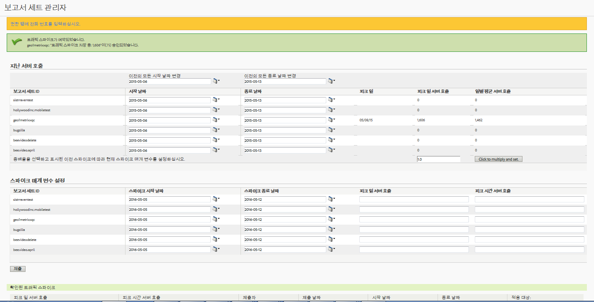

# 지난 서버 호출 예측 및 트래픽 스파이크 예약

작년 특정 기간 동안의 일별 서버 호출 평균과 올해 예상되는 서버 호출량 증가 볼륨을 가져올 수 있습니다. 그런 다음 이 곱하기 인자를 기반으로 하여 트래픽 스파이크를 예약할 수 있습니다.

1. Log in to Analytics as an Admin and go to **[!UICONTROL Admin]** &gt; **[!UICONTROL Traffic Management]**.

1. **[!UICONTROL 확장]**&#x200B;을 클릭하여 보고서 세트 목록을 확장하고 **보고서 세트 선택[!UICONTROL 을 클릭하여 여러 보고서 세트를 선택합니다.]**

1. **[!UICONTROL 스파이크 예약을 클릭합니다]**.
1. Under **[!UICONTROL Past Server Calls]**, select a start and end date for the selected report suites.

   피크 일, 피크 일 서버 호출 및 일별 평균 서버 호출에 대한 크기가 생성됩니다.

1. 곱하기 인자에 대한 값을 입력하고 **[!UICONTROL 클릭하여 곱하기 및 설정을 클릭합니다]**.

   각 보고서 세트에 대해 각 열에 대한 값을 곱합니다.

1. Under **[!UICONTROL Set Spike Parameters]**, submit the spike parameters for the selected report suites.

   이제 선택한 각 보고서 세트에 대한 스파이크가 예약됩니다.

