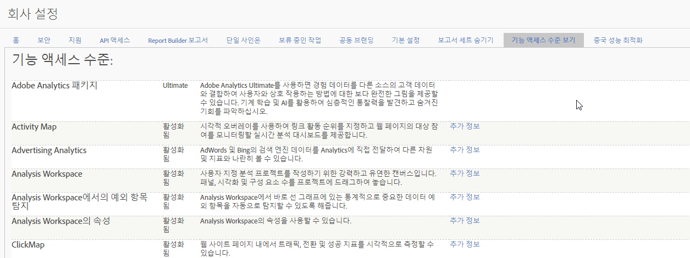

# 기능 액세스 수준

**[!UICONTROL 관리]** &gt; **[!UICONTROL 회사 설정]** &gt; **[!UICONTROL 기능 액세스 수준 보기]**

이 설정 그룹을 사용하면 회사에서 사용할 수 있는 Adobe Analytics 기능에 대한 액세스 수준을 볼 수 있습니다. 일부 기능은 [Adobe Analytics Ultimate](https://www.adobe.com/data-analytics-cloud/analytics/ultimate.html)와 같은 고급 제품 SKU에서만 사용할 수 있습니다.

