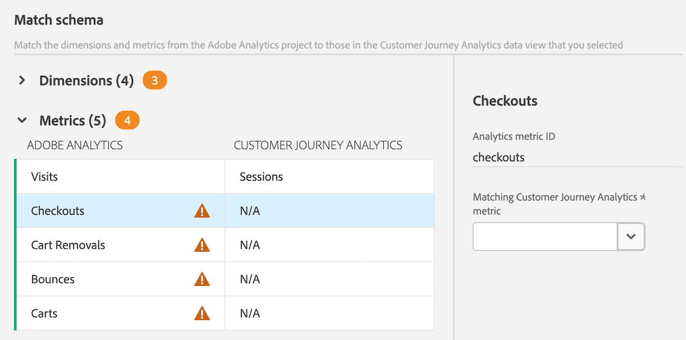

# Adobe Analytics에서 Customer Journey Analytics으로 구성 요소 및 프로젝트 마이그레이션

Adobe Analytics 관리자는 Adobe Analytics 프로젝트 및 관련 구성 요소를 Customer Journey Analytics로 마이그레이션할 수 있습니다.

마이그레이션 프로세스에 포함된 사항:

* Customer Journey Analytics에서 Adobe Analytics 프로젝트를 다시 생성합니다.

* Adobe Analytics 보고서 세트의 차원 및 지표를 Customer Journey Analytics 데이터 보기의 차원 및 지표에 매핑합니다.

  일부 차원 및 지표는 자동으로 매핑되며, 다른 차원은 마이그레이션 프로세스의 일부로 수동으로 매핑해야 합니다. 세그먼트도 마이그레이션되지만 마이그레이션 프로세스의 일부로 매핑할 필요는 없습니다.

  마이그레이션이 완료되면 마이그레이션된 모든 구성 요소가 마이그레이션 요약에 표시됩니다.

>[!NOTE]
>
>이 페이지의 정보에서는 사용자 인터페이스로 프로젝트 및 관련 구성 요소를 마이그레이션하는 방법을 설명합니다.
>
>또는 API를 사용하여 마이그레이션을 수행할 수 있습니다. 자세한 내용은 [Adobe Analytics API](https://adobedocs.github.io/analytics-2.0-apis/?urls.primaryName=Analytics%202.0%20APIs)를 참조하십시오. **[!UICONTROL 정의 선택]** 드롭다운 메뉴에서 모든 API 정의를 사용할 수 있습니다.

## 마이그레이션 준비

프로젝트를 Customer Journey Analytics으로 마이그레이션하기 전에 [Adobe Analytics에서 Customer Journey Analytics으로 구성 요소 및 프로젝트 마이그레이션 준비](/help/admin/tools/component-migration/prepare-component-migration.md)에서 프로젝트 마이그레이션에 대해 자세히 알아보세요.

또한 Analytics 관리자가 사용할 수 있는 도구를 사용하여 [Adobe Analytics 인벤토리](/help/admin/tools/analytics-inventory.md)를 실행하십시오.

## Adobe Analytics 프로젝트를 Customer Journey Analytics으로 마이그레이션

>[!NOTE]
>
>이 섹션에 설명된 대로 프로젝트를 Customer Journey Analytics으로 마이그레이션하기 전에 [구성 요소와 프로젝트를 Adobe Analytics에서 Customer Journey Analytics으로 마이그레이션 준비](/help/admin/tools/component-migration/prepare-component-migration.md)에서 프로젝트 마이그레이션에 대해 자세히 알아보십시오.
>
>**매핑하는 모든 차원 또는 지표는 마이그레이션을 수행하는 사용자에 관계없이 전체 IMS 조직의 향후 프로젝트와 모든 프로젝트에 적용됩니다. 향후 프로젝트를 마이그레이션할 때 이러한 매핑을 업데이트할 수 있습니다.**

1. Adobe Analytics에서 [!UICONTROL **관리**] 탭을 선택한 다음 [!UICONTROL **모든 관리자**]&#x200B;를 선택합니다.

1. [!UICONTROL **데이터 구성 및 수집**]&#x200B;에서 [!UICONTROL **구성 요소 마이그레이션**]&#x200B;을 선택합니다.

1. 마이그레이션할 각 프로젝트를 찾습니다. 프로젝트 목록을 필터링, 정렬 또는 검색할 수 있습니다.

   기본적으로 사용자와 공유되는 프로젝트만 표시됩니다. 조직의 모든 프로젝트를 보려면 **필터** 아이콘을 선택한 다음 [!UICONTROL **기타 필터**]&#x200B;를 확장하고 [!UICONTROL **모두 표시**]&#x200B;를 선택하십시오. 프로젝트 목록 필터링, 정렬 및 검색에 대한 자세한 내용은 [프로젝트 목록 필터링, 정렬 및 검색](#filter-sort-and-search-the-list-of-projects)을 참조하십시오.

1. (조건부) 여러 프로젝트를 한 번에 마이그레이션하려면 마이그레이션할 각 프로젝트의 왼쪽에 있는 확인란을 선택한 다음 [!UICONTROL **Customer Journey Analytics으로 마이그레이션**]&#x200B;을 선택합니다.

   여러 프로젝트를 마이그레이션할 때 다음 사항을 고려하십시오.

   * 한 번에 마이그레이션할 프로젝트를 최대 20개까지 선택할 수 있습니다.

   * 마이그레이션 상태는 마이그레이션하는 모든 프로젝트에 대해 동일해야 합니다.

     예를 들어 마이그레이션 상태가 **[!UICONTROL 시작되지 않음]**&#x200B;인 프로젝트 중 하나를 마이그레이션하도록 선택하면 마이그레이션 상태가 **[!UICONTROL 실패]**&#x200B;인 다른 프로젝트를 선택할 수 없습니다.

   * 마이그레이션하는 모든 프로젝트에 대해 동일한 프로젝트 소유자를 지정해야 합니다.

   * 차원 및 지표는 마이그레이션하는 모든 프로젝트에 대해 동일한 데이터 보기에 매핑되어야 합니다.

   [!UICONTROL **project_name을 Customer Journey Analytics으로 마이그레이션**] 대화 상자가 표시됩니다.

   <!-- add screenshot -->

1. (조건부) 단일 프로젝트를 마이그레이션하려면 마이그레이션할 프로젝트 위로 마우스를 가져간 다음 **마이그레이션** 아이콘 을 선택합니다.

   [!UICONTROL **project_name을 Customer Journey Analytics으로 마이그레이션**] 대화 상자가 표시됩니다.

   <!-- add screenshot -->

1. [!UICONTROL **프로젝트 소유자**] 필드에서 Customer Journey Analytics에서 마이그레이션되는 프로젝트의 소유자로 설정할 사용자의 이름을 입력한 다음 드롭다운 메뉴에서 이름을 선택합니다.

   지정한 소유자는 마이그레이션된 프로젝트에 대한 모든 관리 권한을 가집니다. 소유자는 Customer Journey Analytics의 관리자여야 합니다. 이후 단계에서 프로젝트의 소유권을 변경할 수 있습니다.

1. [!UICONTROL **보고서 세트에 대한 맵 스키마**] 섹션에서 보고서 세트를 선택합니다.

1. [!UICONTROL **데이터 보기**] 드롭다운 메뉴에서 프로젝트 및 구성 요소를 마이그레이션할 Customer Journey Analytics 데이터 보기를 선택합니다.

   여러 프로젝트를 마이그레이션하는 경우 마이그레이션하는 모든 프로젝트가 단일 데이터 보기 매핑으로 결합됩니다.

1. [!UICONTROL **맵 스키마**]&#x200B;을(를) 선택하십시오.

1. [!UICONTROL **맵 스키마**] 섹션에서 [!UICONTROL **차원**] 및 [!UICONTROL **지표**] 섹션을 확장합니다.

   Adobe Analytics의 일부 차원 및 지표는 Customer Journey Analytics의 차원 또는 지표에 자동으로 매핑됩니다. 다른 도메인은 수동으로 매핑해야 합니다.

   **자동으로 차원 및 지표 매핑**

   >[!NOTE]
   >
   >   WebSDK를 사용하여 데이터를 Adobe Experience Platform으로 수집한 경우 차원 및 지표를 자동으로 매핑할 수 없습니다. 자세한 내용은 [Adobe Analytics에서 Customer Journey Analytics으로 구성 요소 및 프로젝트 마이그레이션 준비](/help/admin/tools/component-migration/prepare-component-migration.md#prerequisites)의 [필수 구성 요소](/help/admin/tools/component-migration/prepare-component-migration.md)를 참조하십시오.

   Adobe Analytics의 일부 차원 및 지표는 Customer Journey Analytics의 차원 또는 지표에 자동으로 매핑됩니다. 이러한 차원 및 지표에 대해 매핑 결정을 내릴 수 없습니다.

   예를 들어 Adobe Analytics의 **방문 횟수** 지표는 Customer Journey Analytics의 **세션** 지표와 자동으로 매핑됩니다.

   차원 또는 지표를 선택하여 연결된 ID를 볼 수 있습니다.

   <!-- update screenshot after I can see the Status column -->

   

   **수동으로 차원 및 지표 매핑**

   Adobe Analytics의 일부 차원 및 지표는 Customer Journey Analytics의 차원 또는 지표에 자동으로 매핑될 수 없습니다.

   차원 또는 지표를 자동으로 매핑할 수 없는 경우 [!UICONTROL **차원**] 또는 [!UICONTROL **지표**] 섹션 머리글 옆에 수동으로 매핑해야 하는 차원 또는 지표의 수를 나타내는 주황색 카운터가 표시됩니다. 표에서 수동으로 매핑해야 하는 각 차원 또는 지표 옆에 경고 아이콘 이 표시됩니다.

   또한 [!UICONTROL **Status**] 열에 [!UICONTROL **매핑되지 않음**]&#x200B;이 표시됩니다.

   <!-- update screenshot after I can see the Status column -->

   

1. 차원 및 지표를 수동으로 매핑하려면 경고 아이콘 이 포함된 차원 또는 지표를 선택한 다음 [!UICONTROL **매핑된 Customer Journey Analytics 지표**] 필드(차원을 매핑하는 경우 [!UICONTROL **매핑된 Customer Journey Analytics 차원**] 필드)에서 선택한 차원 또는 지표에 매핑할 Customer Journey Analytics의 차원 또는 지표를 선택합니다.

   

   차원 또는 지표가 매핑되면 경고 아이콘이 사라지고 [!UICONTROL **상태**] 열이 녹색 점이 있는 [!UICONTROL **매핑됨**] (으)로 변경됩니다. (회색 점이 있는 [!UICONTROL **매핑됨**] 상태는 차원 또는 지표가 이전 마이그레이션 중에 매핑되었음을 나타냅니다. 이전 매핑은 업데이트할 수 없습니다.)

   경고 아이콘이 포함된 각 차원 또는 지표에 대해 이 프로세스를 반복합니다.

   Adobe Analytics 보고서 세트의 모든 차원과 지표가 Customer Journey Analytics 보고서 세트의 차원 또는 지표에 매핑되면  섹션의 보고서 세트 이름 옆에 녹색 확인 표시 [!UICONTROL **확인 표시**]&#x200B;가 나타납니다.

1. (조건부) 마이그레이션하는 프로젝트에 둘 이상의 보고서 세트가 포함되어 있는 경우 [!UICONTROL **보고서 세트에 대한 스키마 매핑**] 섹션에서 다른 보고서 세트를 선택한 다음 6단계부터 10단계까지 반복합니다. <!-- double-check that the step numbers are still correct -->

1. [!UICONTROL **마이그레이션**]&#x200B;을 선택합니다.

   >[!WARNING]
   >
   >[!UICONTROL **마이그레이션**]&#x200B;을 선택하면 화면에 경고 메시지가 표시됩니다. 계속하기 전에 매핑하는 차원 또는 지표가 마이그레이션을 수행하는 사용자에 관계없이 전체 IMS 조직에서 향후 모든 프로젝트 및 이 프로젝트에 적용됨을 이해하십시오. 향후 프로젝트를 마이그레이션할 때 이러한 매핑을 업데이트할 수 있습니다.

   마이그레이션이 완료되면 [!UICONTROL **마이그레이션 상태**] 페이지에서 마이그레이션된 항목에 대한 요약을 제공합니다.

   마이그레이션이 실패하면 아래의 [실패한 마이그레이션 다시 시도](#retry-a-failed-migration) 섹션을 참조하십시오.

1. (선택 사항) 프로젝트가 마이그레이션되면 Customer Journey Analytics의 모든 사용자에게 프로젝트의 소유권을 전송할 수 있습니다. 자세한 내용은 Customer Journey Analytics 안내서의 [자산 전송](https://experienceleague.adobe.com/ko/docs/analytics-platform/using/tools/asset-transfer/transfer-assets)을 참조하십시오.

## 실패한 마이그레이션 다시 시도

마이그레이션이 실패하면 마이그레이션을 다시 시도할 수 있습니다.

실패한 마이그레이션을 다시 시도하기 전에 프로젝트에서 [지원되지 않는 요소](/help/admin/tools/component-migration/prepare-component-migration.md#understand-unsupported-elements-that-cause-errors)를 제거하십시오.

>[!NOTE]
>
>마이그레이션을 다시 시도한 후에도 계속 실패하는 경우 프로젝트 ID를 사용하여 고객 지원 센터에 문의하십시오. 프로젝트 ID는 마이그레이션 상태 페이지에서 찾을 수 있습니다. <!-- when does this page display? How can they get there -->

실패한 마이그레이션을 다시 시도하려면 다음 작업을 수행하십시오.

1. Adobe Analytics에서 [!UICONTROL **관리**] 탭을 선택한 다음 [!UICONTROL **모든 관리자**]&#x200B;를 선택합니다.

1. [!UICONTROL **데이터 구성 및 수집**]&#x200B;에서 [!UICONTROL **구성 요소 마이그레이션**]&#x200B;을 선택합니다.

1. 다시 시도할 프로젝트 옆에 있는 [!UICONTROL **마이그레이션 상태**] 열에서 [!UICONTROL **실패**]&#x200B;를 선택합니다.

   

   [!UICONTROL **마이그레이션 상태**] 페이지가 표시됩니다.

   또한 위의 [Adobe Analytics 프로젝트를 Customer Journey Analytics으로 마이그레이션](#migrate-adobe-analytics-projects-to-customer-journey-analytics) 섹션에 설명된 마이그레이션 단계를 완료한 직후에 이 페이지가 표시됩니다.

1. [!UICONTROL **마이그레이션 다시 시도**]&#x200B;를 선택하십시오.

## 프로젝트 목록 필터링, 정렬 및 검색

구성 요소 마이그레이션 페이지에서 프로젝트 목록을 필터링, 정렬 및 검색할 수 있습니다.

### 프로젝트 목록 필터링

다음 기준으로 필터링할 수 있습니다.

| 필터 | 설명 |
|---------|----------|
| [!UICONTROL **상태**] | 마이그레이션 상태: <ul><li>[!UICONTROL **시작되지 않음**]</li><li>[!UICONTROL **시작**]</li><li>[!UICONTROL **완료**]</li><li>[!UICONTROL **실패**]</li></ul>. |
| [!UICONTROL **태그**] | 태그 목록에서 태그를 선택합니다. 선택한 태그가 적용된 프로젝트만 표시됩니다. |
| [!UICONTROL **보고서 세트**] | 보고서 세트 목록에서 보고서 세트를 선택합니다. 선택한 보고서 세트를 사용하는 프로젝트만 표시됩니다. |
| [!UICONTROL **소유자**] | 소유자 목록에서 소유자를 선택합니다. 선택한 사용자가 소유한 프로젝트만 표시됩니다. |
| [!UICONTROL **기타 필터**] | 다음과 같은 추가 필터를 사용할 수 있습니다. <ul><li>[!UICONTROL **내**]: 사용자로 설정된 프로젝트만 표시합니다.</li><li>[!UICONTROL **나와 공유**]: 사용자와 공유된 프로젝트만 표시합니다.</li><li>[!UICONTROL **즐겨찾기**]: 즐겨찾기로 표시된 프로젝트만 표시합니다. [프로젝트 랜딩 페이지](/help/analyze/landing.md)에서 프로젝트를 즐겨찾기로 표시할 수 있습니다.</li><li>[!UICONTROL **월별**]</li><li>[!UICONTROL **연간**]</li></ul> |

{style="table-layout:auto"}

### 프로젝트 목록 정렬

모든 열을 기준으로 프로젝트 목록을 정렬할 수 있습니다.

프로젝트 목록을 정렬하려면

1. 정렬 기준으로 사용할 열의 열 머리글을 선택합니다.

1. (선택 사항) 정렬 순서를 반대로 하려면 동일한 열 헤더를 다시 선택합니다.

### 프로젝트 검색

구성 요소 마이그레이션 페이지에서 프로젝트 목록을 검색하여 마이그레이션하려는 프로젝트를 찾을 수 있습니다.

1. 구성 요소 마이그레이션 페이지 상단의 검색 필드에서 마이그레이션하려는 프로젝트의 이름을 입력하십시오.

1. 드롭다운 메뉴에 표시될 때 프로젝트를 선택합니다.

<!-- is there going to be a way to customize the columns that are displayed? -->
