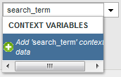

# 처리 규칙 사용 사례

조직에서 처리 규칙을 사용할 수 있는 방법에 대한 응용 프로그램이 광범위합니다. 다음 섹션에서는 유용하도록 사용할 수 있는 몇 가지 일반적인 방법에 대해 자세히 설명합니다.

+++eVar에 컨텍스트 데이터 변수 복사

처리 규칙은 [컨텍스트 데이터 변수](/help/implement/vars/page-vars/contextdata.md)에서 [Props](/help/components/dimensions/prop.md) 및 [eVars](/help/components/dimensions/evar.md)(으)로 값을 이동하는 데 사용됩니다. 처리 규칙이 없으면 컨텍스트 데이터 변수는 의미가 없으며 Analytics에 보고서를 채우지 않습니다.

[!UICONTROL 컨텍스트 변수] 목록에는 지난 30일 동안 보고서 세트로 전송된 모든 변수가 포함되어 있습니다. 컨텍스트 데이터 변수 이름은 알지만 현재 보고서 세트로 보내지 않았다면 수동으로 추가할 수 있습니다.

다음 예제에서는 `search_term` 컨텍스트 데이터 변수를 가져와 해당 값을 eVar3에 지정합니다.

| 규칙 세트 | 값 |
| --- | --- |
| 조건 | `search_term`(컨텍스트 데이터)이(가) 설정됨 |
| 액션 | [!UICONTROL eVar3 값 &#x200B;]을(를) `search_term`(컨텍스트 데이터)로 덮어쓰기 |

위의 예제는 채울 eVar가 몇 개만 있을 때 잘 작동합니다. 조직에 각각 고유한 eVar가 필요한 수백 개의 컨텍스트 데이터 변수가 있는 경우 조건문을 사용할 수 있습니다. 십여 개의 조건문을 단일 처리 규칙에 맞게 설정하여 조직에서 150개 처리 규칙 제한을 실행하지 않고도 한 보고서 세트에 모든 eVar를 채울 수 있습니다.

다음 예제에서는 여러 변수를 다양한 컨텍스트 데이터 변수로 채웁니다. 한 작업에는 조건문도 포함되어 있습니다.

| 규칙 세트 | 값 |
| --- | --- |
| 액션 | [!UICONTROL 값 &#x200B;] eVar55를 `spa.billing_customer_name`(컨텍스트 데이터)로 덮어쓰기 |
| 액션 | [!UICONTROL (컨텍스트 데이터)이 설정된 경우 &#x200B;]Prop7의 값 `testhierarchy`을(를) `testhierarchy`(컨텍스트 데이터)로 덮어쓰기 |
| 액션 | [!UICONTROL eVar8 값 &#x200B;]을(를) `spa.ims_org`(컨텍스트 데이터)로 덮어쓰기 |

+++

+++컨텍스트 데이터 변수를 사용하여 이벤트 설정

처리 규칙은 [컨텍스트 데이터 변수](/help/implement/vars/page-vars/contextdata.md)에 따라 이벤트를 트리거할 수 있습니다.

[!UICONTROL 컨텍스트 변수] 목록에는 지난 30일 동안 보고서 세트로 전송된 모든 변수가 포함되어 있습니다. 컨텍스트 데이터 변수 이름은 알지만 현재 보고서 세트로 보내지 않았다면 수동으로 추가할 수 있습니다.

다음 규칙 정의는 특정 컨텍스트 데이터 변수를 포함하는 모든 히트에 대해 이벤트를 설정합니다.

| 규칙 세트 | 값 |
| --- | --- |
| 조건 | `search_term`(컨텍스트 데이터)이(가) 설정됨 |
| 액션 | [!UICONTROL Event1을 &#x200B;]사용자 지정 값&#x200B;(으)로 설정`1` |

이벤트를 설정하는 방법을 보여 주는 처리 규칙 인터페이스의 

+++

+++쿼리 문자열 매개 변수를 사용하여 변수 채우기

쿼리 문자열 매개 변수를 사용하여 변수를 채울 수 있습니다. 대부분의 경우 원하는 쿼리 문자열 값을 얻기 위해 구현을 일반적으로 조정합니다. 그러나 이 데이터를 수집하기 위해 구현을 쉽게 조정할 수 없는 경우 처리 규칙이 적절한 대안입니다. 오타 또는 유사한 문제로 인해 값을 작성할 수 없는 경우 처리 규칙을 사용하여 변수를 채울 수 있습니다.

덮어쓰기 전에 항상 값이 비어 있는지 또는 예상 값을 포함하는지 확인하십시오.

| 규칙 세트 | 값 |
| --- | --- |
| 조건 | 캠페인이 설정되지 않음 |
| 액션 | [!UICONTROL 캠페인 값 &#x200B;]을(를) [!UICONTROL 쿼리 문자열 매개 변수] `cpid`(으)로 덮어쓰기 |

| 규칙 세트 | 값 |
| --- | --- |
| 조건 | [!UICONTROL 쿼리 문자열 매개 변수] `q` [!UICONTROL 설정되어 있음] |
| 액션 | [!UICONTROL 내부 검색어의 값을 &#x200B;]쿼리 문자열 매개 변수&#x200B;(으)로 덮어쓰기`q` |

+++

+++모든 이벤트를 조건부로 설정

이벤트는 처리 규칙에서 사용할 수 있는 조건에 따라 설정할 수 있습니다. 예를 들어 페이지 이름이 &quot;제품 개요&quot;와 같은 경우 이벤트를 트리거할 수 있습니다.

| 규칙 세트 | 값 |
| --- | --- |
| 조건 | [!UICONTROL 페이지 이름]이(가) &quot;제품 개요&quot;와 같은 경우 |
| 액션 | [!UICONTROL 이벤트 설정] [!UICONTROL 제품 보기]를 [!UICONTROL 사용자 지정 값] `1`(으)로 설정 |

조건부로 이벤트 집합을 표시하는 처리 규칙 인터페이스의 

+++

+++카테고리와 페이지 이름을 연결하여 하위 카테고리 추가

다른 값을 통합하는 연결 옵션을 사용하여 값을 채울 수 있습니다.

| 규칙 세트 | 값 |
| --- | --- |
| 조건 | 없음(항상 실행) |
| 액션 | [!UICONTROL 값을 &#x200B;] eVar1에 [!UICONTROL 연결된 값] 범주 + 페이지 이름으로 덮어쓰기 |

연결된 값을 표시하는 처리 규칙 인터페이스의 

+++

+++보고서에서 값 정리

수집된 철자 오류에 대해 값을 일치시키고 해당 값을 업데이트하여 보고서에 올바로 표시할 수 있습니다.

Adobe에서는 원하지 않는 덮어쓰기를 방지하기 위해 가능한 가장 제한적인 일치 옵션을 사용할 것을 권장합니다. 변수에 대해 보고서를 실행하고 사용할 잠재적 규칙 조건을 검색할 수 있습니다. 문자열 비교는 대/소문자를 구분하지 않습니다.

| 규칙 세트 | 값 |
| --- | --- |
| 조건 | prop1 [!UICONTROL 다음으로 시작] &quot;[!DNL Shoping]&quot; |
| 액션 | [!UICONTROL Prop1의 &#x200B;] 값을 [!UICONTROL 사용자 지정 값] &quot;[!DNL Shopping]&quot;(으)로 덮어쓰기 |

오타를 수정하는 방법을 보여 주는 처리 규칙 인터페이스의 

+++

+++히트에서 이벤트 제거

구현을 변경하지 않고 처리 규칙을 사용하여 히트에서 특정 이벤트를 제거하거나 취소할 수 있습니다. 이벤트를 사용자 지정 값 `0`(으)로 설정하면 이벤트가 계산되지 않습니다.

| 규칙 세트 | 값 |
| 조건 | 없음(항상 실행) |
| 작업 | [!UICONTROL Event1을 &#x200B;]사용자 지정 값&#x200B;(으)로 설정`0` |

+++
