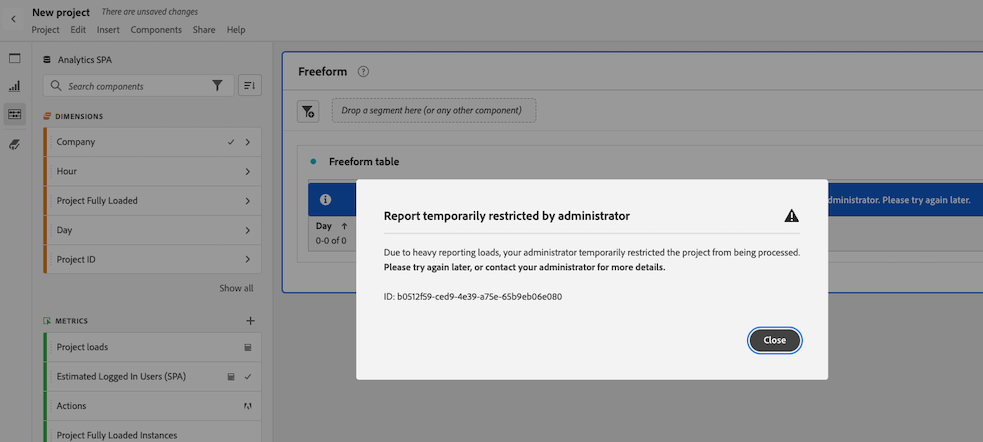

# 보고 활동 관리자에서 보고 요청 취소

[!UICONTROL 보고 활동 관리자]를 사용하면 관리자가 보고 요청을 신속하게 진단하고 취소하여 보고가 가장 많은 시간대에 보고 용량 문제를 해결할 수 있습니다.

보고 요청을 취소할 때 다음 사항을 고려해야 합니다.

* 특정 요청을 취소하거나, 특정 사용자의 모든 요청을 취소하거나, 특정 프로젝트와 관련된 모든 요청을 취소할 수 있습니다.

  요청을 취소하면 해당 액션이 [로그](/help/admin/tools/logs.md)에 기록됩니다. [!UICONTROL **이벤트 유형**] 열은 [!UICONTROL **관리자 액션**]&#x200B;으로 표시되고, 취소에 대한 설명은 [!UICONTROL **이벤트**] 열에서 확인할 수 있습니다.

* 요청을 취소할 때, 지정된 기간 동안 후속 요청을 제한하도록 선택할 수도 있습니다.

  이후의 요청을 제한하는 경우 해당 액션은 [로그](/help/admin/tools/logs.md)에 기록됩니다. [!UICONTROL **이벤트 유형**] 열은 [!UICONTROL **관리자 액션**]&#x200B;으로 표시되고, 제한에 대한 설명은 [!UICONTROL **이벤트**] 열에서 확인할 수 있습니다.

* 요청의 [!UICONTROL **사용자**] 열이 [!UICONTROL **인식되지 않음**]&#x200B;으로 표시되는 경우 요청을 취소할 수 없습니다. 이런 현상이 발생하는 경우, 해당 사용자가 관리 권한이 없는 로그인 회사에 속해 있다는 의미입니다.

보고 활동 관리자에 대한 자세한 내용, 주요 이점 및 권한 요구 사항을 알아보려면 [보고 활동 관리자 개요](/help/admin/tools/reporting-activity-manager/reporting-activity-overview.md)를 참조하십시오.

## 특정 요청 취소

보고 용량이 많이 소모되는 개별 요청을 취소할 수 있습니다.

1. Adobe Analytics에서 **[!UICONTROL 관리]** > **[!UICONTROL 보고 활동 관리자]**&#x200B;로 이동합니다.

1. 보고 요청을 취소할 보고서 세트를 선택합니다. <!--double-check this step-->

   이 페이지에서 제공하는 데이터에 대한 자세한 내용은 [보고 활동 관리자에서 보고 활동 보기](/help/admin/tools/reporting-activity-manager/reporting-activity.md)를 참조하십시오.

1. [!UICONTROL **요청**] 탭을 선택한 다음 하나 이상의 요청을 선택합니다.

   <!-- add screenshot -->

1. [!UICONTROL **요청 취소**]&#x200B;를 선택합니다.

   [!UICONTROL **취소 _x_ 보고서 요청**] 대화 상자가 표시됩니다.

1. 취소 메시지 필드는 요청이 취소되었을 때 사용자에게 표시되는 메시지를 보여 줍니다. 기본 메시지가 제공됩니다. 기본 메시지를 업데이트하여 추가 세부 정보를 제공할 수 있습니다.

1. (선택 사항) 지정된 기간 동안 향후 요청을 제한하는 방법:

   1. [!UICONTROL **후속 요청 제한**] 옵션 활성화

      

   1. 다음 선택 사항 중 하나를 선택합니다.

      | 옵션 | 함수 |
      |---------|----------|
      | [!UICONTROL **사용자 및 프로젝트**] | 선택한 요청과 연관된 사용자는 연계된 프로젝트에 대한 보고 요청 실행이 일시적으로 제한됩니다. |
      | [!UICONTROL **사용자**] | 선택한 요청과 관련된 사용자가 보고 요청 제출에서 일시적으로 사용이 제한됩니다. |
      | [!UICONTROL **프로젝트**] | 선택한 요청과 관련된 프로젝트가 모든 보고 요청에서 일시적으로 사용이 제한됩니다. |
      | [!UICONTROL **제한 기간**] | 요청이 제한될 기간을 선택합니다. 1분(기본값), 5분, 10분, 15분 또는 30분을 선택할 수 있습니다. <!-- double-check this -->
제한을 설정한 후에는 미리 제한을 제거할 수 없습니다.
 |

      {style="table-layout:auto"}

1. [!UICONTROL **취소 계속**]&#x200B;을 선택합니다.

   Analysis Workspace에 요청이 취소되었음을 사용자에게 알리는 알림이 표시됩니다. 이것이 Analysis Workspace에 어떻게 나타나는지에 대한 자세한 내용은 [사용자가 취소된 보고서에 액세스할 때의 경험](#experience-when-users-access-a-cancelled-report)을 참조하십시오.

## 사용자별 요청 취소

한 명 이상의 사용자와 관련된 모든 요청을 취소할 수 있습니다.

1. Adobe Analytics에서 **[!UICONTROL 관리]** > **[!UICONTROL 보고 활동 관리자]**&#x200B;로 이동합니다.

1. 보고 요청을 취소할 보고서 세트를 선택합니다. <!--double-check this step-->

   이 페이지에서 제공하는 데이터에 대한 자세한 내용은 [보고 활동 관리자에서 보고 활동 보기](/help/admin/tools/reporting-activity-manager/reporting-activity.md)를 참조하십시오.

1. [!UICONTROL **사용자**] 탭을 선택한 후 한 명 이상의 사용자를 선택합니다.

   <!-- add screenshot -->

1. [!UICONTROL **요청 취소**]&#x200B;를 선택합니다.

   [!UICONTROL **취소 _x_ x 사용자의 보고서 요청**] 대화 상자가 표시됩니다.

1. 취소 메시지 필드는 요청이 취소되었을 때 사용자에게 표시되는 메시지를 보여 줍니다. 기본 메시지가 제공됩니다. 기본 메시지를 업데이트하여 추가 세부 정보를 제공할 수 있습니다.

1. (선택 사항) 지정된 기간 동안 향후 요청을 제한하는 방법:

   1. [!UICONTROL **후속 요청 제한**] 옵션 활성화.

      

   1. 다음 선택 사항 중 하나를 선택합니다.

      | 옵션 | 함수 |
      |---------|----------|
      | [!UICONTROL **사용자 및 프로젝트**] | 선택한 사용자는 연관된 프로젝트에 대한 보고 요청이 일시적으로 제한됩니다. |
      | [!UICONTROL **사용자**] | 선택한 사용자는 보고 요청이 일시적으로 제한됩니다. |
      | [!UICONTROL **프로젝트**] | 선택한 사용자와 연관된 프로젝트는 다른 사용자에 의한 모든 보고 요청이 제한됩니다. |
      | [!UICONTROL **제한 기간**] | 요청이 제한될 기간을 선택합니다. 1분(기본값), 5분, 10분, 15분 또는 30분을 선택할 수 있습니다. <!--double-check this--> 
제한을 설정한 후에는 미리 제한을 제거할 수 없습니다.
 |

      {style="table-layout:auto"}

1. [!UICONTROL **취소 계속**]&#x200B;을 선택합니다.

   Analysis Workspace에 요청이 취소되었음을 사용자에게 알리는 알림이 표시됩니다. 이것이 Analysis Workspace에 어떻게 나타나는지에 대한 자세한 내용은 [사용자가 취소된 보고서에 액세스할 때의 경험](#experience-when-users-access-a-cancelled-report)을 참조하십시오.

## 프로젝트별 요청 취소

한 개 이상의 프로젝트와 관련된 모든 요청을 취소할 수 있습니다.

1. Adobe Analytics에서 **[!UICONTROL 관리]** > **[!UICONTROL 보고 활동 관리자]**&#x200B;로 이동합니다.

1. 보고 요청을 취소할 보고서 세트를 선택합니다. <!--double-check this step-->

   이 페이지에서 제공하는 데이터에 대한 자세한 내용은 [보고 활동 관리자에서 보고 활동 보기](/help/admin/tools/reporting-activity-manager/reporting-activity.md)를 참조하십시오.

1. [!UICONTROL **프로젝트**] 탭을 선택한 후 하나 이상의 프로젝트를 선택합니다.

   <!-- add screenshot -->

1. [!UICONTROL **요청 취소**]&#x200B;를 선택합니다.

   x 프로젝트의 [!UICONTROL **취소 _x_ 보고서 요청**] 대화 상자가 표시됩니다.

1. 취소 메시지 필드는 요청이 취소되었을 때 사용자에게 표시되는 메시지를 보여 줍니다. 기본 메시지가 제공됩니다. 기본 메시지를 업데이트하여 추가 세부 정보를 제공할 수 있습니다.

1. (선택 사항) 지정된 기간 동안 향후 요청을 제한하는 방법:

   1. [!UICONTROL **후속 요청 제한**] 옵션 활성화.

      

   1. 다음 선택 사항 중 하나를 선택합니다.

      | 옵션 | 함수 |
      |---------|----------|
      | [!UICONTROL **사용자 및 프로젝트**] | 선택한 프로젝트는 연관된 사용자의 보고 요청이 일시적으로 제한됩니다. |
      | [!UICONTROL **사용자**] | 선택한 프로젝트와 연계된 사용자는 모든 보고 요청이 제한됩니다. |
      | [!UICONTROL **프로젝트**] | 선택한 프로젝트는 모든 사용자의 모든 보고 요청이 일시적으로 제한됩니다. |
      | [!UICONTROL **제한 기간**] | 요청이 제한될 기간을 선택합니다. 1분(기본값), 5분, 10분, 15분 또는 30분을 선택할 수 있습니다. <!--double-check this--> 
제한을 설정한 후에는 미리 제한을 제거할 수 없습니다.
 |

      {style="table-layout:auto"}

1. [!UICONTROL **취소 계속**]&#x200B;을 선택합니다.

   Analysis Workspace에 요청이 취소되었음을 사용자에게 알리는 알림이 표시됩니다. 이것이 Analysis Workspace에 어떻게 나타나는지에 대한 자세한 내용은 [사용자가 취소된 보고서에 액세스할 때의 경험](#experience-when-users-access-a-cancelled-report)을 참조하십시오.

## 애플리케이션별 요청 취소

한 개 이상의 애플리케이션과 관련된 모든 요청을 취소할 수 있습니다. 애플리케이션과 관련된 요청을 취소할 때 특정 기간 동안 해당 애플리케이션과 관련된 요청을 추가로 제한할 수 있습니다.

애플리케이션은 다음과 같습니다.

* Analysis Workspace UI
* Workspace 예약된 프로젝트
* Report Builder
* 빌더 UI: 세그먼트, 계산된 지표, 주석, 대상자 등
* 1.4 또는 2.0 API의 API 호출
* 경고
* 모든 사용자와 링크 공유
* Analytics 보고 엔진을 쿼리하는 기타 애플리케이션

애플리케이션별 요청 취소 방법:

1. Adobe Analytics에서 **[!UICONTROL 관리]** > **[!UICONTROL 보고 활동 관리자]**&#x200B;로 이동합니다.

1. 보고 요청을 취소할 연결을 선택합니다. <!--double-check this step-->

   이 페이지에서 제공하는 데이터에 대한 자세한 내용은 [보고 활동 관리자에서 보고 활동 보기](/help/admin/tools/reporting-activity-manager/reporting-activity.md)를 참조하십시오.

1. [!UICONTROL **애플리케이션**] 탭을 선택한 후 하나 이상의 애플리케이션을 선택합니다.

   <!-- add screenshot -->

1. [!UICONTROL **요청 취소**]&#x200B;를 선택합니다.

   x 프로젝트의 [!UICONTROL **취소 _x_ 보고서 요청**] 대화 상자가 표시됩니다.

1. 취소 메시지 필드는 요청이 취소되었을 때 사용자에게 표시되는 메시지를 보여 줍니다. 기본 메시지가 제공됩니다. 기본 메시지를 업데이트하여 추가 세부 정보를 제공할 수 있습니다.

1. (선택 사항) 지정된 기간 동안 향후 요청을 제한하는 방법:

   1. [!UICONTROL **후속 요청 제한**] 옵션 활성화

      

   1. 다음 선택 사항 중 하나를 선택합니다.

      | 옵션 | 함수 |
      |---------|----------|
      | [!UICONTROL **사용자 및 프로젝트**] | 선택한 애플리케이션은 연관된 사용자와 프로젝트의 보고 요청이 일시적으로 제한됩니다.
가장 덜 제한적인 옵션입니다.
 |
      | [!UICONTROL **사용자**] | 선택한 애플리케이션과 연관된 사용자는 모든 보고 요청이 제한됩니다. |
      | [!UICONTROL **프로젝트**] | 선택한 사용자와 연관된 애플리케이션은 다른 사용자에 의한 모든 보고 요청이 제한됩니다. |
      | [!UICONTROL **제한 기간**] | 요청이 제한될 기간을 선택합니다. 1분(기본값), 5분, 10분, 15분 또는 30분을 선택할 수 있습니다. <!--double-check this--> 
제한을 설정한 후에는 미리 제한을 제거할 수 없습니다.
 |

      {style="table-layout:auto"}

1. [!UICONTROL **취소 계속**]&#x200B;을 선택합니다.

   요청이 취소되었음을 사용자에게 알리는 알림이 애플리케이션(예: Analysis Workspace)에 표시됩니다. 이것이 Analysis Workspace에 어떻게 나타나는지에 대한 자세한 내용은 [사용자가 취소된 보고서에 액세스할 때의 경험](#experience-when-users-access-a-cancelled-report)을 참조하십시오.

## 사용자가 취소된 보고서에 액세스할 때의 경험

Analysis Workspace에서 사용자는 취소의 영향을 받는 보고서나 시각화에 액세스하려고 할 때 다음과 같은 메시지를 보게 됩니다.

### 프로젝트에 대한 메시지

사용자가 취소로 인해 영향을 받는 프로젝트에 액세스하려고 하면 보고서가 일시적으로 제한된다는 메시지가 표시됩니다.

### 시각화에 대한 메시지

사용자가 취소로 인해 영향을 받는 시각화에 액세스하려고 하면 보고서의 데이터 처리가 일시적으로 제한된다는 메시지가 표시됩니다.

