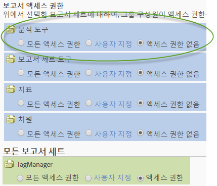
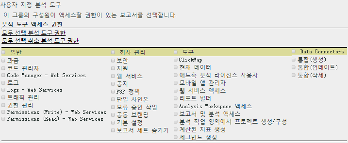

# 분석 도구 권한 사용자 정의

>[!IMPORTANT]
>
>User and product management is moving to the [Admin Console](https://helpx.adobe.com/enterprise/using/admin-console.html). Adobe는 사용자를 마이그레이션할 때가 되면 통지합니다. After all customers have migrated, help content for **[!UICONTROL Analytics]** &gt; **[!UICONTROL Admin Tools]** &gt; **[!UICONTROL User Management]** will be retired.
>[!IMPORTANT]
>
>User and product management is moving to the [Admin Console](https://helpx.adobe.com/enterprise/using/admin-console.html). Adobe는 사용자를 마이그레이션할 때가 되면 통지합니다. After all customers have migrated, help content for **[!UICONTROL Analytics]** &gt; **[!UICONTROL Admin Tools]** &gt; **[!UICONTROL User Management]** will be retired.

일반 항목(청구, 로그 등), 회사 관리, 도구, 웹 서비스 액세스, Report Builder 및 Data Connectors 통합에 대한 사용자 권한을 활성화합니다.

**[!UICONTROL 사용자 관리]** &gt; **[!UICONTROL 그룹]** &gt; **[!UICONTROL 보고서 액세스]** &gt; **[!UICONTROL 분석 도구]** &gt; **[!UICONTROL 사용자 지정]**

>[!NOTE]
>
>2016 가을 릴리스 (10 월 20 일) 가 그룹 관리에 변경되었습니다. See [Administrative Changes - Fall 2016](../../../admin/user-management2/c-user-management/permissions-changes.md#concept_86581595B86B47D5B8F90282FC3E31EF) for a summary of changes.

## 보고서 액세스 - 분석 도구

**[!UICONTROL 사용자 지정]을 클릭하여 이 그룹에서 액세스할 항목을 선택합니다.**

## 필드 설명

이 페이지의 설정은 [!UICONTROL 사용자 그룹 정의] 페이지에서 선택한 보고서 세트와 관련된 것입니다.

| 요소 | 설명 |
|--- |--- |
| **일반** |  |
| [과금](../../../admin/admin/billing-admin.md) | 각 보고서 세트에 대한 트래픽 세부 사항을 포함하여 청구 정보에 액세스할 수 있도록 합니다. |
| [코드 관리자](../../../admin/admin/code-manager-admin.md) | 웹 및 모바일 플랫폼에 대한 데이터 수집 코드를 다운로드할 권한을 활성화합니다. |
| 코드 관리자 - 웹 서비스 | 관리자가 아닌 사용자가 웹 서비스를 통해 코드 관리자에 액세스할 수 있도록 허용합니다. |
| [로그](../../../admin/admin/logs.md) | 사용자가 로그인하는 시점, 사용자의 사용, 액세스, 보고서 세트 및 관리 변경을 확인하는 데 도움이 되는 로그 파일에 대한 권한을 활성화합니다. |
| 로그 - 웹 서비스 | 관리자가 아닌 사용자가 웹 서비스를 통해 관리 도구에 액세스할 수 있도록 허용합니다. |
| [트래픽 관리](../../../admin/c-traffic-management/traffic-management.md) | 트래픽 관리 페이지에서 예상되는 트래픽 볼륨 변경을 지정할 수 있습니다. |
| 권한 관리 | 관리자가 아닌 사용자에게 관리 도구의 [사용자 관리] 페이지에 액세스할 권한을 부여합니다. 이러한 사용자에게는 읽기 권한이 있지만, 쓰기 권한이 없습니다. |
| 권한(쓰기) - 웹 서비스 | 관리자가 아닌 사용자에게 웹 서비스의 [사용자 관리]에서 읽기 및 쓰기 권한 설정을 부여합니다. 이 설정은 특히 관리 API에서 표시된 사용 권한 작업을 참조합니다. |
| 권한(읽기) - 웹 서비스 | 관리자가 아닌 사용자가 웹 서비스의 사용자 관리에서 권한 설정을 볼 수 있도록 허용합니다. 이 설정은 특히 관리 API에서 표시된 사용 권한 작업을 참조합니다. |
| **회사 경영** |  |
| [보안](../../../admin/company/security-manager.md) | 해당 데이터에 대한 액세스를 제어할 수 있도록 보안 관리자 페이지에 대한 권한을 부여합니다. 어려운 암호, 암호 만료, IP 로그인 제한 및 이메일 도메인 제한 옵션이 제공됩니다. |
| 지원 정보 | 회사 설정의 지원 정보에 대한 권한을 부여합니다. |
| [Web Services](../../../admin/company/web-services-admin.md) | 관리 도구 인터페이스에서 웹 서비스 페이지에 대한 액세스를 허용합니다([!UICONTROL 회사 설정] &gt; [!UICONTROL 웹 서비스]). 웹 서비스 API를 사용하면 사용자 인터페이스를 통해 사용 가능한 기능을 복제하고 늘릴 수 있는 Adobe Analytics 서비스에 프로그래밍 방식으로 액세스할 수 있습니다. |
| 공지 | 버전 14만 해당됩니다. |
| Single Sign-On(이전) | 관리 도구의 Single Sign-On 페이지에 대한 액세스 권한을 부여합니다. **참고:** Adobe Experience Cloud에서 단일 사인 온은 Experience Cloud와 솔루션 간 [계정 연결](https://marketing.adobe.com/resources/help/en_US/mcloud/organizations.html)을 사용하여 구현됩니다. |
| [보류 중인 작업](../../../admin/company/pending-actions-admin.md) | [!UICONTROL 회사 설정]에서 보류 중인 작업을 관리할 권한을 부여합니다. |
| [공동 브랜딩](../../../admin/company/co-branding-admin.md) | Analytics를 공동 브랜딩할 권한을 부여합니다. |
| [기본 설정](../../../admin/admin/preferences-manager.md) | [!UICONTROL 기본 설정 관리자]에 대한 권한을 부여합니다. |
| [보고서 세트 숨기기](../../../admin/company/c-hide-report-suites.md) | Adobe Analytics 사용자 인터페이스에서 보고서 세트를 숨길 권한을 부여합니다. |
| **도구** | 이러한 설정은 Analytics 도구(인터페이스와 애플리케이션) 및 고급 기능(세그멘테이션 및 계산된 지표)에 대한 액세스 권한을 부여합니다. |
| [ClickMap](https://marketing.adobe.com/resources/help/en_US/sc/user/clickmap.html) | [!UICONTROL 도구] 메뉴의 ClickMap을 헤더에 표시합니다. (**참고:** Adobe는 [Activity Map](https://marketing.adobe.com/resources/help/en_US/analytics/activitymap/activitymap-enable.html) 사용을 권장합니다.) |
| [현재 데이터](https://marketing.adobe.com/resources/help/en_US/reference/data_latency.html) | 보고에 현재 데이터 기능을 사용할 권한을 부여합니다. |
| [Ad Hoc Analysis](https://marketing.adobe.com/resources/help/en_US/dsc/) 라이선스 사용자 | [!UICONTROL Ad Hoc Analysis]에 대한 액세스 권한을 부여합니다. |
| 웹 서비스 액세스 | 관리자가 아닌 사용자에 대한 웹 서비스 액세스를 활성화합니다. 웹 서비스 자격 증명을 생성합니다. |
| [Report Builder](https://marketing.adobe.com/resources/help/en_US/arb/setup.html) | 이 그룹 구성원에게 [!UICONTROL Report Builder] 라이선스에 대한 액세스 권한을 부여합니다. |
| [Analysis Workspace](https://marketing.adobe.com/resources/help/en_US/analytics/analysis-workspace/) 액세스 | 사용자에게 [!DNL Adobe Analytics]에 대한 권장 보고 인터페이스인 Analysis Workspace에 액세스할 권한을 부여합니다. |
| [Reports &amp; Analytics](https://marketing.adobe.com/resources/help/en_US/sc/user/) | 사용자에게 Reports &amp; Analytics에 액세스할 권한을 부여합니다. |
| [Analysis Workspace에서 프로젝트 생성/조정](https://marketing.adobe.com/resources/help/en_US/analytics/analysis-workspace/curate.html) | 사용자에게 Analysis Workspace에서 프로젝트를 만들고 조정할 권한을 부여합니다. |
| [계산된 지표 생성](https://marketing.adobe.com/resources/help/en_US/analytics/calcmetrics/) | 사용자에게 계산된 지표를 생성할 권한을 부여합니다. |
| [세그먼트 생성](https://marketing.adobe.com/resources/help/en_US/analytics/segment/) | 사용자에게 세그먼트를 생성할 권한을 부여합니다. |
| **Data Connectors** |  |
| 통합(생성, 업데이트 또는 삭제) | Data Connectors 통합을 생성하고, 업데이트하고, 삭제할 권한을 부여합니다. |
