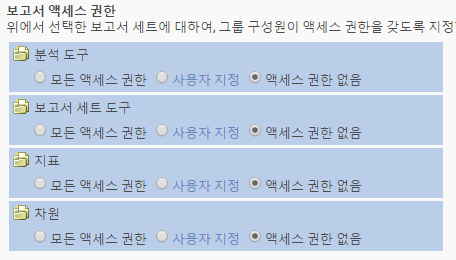

# 보고서 액세스 사용자 지정 - 개요

>[!IMPORTANT]
>
>User and product management is moving to the [Admin Console](https://helpx.adobe.com/enterprise/using/admin-console.html). Adobe는 사용자를 마이그레이션할 때가 되면 통지합니다. After all customers have migrated, help content for **[!UICONTROL Analytics]** &gt; **[!UICONTROL Admin Tools]** &gt; **[!UICONTROL User Management]** will be retired.

Analytics 도구, 보고서 세트 도구, 지표 및 측정기준에 대한 그룹 권한을 사용자 지정합니다.

**[!UICONTROL 새 그룹 추가]** &gt; **[!UICONTROL 보고서 액세스]**

[!UICONTROL 사용자 그룹 정의] 페이지의 [!UICONTROL 보고서 액세스] 섹션은 세분화된 수준에서 권한을 사용자 지정할 수 있는 액세스 카테고리를 제공합니다.

예를 들면 여러 Analytics 도구([!UICONTROL Analysis Workspace], [!UICONTROL Reports &amp; Analytics], [!UICONTROL Report Builder])에 대한 액세스 권한, 특정 지표 및 측정기준(eVars 포함)에 대한 권한 및 세그먼트나 계산된 지표 생성과 같은 기능을 가진 그룹을 생성할 수 있습니다.

## 권한에 대해 알고 있어야 하는 사항 {#section_3D25D4A5BD044008870C5B98F696244E}

<table id="table_DB7806E05E2040EC9A4CB7C3596879EC"> 
 <thead> 
  <tr> 
   <th colname="col1" class="entry"> 항목 </th> 
   <th colname="col2" class="entry"> 설명 </th> 
  </tr> 
 </thead>
 <tbody> 
  <tr> 
   <td colname="col1"> 
관리자 액세스/사전 정의된 그룹 
 </td> 
   <td colname="col2"> 
 사전 정의된 그룹은 더 이상 관리자에게 필요하지 않습니다. 이제 관리자는 웹 서비스 액세스, Report Builder, Activity Map, Ad Hoc Analysis은 물론 모든 항목(도구, 지표, 측정기준)에 대한 액세스 권한을 가지고 있습니다. 
 
그룹의 목적은 관리자가 아닌 사용자에게 액세스 권한을 부여하거나 액세스를 제한하는 것입니다. 
 </td> 
  </tr> 
  <tr> 
   <td colname="col1"> 
사용자 지정 그룹 
 </td> 
   <td colname="col2"> 
 사용자 지정 그룹이 사전 정의된 그룹으로 대체되었습니다. 기존의 사전 정의된 그룹은 같은 그룹 이름을 사용하여 사용자 지정 그룹으로 마이그레이션됩니다. 해당 설정을 포함하여 생성한 사용자 지정 그룹은 모두 유지됩니다. 하지만 설정 위치가 이동됩니다. 예를 들면 회사 설정(관리 콘솔 사용자 지정의)은 현재 <a href="../../../admin/user-management2/c-customize-report-access/groups-analytics-tools.md#concept_C4383A6C0F5E4130875FDD3756F2E2FC" format="dita" scope="local"> Analytics 도구 사용자 지정</a>에 있습니다. 
 
  모든 보고서 액세스에 속한 사용자가 액세스 권한이 있는 사용자 지정 그룹으로 마이그레이션되었습니다. 
 
    <ul id="ul_7E1B443DEEF7452E85FEB30CA0BBC8BE"> 
     <li id="li_A510C2A4129340E0AB08EEBDBE4AEAD9">모든 측정 기준 </li> 
     <li id="li_8BA1D7A2527C4F10AC93108B9E87F418">모든 지표 </li> 
     <li id="li_265830A2C6B94AF28720DA99980EAA51">모든 보고서 세트 </li> 
     <li id="li_685B99DEAB814D7B9C11B14AA4CB8CD4">채널 보고서 </li> 
     <li id="li_B35420302AAB42509BD6AF0FA6349BF8">예외 항목 탐지 </li> 
     <li id="li_3787E4696C454D3ABD1D75F6C282A9A2">실시간 보고서 </li> 
     <li id="li_3797DF9C40D1426588819116362962F5">Analysis Workspace 액세스 </li> 
    </ul> 
이전에 사전 정의된 그룹에서 사용할 수 있었던 모든 설정은 사용자 그룹 정의의 보고서 액세스</a> 설정에서 사용자 지정할 수 있으므로 관리자는 사용자 지정 그룹을 삭제하고 직접 생성할 수 있습니다. 
 </td> 
  </tr> 
  <tr> 
   <td colname="col1"> 
측정기준-수준 권한 
 </td> 
   <td colname="col2"> 
측정기준(및 지표)에 대한 액세스를 포함하거나 제외하도록 권한을 사용자 지정할 수 있습니다. 
 
    <ul id="ul_DA5A54223673474E9151AF979DA50659"> 
     <li id="li_C3E82F7BC07A4F2F83A85D3D511292CC"> 
사용자 지정 그룹 내의 모든 현재 측정 기준 및 지표가 자동으로 새 카테고리에 마이그레이션되었습니다. 기존 그룹에 지표가 활성화되어 있을 경우, 기본적으로 모든 새로 허용할 수 있는 측정 기준(eVar 및 컨텐츠 인식) 및 지표가 주어집니다. 
 </li> 
     <li id="li_CC56F9181CC14AB59318628E72F2E8C9"> 분류 가져오기(이전 SAINT) 권한: 분류에 대한 액세스 권한은 분류가 기준으로 사용하는 <a href="https://marketing.adobe.com/resources/help/en_US/reference/c_classifications.html" format="html" scope="external">변수</a>에 대한 액세스 권한으로 결정됩니다.  </li> 
    </ul> 
See <a href="../../../admin/user-management2/c-customize-report-access/groups-dimensions.md#concept_68B36161345341369B6D01DC7DD42A22" format="dita" scope="local"> Customize Dimension Permissions</a>. 
 </td> 
  </tr> 
  <tr> 
   <td colname="col1"> 
<a href="https://helpx.adobe.com/enterprise/using/admin-console.html" format="html" scope="external"> Adobe Admin Console</a> 
 </td> 
   <td colname="col2"> 
새로운 고객 또는 회사가 <a href="https://marketing.adobe.com/resources/help/en_US/mcloud/core_services.html" format="html" scope="external">Experience Cloud에 공급된</a> 고객에게만 권장됩니다. 기존 Analytics 고객을 Experience Cloud ID 관리 시스템으로 마이그레이션할 계획입니다. 
 
More information is available in <a href="https://marketing.adobe.com/resources/help/en_US/experience-cloud/admin-console/analytics-migration/" format="html" scope="external"> Analytics User Migration to the Admin Console</a>. 
 </td> 
  </tr> 
  <tr> 
   <td colname="col1"> 
컨텐츠 인식 
 </td> 
   <td colname="col2"> 
컨텐츠 인식에 Experience Cloud 솔루션 통합과 관련된 지표에 대한 권한을 관리할 수 있는 변수가 포함되어 있습니다. 소셜, 모바일 또는 Experience Cloud 통합을 통해 삽입된 다른 모든 데이터에 대한 권한을 관리할 수 있습니다. 이러한 권한은 기본적으로 사용됩니다. 
 </td> 
  </tr> 
  <tr> 
   <td colname="col1"> 
권한/보고서 비활성화 
 </td> 
   <td colname="col2"> 
다음의 현재 사용되지 않는 보고서가 제거됩니다. 
 
    <ul id="ul_C0415CFF0562472297272EC58ECC0774"> 
     <li id="li_62B1CE33B1454987B878B321EB40D62E">월별 요약 </li> 
     <li id="li_71CD776D212540A18F9B083D2E11A296">방문자 홈 페이지 </li> 
     <li id="li_406200AD68C74D11B5F53988A4E76A68">Netscape 플러그인 </li> 
     <li id="li_A124637D69C94C78921C8B028D890541">주요 방문자 </li> 
     <li id="li_5C26FF95371B4F3080FF75C7F8DE0F72">주요 방문자가 본 페이지 수 </li> 
     <li id="li_E7E262BD0CF64E16B838F995F6A13B8A">방문자 스냅샷 </li> 
     <li id="li_0EDC74625C0D4B1A992FCA49B648E4C0">DRM </li> 
     <li id="li_ACC92E6EA188409486E7C943F26B9DAC">네트 프로토콜 </li> 
     <li id="li_6E18C4D12377416A8124BBD13164B03A">Java 버전 </li> 
     <li id="li_1599265E59EF4F34BB406356410C9E68">북마크 URL 길이 </li> 
     <li id="li_3035442010984C409089B21E03DB7BCC">장치 번호 전송 </li> 
     <li id="li_6B2163ED8FC84EBF933D97A504B4D527">PTT </li> 
     <li id="li_0EB8A4A7619B45DF87109B183A7C69C8">데코레이션 메일 지원 </li> 
     <li id="li_989FAC662F7344E6BDDC517B79D4581E">정보 </li> 
     <li id="li_F1FB7F8E415443F3B63F6D11D59A04AB">정보 서비스 </li> 
    </ul> 
이러한 보고서는 
 
    <ul id="ul_F71505C59F734EA9B541BF8AB9F9388F"> 
     <li id="li_7D461907B895447280E69CF1520DF47C">여전히 책갈피로 액세스할 수 있습니다. </li> 
     <li id="li_27BA2DD6BA4C446FBAA06B6C76CD171F">새 측정 기준 권한 카테고리에 포함되지 않습니다. </li> 
     <li id="li_504E9D8421714406A0F37DEF1E10E34B">더 이상 권한을 편집할 수 없습니다. </li> 
     <li id="li_0022E8DCA07344C793847E8282EFBEEF">현재 액세스 권한이 있는 사용자 지정 그룹에 대한 액세스 권한을 보유하게 됩니다. </li> 
    </ul> </td> 
  </tr> 
 </tbody> 
</table>

