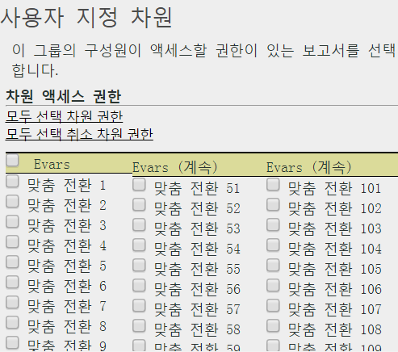

# 차원 권한 사용자 정의

>[!IMPORTANT]
>
>User and product management is moving to the [Admin Console](https://helpx.adobe.com/enterprise/using/admin-console.html). Adobe는 사용자를 마이그레이션할 때가 되면 통지합니다. After all customers have migrated, help content for **[!UICONTROL Analytics]** &gt; **[!UICONTROL Admin Tools]** &gt; **[!UICONTROL User Management]** will be retired.

eVar, 트래픽 보고서, 솔루션 보고서 및 경로 지정 보고서를 포함하여 세분화된 수준에서 사용자 액세스를 사용자 지정합니다.

**[!UICONTROL 사용자 관리]** &gt; **[!UICONTROL 그룹]** &gt; **[!UICONTROL 보고서 액세스]** &gt; **[!UICONTROL 차원]** &gt; **[!UICONTROL 사용자 지정]**

>[!IMPORTANT]
>
>현재 일부 차원은 권한이 없습니다. 이러한 측정기준은 다음과 같습니다. 모바일 책갈피 길이, 모바일 장치 번호, 모바일 DRM, 모바일 정보 서비스, 모바일 Java VM, 모바일 메일 장식, 모바일 네트 프로토콜, 모바일 OS, 모바일 Push To Talk.
>
>이러한 측정기준은 다른 사용 권한과 상관없이 모든 사용자가 사용할 수 있습니다.

이 페이지의 설정은 [!UICONTROL 사용자 그룹 정의] 페이지에서 선택한 보고서 세트와 관련된 것입니다.

권한의 측정기준 카테고리에 대한 다음 정보를 파악합니다.

* eVar 1-250은 개별적으로 권한이 주어집니다.
* 모든 트래픽 보고서는 측정 기준입니다.
* 비디오 및 모바일 보고서는 차원뿐만 아니라 다른 분석 솔루션 보고서입니다 (Experience Manager, Advertising Cloud, Social 및 Do on).
* 사용자에게 상위 측정 기준에 대한 액세스 권한이 있을 경우 경로 지정 보고서를 사용할 수 있습니다.
* 사용자 지정 그룹 내의 모든 현재 측정 기준 및 지표가 자동으로 새 카테고리에 마이그레이션되었습니다. 기존 그룹에 지표가 활성화되어 있을 경우, 기본적으로 모든 새로 허용할 수 있는 측정 기준(eVar 및 컨텐츠 인식) 및 지표가 주어집니다.
* 분류 가져오기(이전 SAINT) 권한: 분류에 대한 액세스 권한은 분류가 기준으로 사용하는 [변수](https://marketing.adobe.com/resources/help/en_US/reference/c_classifications.html)에 대한 액세스 권한으로 결정됩니다. 

자세한 내용은 [권한 변경 사항에 대한 FAQ](https://marketing.adobe.com/resources/help/en_US/reference/permissions_faq.html)를 참조하십시오.

**측정기준 사용자 지정**

다음 항목은 권한을 부여할 수 있는 측정기준입니다.

<table id="table_F37D74A1619A4560A5F5651E855DAF1C"> 
 <thead> 
  <tr> 
   <th colname="col1" class="entry"> 요소 </th> 
   <th colname="col2" class="entry"> 설명 </th> 
  </tr> 
 </thead>
 <tbody> 
  <tr> 
   <td colname="col1"> 
 <a href="../../../admin/admin/conversion-var-admin/conversion-var-admin.md#concept_C02F7AA01DE242F1AA1A4E74022BE9DE" format="dita" scope="local"> eVar </a> 
 </td> 
   <td colname="col2"> 
eVar 1-250은 개별적으로 권한이 주어집니다. eVar는 사용자 지정 보고서의 전환 성공 지표를 세그먼트화하는 데 사용하는 전환 변수입니다. 
 </td> 
  </tr> 
  <tr> 
   <td colname="col1"> 
 <a href="https://marketing.adobe.com/resources/help/en_US/sc/implement/props_eVars.html" format="html" scope="external"> Prop </a> 
 </td> 
   <td colname="col2"> 
Prop는 사용자 지정 트래픽 변수입니다. 
 
분석 구현에서 <a href="https://marketing.adobe.com/resources/help/en_US/sc/implement/props_eVars.html" format="html" scope="external">트래픽 prop 및 전환 eVar</a>를 참조하십시오. 
 </td> 
  </tr> 
  <tr> 
   <td colname="col1"> 
 <a href="https://marketing.adobe.com/resources/help/en_US/sc/implement/hierN.html" format="html" scope="external"> 계층 </a> 
 </td> 
   <td colname="col2"> 
 계층(hierN) 변수는 사이트의 계층 또는 페이지 구조에서 페이지의 위치를 결정합니다. 
 </td> 
  </tr> 
  <tr> 
   <td colname="col1"> 
 <a href="https://marketing.adobe.com/resources/help/en_US/sc/implement/listN.html" format="html" scope="external"> Listvar </a> 
 </td> 
   <td colname="col2"> 
 목록 Prop 함수와 마찬가지로 목록 변수는 같은 이미지 요청에서 여러 값을 사용할 수 있도록 허용합니다.  
 </td> 
  </tr> 
  <tr> 
   <td colname="col1"> 
표준 
 </td> 
   <td colname="col2"> 
Analytics의 표준 (즉시 사용 가능한) Analytics의 차원. 
 </td> 
  </tr> 
  <tr> 
   <td colname="col1"> 
 <a href="https://marketing.adobe.com/resources/help/en_US/em/" format="https" scope="external"> AEM </a> 
 </td> 
   <td colname="col2"> 
Adobe Experience Manager 
 </td> 
  </tr> 
  <tr> 
   <td colname="col1"> 
 <a href="https://marketing.adobe.com/resources/help/en_US/media-optimizer/" format="https" scope="external"> AMO </a> 
 </td> 
   <td colname="col2"> 
Adobe Advertising Cloud 
 </td> 
  </tr> 
  <tr> 
   <td colname="col1"> 
 <a href="https://marketing.adobe.com/resources/help/en_US/analytics/activitymap/" format="https" scope="external"> Activity Map </a> 
 </td> 
   <td colname="col2"> 
 Activity Map 보고 차원: Activity Map 페이지, Activity Map 링크, Activity Map 영역, 지역별 Activity Map 링크, Activity Map XY 
 </td> 
  </tr> 
  <tr> 
   <td colname="col1"> 
 <a href="https://marketing.adobe.com/resources/help/en_US/mobile/" format="https" scope="external"> 모바일 </a> 
 </td> 
   <td colname="col2"> 
Adobe Mobile Services 
 </td> 
  </tr> 
  <tr> 
   <td colname="col1"> 
 Comscore 
 </td> 
   <td colname="col2"> 
이 파트너 통합은 더 이상 활성화되어 있지 않습니다. 
 </td> 
  </tr> 
  <tr> 
   <td colname="col1"> 
 <a href="https://marketing.adobe.com/resources/help/en_US/sc/appmeasurement/hbvideo/nielsen-partnership.html" format="html" scope="external"> Nielsen </a> 
 </td> 
   <td colname="col2"> 
파트너 통합입니다. 
 </td> 
  </tr> 
  <tr> 
   <td colname="col1"> 
 Social 
 </td> 
   <td colname="col2"> 
사용되지 않습니다. 
 </td> 
  </tr> 
 </tbody> 
</table>

