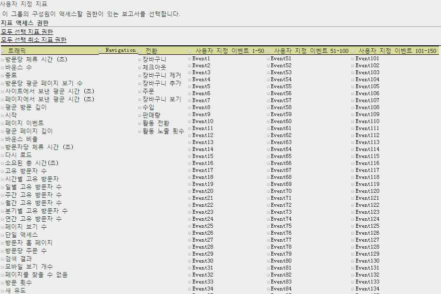

# 지표 권한 사용자 지정

>[!IMPORTANT]
>
>User and product management is moving to the [Admin Console](https://helpx.adobe.com/enterprise/using/admin-console.html). Adobe는 사용자를 마이그레이션할 때가 되면 통지합니다. After all customers have migrated, help content for **[!UICONTROL Analytics]** &gt; **[!UICONTROL Admin Tools]** &gt; **[!UICONTROL User Management]** will be retired.

트래픽 지표, 전환 지표, 사용자 지정 이벤트, 솔루션 이벤트 및 컨텐츠 인식에 대한 권한을 활성화합니다.

**[!UICONTROL 사용자 관리 &gt;]** 그룹 **[!UICONTROL &gt;]** 보고서 액세스 **[!UICONTROL &gt;]** 지표 **[!UICONTROL &gt;]** 사용자 **[!UICONTROL 지정]**

[지표 사용자 지정] 페이지의 설정은 [!UICONTROL 사용자 그룹 정의] 페이지에서 선택한 보고서 세트에만 적용됩니다.

## 솔루션 이벤트

In addition to [Custom Events](https://marketing.adobe.com/resources/help/en_US/sc/implement/events.html), this category includes Analytics solution events, including Experience Manager (AEM), Advertising Cloud (AMO), Mobile, Video, and Social.). 지표를 사용한 모든 사용자 지정 그룹에는 모든 Analytics 솔루션 이벤트가 새 지표로 추가됩니다.

사용자 지정 이벤트 및 Analytics 솔루션 이벤트(AEM, AMO, 모바일, 비디오 및 소셜)에 대한 권한을 설정할 수 있습니다.

지표를 사용한 모든 사용자 지정 그룹에는 모든 Analytics 솔루션 이벤트가 새 지표로 추가됩니다.

Analytics에 사용된 지표에 대한 자세한 내용은 [Metrics overview](/help/components/c-variables/c-metrics/metricslist.md) for information about metrics used in Analytics.

## 컨텐츠 인식

컨텐츠 인식에 Experience Cloud 솔루션 통합과 관련된 지표에 대한 권한을 관리할 수 있는 변수가 포함되어 있습니다. [!DNL Social][!DNL Mobile][!DNL Experience Cloud] 통합을 통해 삽입된 기타 모든 데이터에 대한 권한을 관리할 수 있습니다. 이러한 권한은 기본적으로 사용됩니다.
