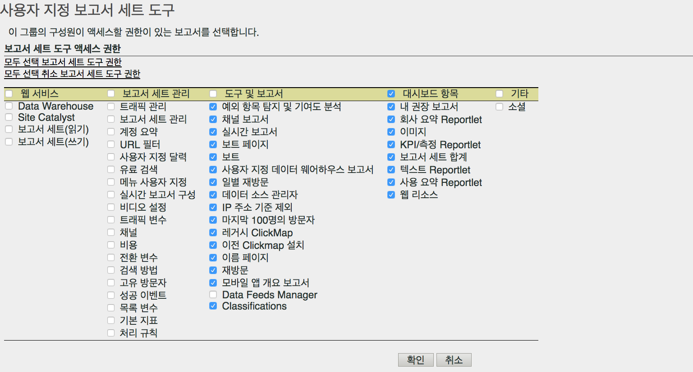

# 보고서 세트 도구 권한 사용자 지정

>[!IMPORTANT]
>
>User and product management is moving to the [Admin Console](https://helpx.adobe.com/enterprise/using/admin-console.html). Adobe는 사용자를 마이그레이션할 때가 되면 통지합니다. After all customers have migrated, help content for **[!UICONTROL Analytics]** &gt; **[!UICONTROL Admin Tools]** &gt; **[!UICONTROL User Management]** will be retired.

API 액세스, 보고서 세트 관리, 도구 및 보고서, 대시보드 항목에 대한 사용자 권한을 활성화합니다.

**[!UICONTROL 사용자 관리]** &gt; **[!UICONTROL 그룹]** &gt; **[!UICONTROL 보고서 액세스]** &gt; **[!UICONTROL 보고서 세트 도구]** &gt; **[!UICONTROL 사용자 지정]**

[!UICONTROL 보고서 세트 도구 사용자 지정] 페이지에서 그룹 구성원에게 다음 항목에 대한 액세스 권한을 제공합니다.

## 필드 설명

이 페이지의 설정은 [!UICONTROL 사용자 그룹 정의] 페이지에서 선택한 보고서 세트와 관련된 것입니다.

| 요소 | 설명 |
|--- |--- |
| **웹 서비스** |  |
| 이러한 설정을 사용하여 사용자가 Data Warehouse 메서드를 호출하고 보고서 세트 설정을 가져올 수 있습니다. |  |
| Data Warehouse | 관리자가 아닌 사용자가 웹 서비스 API를 통해 데이터 웨어하우스 메서드를 사용하여 전화를 걸 수 있습니다. See [Data Warehouse - Developer Documentation](/help/export/data-warehouse/data-warehouse.md) |
| 보고서 세트(읽기) | 관리자가 아닌 사용자가 API에서 보고서 세트 메서드를 사용할 수 있도록 허용합니다. |
| 보고서 세트(쓰기) | 관리자가 아닌 사용자가 API에서 보고서 세트 메서드를 사용할 수 있도록 허용합니다. |
| **보고서 세트 관리** |  |
| These settings grant access to the menu items in  Admin &gt;  Report Suites  &gt;  Edit Settings ([Report Suite Manager](../../../admin/c-manage-report-suites/report-suites-admin.md)). |  |
| [트래픽 관리](../../../admin/c-traffic-management/traffic-management.md) | 트래픽 관리에 대한 권한을 부여합니다. |
| [보고서 세트 관리](../../../admin/c-manage-report-suites/report-suites-admin.md) | 보고서 세트를 관리할 권한을 부여합니다. |
| [계정 요약](../../../admin/admin/general-acct-settings-admin.md) | 보고서 세트에 대한 계정 설정을 편집할 권한을 부여합니다. |
| [URL 필터](../../../admin/admin/internal-url-filter-admin.md) | 보고서 세트의 내부 URL 필터에 대한 권한을 부여합니다. 내부 URL 필터는 어느 레퍼러 또는 참조 페이지가 사이트 내부인지 결정하는 데 사용됩니다. |
| [사용자 지정 달력](../../../admin/admin/custom-calendar.md)을 참조하십시오 | 사용자 지정 달력을 편집할 권한을 부여합니다. |
| [유료 검색](https://marketing.adobe.com/resources/help/en_US/reference/paid_search_detection.html) | 유로 검색 감지는 검색 엔진 및 검색 키워드 보고서에서 유료 검색과 자연어 검색을 구별합니다. |
| [메뉴 사용자 지정](../../../admin/admin/customize-menus.md) | Reports &amp; Analytics에 표시되는 보고서 메뉴를 사용자 지정합니다. |
| [실시간 보고서 구성](../../../admin/admin/realtime/t-realtime-admin.md) | 실시간 보고서 Analytics를 설정하는 권한입니다. |
| [비디오 설정](../../../admin/admin/video-management.md) | 일련의 사용자 지정 전환 변수(eVar)와 사용자 지정 이벤트를 비디오 추적 및 보고용으로 지정하는 권한입니다. |
| [비디오 분류](https://marketing.adobe.com/resources/help/en_US/sc/appmeasurement/video/video_config.html) | 일련의 사용자 지정 전환 변수(eVar)와 사용자 지정 이벤트를 비디오 추적 및 보고용으로 지정하는 권한입니다. |
| [트래픽 변수](../../../admin/admin/c-traffic-variables/traffic-var.md) | 특정 트래픽 관련 이벤트와 사용자 지정 데이터를 관련 지을 권한입니다. |
| [트래픽 분류](/help/admin/admin/c-traffic-variables/traffic-classifications.md) | 분류([도구 및 보고서] 아래에 있음)로 통합되었습니다. |
| [채널](https://marketing.adobe.com/resources/help/en_US/mchannel/index.html) | 보고서 세트 관리자 &gt; 설정 편집 &gt; 마케팅 채널의 마케팅 채널 설정에 대한 권한을 부여합니다. |
| [비용](https://marketing.adobe.com/resources/help/en_US/mchannel/c_overview_budget.html) | 보고서 세트 관리자에서 마케팅 채널 &gt; 마케팅 채널 비용에 대한 권한을 사용하도록 설정합니다. |
| [전환 변수](../../../admin/admin/conversion-var-admin/conversion-var-admin.md) | 사용자 지정 인사이트 전환 변수(또는 eVar)는 사이트에서 선택된 웹 페이지의 Adobe 코드에 삽입됩니다. eVar의 기본 목적은 사용자 지정 마케팅 보고서의 전환 성공 지표를 세그먼트화하는 것입니다. |
| [검색 방법](../../../admin/admin/finding-methods.md) | 여러 검색 방법 보고서가 사용자 사이트에서 전환 성공 이벤트에 대한 크레딧을 받는지 확인할 수 있습니다. |
| [전환 분류](../../../admin/admin/conversion-var-admin/conversion-classifications.md) | 분류([도구 및 보고서] 아래에 있음)로 통합되었습니다. |
| [고유 방문자](https://marketing.adobe.com/resources/help/en_US/reference/t_unique_visitor_variable.html) | 고유한 방문자 변수를 지정할 권한을 부여합니다. |
| [성공 이벤트](https://marketing.adobe.com/resources/help/en_US/reference/success_event.html) | 제품 보기, 체크아웃 및 구매처럼 추적이 가능한 작업입니다. |
| [분류 계층](../../../components/c-classifications2/classification-hierarchies.md) | 분류([도구 및 보고서] 아래에 있음)로 통합되었습니다. |
| [목록 변수](https://marketing.adobe.com/resources/help/en_US/sc/implement/listN.html)로 분류할 수 있습니다 | List Var라고도 합니다. 목록 Prop과 마찬가지로 목록 변수는 같은 이미지 요청에서 여러 값을 사용할 수 있도록 허용합니다.  |
| [기본 지표](../../../admin/admin/default-metrics.md) | 사용자가 사용자 지정 지표 세트를 선택하지 않는 경우 Reports &amp; Analytics 기능은 모든 전환 보고서에 기본 지표 세트를 표시합니다. 선택된 지표가 연관된 보고서 세트의 모든 사용자에게 표시됩니다. |
| [처리 규칙](https://marketing.adobe.com/resources/help/en_US/sc/implement/ref-processing-rules.html) | 데이터 수집을 단순화하고 보고서로 전송되는 대로 콘텐츠를 관리하는 처리 규칙에 대한 액세스 권한을 부여합니다. |
| **도구 및 보고서** |  |
| [예외 항목 탐지](https://marketing.adobe.com/resources/help/en_US/analytics/analysis-workspace/anomaly_detection.html) | 이전 데이터에 관해 주어진 지표가 변경되는 방법을 결정하는 통계적 방법을 제공하는 예외 항목 탐지에 대한 권한을 부여합니다. |
| [채널 보고서](https://marketing.adobe.com/resources/help/en_US/mchannel/index.html) | 보고서 &gt; 마케팅 채널 보고서에 있는 마케팅 채널 보고서에 대한 권한을 부여합니다. |
| [실시간 보고서](../../../admin/admin/realtime/t-realtime-admin.md) | 실시간 보고서에 대한 액세스 권한을 부여합니다. |
| [보트 페이지](../../../admin/admin/bot-removal/bot-rules.md#concept_A306689C65EB4D0F9AE65E3FD48ED5F7) | 보트 규칙을 사용하여 알려진 스파이더 및 보트가 생성하는 트래픽을 보고서 세트에서 제거할 수 있습니다. 보트 트래픽을 제거하면 웹 사이트에서 사용자 활동을 더 정확하게 측정할 수 있습니다. |
| [보트](../../../admin/admin/bot-removal/bot-rules.md) | 보트 규칙을 사용하여 알려진 스파이더 및 보트가 생성하는 트래픽을 보고서 세트에서 제거할 수 있습니다. 보트 트래픽을 제거하면 웹 사이트에서 사용자 활동을 더 정확하게 측정할 수 있습니다. |
| [사용자 지정 Data Warehouse 보고서](../../..//export/data-warehouse/data-warehouse.md) | Data Warehouse는 데이터를 필터링하여 실행할 수 있는 스토리지 및 사용자 지정 보고서에 대한 원시의 처리되지 않은 데이터 사본을 참조합니다. 특별한 질문에 따라 원시 데이터의 고급 데이터 관계를 표시하는 보고서를 요청할 수 있습니다. |
| [일별 재방문](../../../components/c-variables/dimensionslist/reports-daily-return-visits.md) | 특정 날짜에 웹 사이트에 여러 번 방문한 방문자의 수를 보여주는 보고서. 하루는 마지막 24시간으로 정의됩니다. |
| [Data Sources 관리자](../../../admin/admin/data-sources.md) | 데이터 소스 기능을 사용하면 오프라인 소스의 데이터를 Analytics로 가져올 수 있습니다. |
| [IP 주소별 제외](../../../admin/admin/exclude-ip.md) | 보고서에서 내부 웹 사이트 활동, 사이트 테스트 및 직원 사용과 같은 특정 IP 주소의 데이터를 제거할 수 있습니다. |
| 기존 ClickMap | 기존 ClickMap 오버레이 도구의 메뉴에 대한 액세스 권한을 부여합니다. |
| 기존 Clickmap 설치 | 기존 ClickMap 도구에 대한 설치 권한을 부여합니다. |
| [재방문](../../../components/c-variables/dimensionslist/reports-return-visits.md) | 방문 번호가 1보다 큰 방문의 수를 표시하는 보고서입니다. 재방문 보고서에는 비쿠키 방문자도 포함됩니다. |
| [분류 가져오기](https://marketing.adobe.com/resources/help/en_US/reference/c_working_with_saint.html)/내보내기 및 [규칙 빌더](https://marketing.adobe.com/resources/help/en_US/reference/classification_rule_builder.html) | 분류로 통합되었습니다(아래 참조). |
| 데이터 피드 관리자 | 권한을 Analytics 데이터 피드. |
| 분류 | 다음 권한을 결합합니다. ' 트래픽 분류 ',' 비디오 분류 ',' 전환 분류 ',' 분류 계층 ',' 분류 관리자'및'분류 가져오기/내보내기 및 규칙 빌더 '.  참고:이 권한을 사용하여 사용자는 선택한 one/s뿐만 아니라 모든 보고서 세트에 대한 분류를 편집합니다. |
| [기여도 분석](https://marketing.adobe.com/resources/help/en_US/analytics/analysis-workspace/contribution-analysis.html) | Analysis Workspace에서 기여도 분석을 사용할 수 있는 권한을 부여합니다. |
| **대시보드 항목** |  |
| 대시보드 항목의 설정을 사용하여 보고 및 분석의 [reportlet](https://marketing.adobe.com/resources/help/en_US/sc/user/dashboard.html) 에 액세스할 수 있습니다. , 내 권장 보고서, 회사 요약 reportlet, 이미지, KPI/게이지 reportlet, 보고서 세트 합계, 텍스트, reportlet, 사용 요약 reportlet 및 웹 리소스 |  |
| **기타** |  |
| Social | 보고서 세트 관리자의 소셜 관리 메뉴에 대한 액세스를 제어합니다. |
