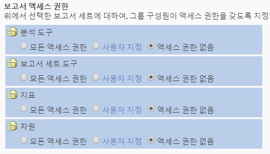
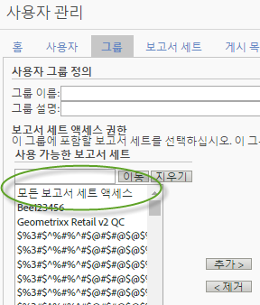

# 사용자 및 그룹 권한 변경

>[!IMPORTANT]
>
>User and product management is moving to the [Admin Console](https://helpx.adobe.com/enterprise/using/admin-console.html). Adobe는 사용자를 마이그레이션할 때가 되면 통지합니다. After all customers have migrated, help content for **[!UICONTROL Analytics]** &gt; **[!UICONTROL Admin Tools]** &gt; **[!UICONTROL User Management]** will be retired.

## 변경 사항{#section_2C205DE94155441B9E9D3E4C46CCF2EE}

**[!UICONTROL 관리]** &gt; **[!UICONTROL 사용자 관리]** &gt; **[!UICONTROL 그룹]**

>[!NOTE]
>
>사용 가능한 권한 조합 수가 많기 때문에 모든 권한 조합에서 사용할 수 있는 모든 API 메서드를 설명하는 설명서를 제공할 수 없습니다. 일반적으로 웹 서비스 액세스 권한이 부여된 비 관리자 사용자에게는 API 메서드에 대한 읽기 액세스 권한만 있으며, 쓰기 액세스 권한은 없습니다.

API와 인터페이스는 동일한 권한 부여 시스템을 사용하기 때문에, 인터페이스(Adobe Admin Console)에서 관리자가 특정 비 관리자 사용자에게 부여한 모든 사용 권한은 사용자가 API에서 가진 권한과 동일합니다.

<table id="table_D1DB0DE37752450BBCCA44DB760BB505"> 
 <thead> 
  <tr> 
   <th colname="col1" class="entry"> 개선 사항 </th> 
   <th colname="col2" class="entry"> 설명 </th> 
  </tr> 
 </thead>
 <tbody> 
  <tr> 
   <td colname="col1"> 
보고서 액세스(사용자 지정 그룹) 변경 
 </td> 
   <td colname="col2"> 
  새 그룹 추가 &gt; 보고서 액세스 
 
새 사용자 그룹 정의 페이지의 보고서 액세스 섹션은 네 개의 카테고리로 간소화되었으며, 따라서 더 세분화된 수준에서 권한을 사용자 지정할 수 있습니다. 
 
 </img> 
 
이전 항목 
 
    <ul id="ul_16D5EF18D57D4608AEEDEC40D90D8828"> 
     <li id="li_F29E84C6228A464C8807F09205AEAAC6"> 
 <a href="../../../admin/user-management2/c-customize-report-access/groups-analytics-tools.md#concept_C4383A6C0F5E4130875FDD3756F2E2FC" format="dita" scope="local"> Analytics 도구</a>: 일반 항목(청구, 로그 등), 회사 관리, 도구, 웹 서비스 액세스, Report Builder 및 Data Connectors 통합에 대한 사용자 권한을 활성화합니다. 
 
 <b>참고:</b> 관리 콘솔 사용자 지정 카테고리의 회사 설정이 Analytics 도구로 이동되었습니다. 
 </li> 
     <li id="li_A6EB788162A2455E94CE54B9279A854D"> 
 <a href="../../../admin/user-management2/c-customize-report-access/groups-report-suite-tools.md#concept_C94E9864349B428AB9CCE0CA4B0A40FF" format="dita" scope="local"> 보고서 세트 도구</a>: 웹 서비스, 보고서 세트 관리, 도구 및 보고서, 대시보드 항목에 대한 사용자 권한을 활성화합니다. 
 </li> 
     <li id="li_EDB0255E009B4F1CAFAF53966B41363C"> 
 <a href="../../../admin/user-management2/c-customize-report-access/groups-metrics.md#concept_05D54436430E4320A48C7C685D337FBE" format="dita" scope="local"> 지표</a>: 트래픽, 전환, 사용자 지정 이벤트, 솔루션 이벤트, 컨텐츠 인식 등에 대한 권한을 활성화합니다. 
 </li> 
     <li id="li_8DAE87D1DEF54803A9C6FE31C01F0FB0"> 
 <a href="../../../admin/user-management2/c-customize-report-access/groups-dimensions.md#concept_68B36161345341369B6D01DC7DD42A22" format="dita" scope="local"> 측정기준</a>: eVar, 트래픽 보고서, 솔루션 보고서 및 경로 지정 보고서를 포함하여 세분화된 수준에서 사용자 액세스를 사용자 지정합니다. 
 </li> 
    </ul> 
예를 들면 여러 Analytics 도구(Analysis Workspace, Reports &amp; Analytics, Report Builder)에 대한 액세스 권한, 특정 지표 및 측정기준(eVars 포함)에 대한 권한 및 세그먼트나 계산된 지표 생성과 같은 기능을 가진 그룹을 생성할 수 있습니다. 
 </td> 
  </tr> 
  <tr> 
   <td colname="col1"> 
사전 정의된 그룹 변경 
 </td> 
   <td colname="col2"> 
 <b>관리자 액세스:</b> 사전 정의된 그룹은 더 이상 관리자에게 필요하지 않습니다. 이제 관리자는 웹 서비스 액세스, Report Builder, Activity Map, Ad Hoc Analysis은 물론 모든 항목(도구, 지표, 측정기준)에 대한 액세스 권한을 가지고 있습니다. 
 
이후에도 그룹의 목적은 관리자가 아닌 사용자에게 액세스 권한을 부여하거나 액세스를 제한하는 것입니다. 
 
 <b>사용자 지정 그룹:</b> 사용자 지정 그룹이 사전 정의된 그룹으로 대체되었습니다. 기존의 사전 정의된 그룹은 같은 그룹 이름을 사용하여 사용자 지정 그룹으로 마이그레이션됩니다. 해당 설정을 포함하여 생성한 사용자 지정 그룹은 모두 유지됩니다. 하지만 설정 위치가 이동됩니다. 예를 들면 회사 설정(관리 콘솔 사용자 지정의)은 현재 <a href="../../../admin/user-management2/c-customize-report-access/groups-analytics-tools.md#concept_C4383A6C0F5E4130875FDD3756F2E2FC" format="dita" scope="local"> Analytics 도구 사용자 지정</a>에 있습니다. 
 
  모든 보고서 액세스에 속한 사용자가 액세스 권한이 있는 사용자 지정 그룹으로 마이그레이션되었습니다. 
 
    <ul id="ul_696A9243F5FD4AF187352C2F4B1CFDC2"> 
     <li id="li_683A0A3BB7214CFFBC61D5A4CD237F48">모든 측정 기준 </li> 
     <li id="li_D8FDBF6A32224731AB706315DEA0A03E">모든 지표 </li> 
     <li id="li_65ABE5C95D43444D88E63EE95C9AED05">모든 보고서 세트 </li> 
     <li id="li_7ED1505590144B38B3B9851BAA6BBB49">채널 보고서 권한 </li> 
     <li id="li_F718FE1FCF9A4B05AB933CA3F105F3EC">예외 항목 탐지 보고서 권한 </li> 
     <li id="li_527BD52007E846FE8B5F71AB3C12F695">실시간 보고서 권한 </li> 
     <li id="li_AFFB58C7FB644AC8A85E2D76BA7D51F5">Analysis Workspace 액세스 권한 </li> 
    </ul> 
이전에 사전 정의된 그룹에서 사용할 수 있었던 모든 설정은 사용자 그룹 정의의 <a href="../c-user-groups/groups.md" format="dita" scope="local">보고서 액세스</a> 설정에서 사용자 지정할 수 있으므로 관리자는 사용자 지정 그룹을 삭제하고 직접 생성할 수 있습니다. 
 </td> 
  </tr> 
  <tr> 
   <td colname="col1"> 
측정기준-수준 권한 
 </td> 
   <td colname="col2"> 
측정기준(및 지표)에 대한 액세스를 포함하거나 제외하도록 권한을 사용자 지정할 수 있습니다. 
 
    <ul id="ul_DA5A54223673474E9151AF979DA50659"> 
     <li id="li_C3E82F7BC07A4F2F83A85D3D511292CC"> 
사용자 지정 그룹 내의 모든 현재 측정 기준 및 지표가 자동으로 새 카테고리에 마이그레이션되었습니다. 기존 그룹에 지표가 활성화되어 있을 경우, 기본적으로 모든 새로 허용할 수 있는 측정 기준(eVar 및 컨텐츠 인식) 및 지표가 주어집니다. 
 </li> 
     <li id="li_CC56F9181CC14AB59318628E72F2E8C9"> 분류 가져오기(이전 SAINT) 권한: 분류에 대한 액세스 권한은 분류가 기준으로 사용하는 <a href="https://marketing.adobe.com/resources/help/en_US/reference/c_classifications.html" format="html" scope="external">변수</a>에 대한 액세스 권한으로 결정됩니다.  </li> 
    </ul> 
See <a href="../../../admin/user-management2/c-customize-report-access/groups-dimensions.md#concept_68B36161345341369B6D01DC7DD42A22" format="dita" scope="local"> Customize Dimension Permissions</a>. 
 </td> 
  </tr> 
  <tr> 
   <td colname="col1"> 
Admin Console 
 </td> 
   <td colname="col2"> 
새로운 고객 또는 회사가 <a href="https://marketing.adobe.com/resources/help/en_US/mcloud/core_services.html" format="html" scope="external">Experience Cloud에 공급된</a> 고객에게만 권장됩니다. 기존 Analytics 고객을 Experience Cloud ID 관리 시스템으로 마이그레이션할 계획입니다. 
 
More information is available in <a href="https://helpx.adobe.com/enterprise/using/manage-permissions-and-roles.html" format="html" scope="external"> Manage product permissions in the Admin Console</a>. 
 </td> 
  </tr> 
 </tbody> 
</table>

## 권한 변경에 대한 FAQ {#section_02809EFC95054B40A089E6C6E4FACA13}

다음은 새 업데이트와 계획된 업데이트 및 그러한 업데이트가 관리 환경에 어떻게 영향을 주는지에 대한 새로운 중요한 정보입니다.

<table id="table_1E93F45C66E841E6882FB602509F30A3"> 
 <thead> 
  <tr> 
   <th colname="col1" class="entry"> 질문 </th> 
   <th colname="col2" class="entry"> 답변 </th> 
  </tr> 
 </thead>
 <tbody> 
  <tr> 
   <td colname="col1"><b>2016년 7월</b> 릴리스에 포함된 권한 변경 사항은 무엇입니까? </td> 
   <td colname="col2"> 
 <b>모든 보고서 세트 액세스</b> 
 
그룹에 포함할 보고서 세트를 추가할 때 모든 보고서 세트 액세스를 지정할 수 있습니다. 이 설정은 그룹 권한을 현재 및 이후의 모든 보고서 세트에 적용합니다. 
 
이 기능을 사용하려면 사용자 관리 &gt; 그룹 &gt; 새 사용자 그룹 추가로 이동한 다음 모든 보고서 세트 액세스를 선택합니다. 
 
 
 </td> 
  </tr> 
  <tr> 
   <td colname="col1"> 
Admin Console를 사용하여 사용자를 관리하거나 기존 Analytics 사용자 관리를 관리해야 합니까? 
 </td> 
   <td colname="col2"> 
Analytics &gt; 관리 &gt; 사용자 관리에서 수행된 변경 사항은 관리 콘솔에 반영되지 않습니다. 따라서 사용자 및 그룹 관리를 위해 관리 콘솔을 이미 사용하는 새 고객만 계속 그래야 합니다. 기존 Analytics 그룹 관리에 대한 마이그레이션이 관리 콘솔로 예정되어 있습니다. 
 </td> 
  </tr> 
  <tr> 
   <td colname="col1"> 
<b>2016년 10월</b> 릴리스에 포함된 권한 변경 사항은 무엇입니까 
 </td> 
   <td colname="col2"> 
현재 관리 도구 인터페이스에 대한 다음과 같은 향상된 기능을 사용할 수 있습니다. 
 
 
     <ul id="ul_2A31E8DC17A94B7FABDBA9C87C3947EF"> 
      <li id="li_AE2ECCA01CC64D30B109BE74379EE474">Permission changes as described in <a href="../../../admin/user-management2/c-user-management/permissions-changes.md#concept_86581595B86B47D5B8F90282FC3E31EF" format="dita" scope="local"> Administrative Changes - Fall 2016</a>. </li> 
      <li id="li_33CB2B6A2E5F45BE97CC5E0983AF280E">작동하지 않는 트래픽 보고서가 제거되었으며, 메뉴에 더 이상 없습니다. </li> 
      <li id="li_57234CF27E1D405987DE89312CD62C52">분류 권한: 분류에 대한 액세스는 분류에 대한 변수에 액세스함으로써 결정됩니다. </li> 
     </ul> 
 </td> 
  </tr> 
  <tr> 
   <td colname="col1"> 
사용자를 마이그레이션하기 위해 수행해야 하는 작업이 있습니까? 
 </td> 
   <td colname="col2"> 
아니요, 모든 권한 마이그레이션은 투명하게 발생합니다. 
 
 
     <ul id="ul_654F85286EC04416B3E0BA725EBE10AD"> 
      <li id="li_8050B8941F794103B82A0ADF0930D216">사용자 지정 그룹에 있는 현재의 모든 트래픽 보고서는 새 측정기준 카테고리로 자동으로 마이그레이션됩니다. </li> 
      <li id="li_B97079DB29A346B98D066F11AB7F94AF">사용자 지정 그룹의 지표가 이미 활성화된 경우 허용 가능한 새로운 모든 측정기준(eVar 및 솔루션 변수)에 자동으로 제공됩니다. </li> 
      <li id="li_F1219EF490DA473BA15F2B215F2995AE"> 적어도 한 개 이상의 지표를 사용한 사용자 지정 그룹에는 사용 가능한 새 트래픽 측정기준(이전 트래픽 보고서)을 <b>제외한</b> 모든 eVar 및 다른 컨텐츠 인식 측정기준에 대한 액세스 권한이 자동으로 부여됩니다. </li> 
      <li id="li_F494CE6144A04A6199CFBBA1D7BEA32B">사전 정의된 모든 그룹이 권한으로 변경됩니다. 이러한 새 권한은 새 Analytics 도구 카테고리에 추가됩니다. </li> 
      <li id="li_2FCD9254FC3C4FD7871EEF9453E5CE1E">지표를 사용한 모든 사용자 지정 그룹에는 모든 Analytics 솔루션 이벤트가 새 지표로 추가됩니다. </li> 
      <li id="li_34C4560769B64F28A4E83BAE71065DCC">모든 보고서 액세스에 사용되는 모든 사용자가 새 사용자 그룹에 추가됩니다. 모든 보고서 액세스는 더 이상 존재하지 않습니다. </li> 
     </ul> 
 </td> 
  </tr> 
  <tr> 
   <td colname="col1"> 
변경되지 않는 내용은 무엇입니까? 
 </td> 
   <td colname="col2"> 
방문자 속성에는 계속 권한이 없습니다. 
 </td> 
  </tr> 
 </tbody> 
</table>

## 권한 빠른 참조 {#section_A3FDD8259F524B21A5489833533D1B28}

다음 표에는 회사의 상태에 따라 작업 및 작업이 발생할 수 있는 위치가 나열되어 있습니다.

>[!NOTE]
>
>A *`migrated user`* and *`Experience Cloud user`* refer to users who have accepted an email invitation to join the Experience Cloud. 이메일 초대를 수락하지 않으면 사용자는 여전히 Analytics 사용자이며 관리 콘솔에서 관리할 수 없습니다. (단, 마이그레이션에서 [Enterprise 또는 페더레이션된 ID](https://helpx.adobe.com/enterprise/using/set-up-identity.html)를 사용하는 경우는 예외입니다. 이 경우 관리자가 사용자별로 사용자를 마이그레이션하면 사용자가 마이그레이션됩니다.)

<table id="table_B68FD00FC5D24823A86BB69558C0327C"> 
 <thead> 
  <tr> 
   <th colname="col1" class="entry"> 작업 </th> 
   <th colname="col2" class="entry"> 로그인 회사를 마이그레이션하지 않음 </th> 
   <th colname="col3" class="entry"> 현재 회사를 마이그레이션 중 </th> 
   <th colname="col4" class="entry"> 로그인 회사 마이그레이션 완료 </th> 
  </tr> 
 </thead>
 <tbody> 
  <tr> 
   <td colname="col1"> 사용자 생성 </td> 
   <td colname="col2"> 
Admin Console (creating a user and adding him or her to an Analytics <a href="https://marketing.adobe.com/resources/help/en_US/mcloud/admin_getting_started.html" format="html" scope="external"> product configuration</a> also creates the user account in Analytics). 
 
 <a href="../../../admin/user-management2/c-user-management/t-add-user-account.md#task_60F86F36CB86446699EA7C7E5FB03EA7" format="dita" scope="local"> 관리 도구</a> 
 </td> 
   <td colname="col3"> 
 <a href="https://adminconsole.adobe.com/enterprise/" format="http" scope="external"> 관리 콘솔</a> 
 </td> 
   <td colname="col4"> 
 <a href="https://adminconsole.adobe.com/enterprise/" format="http" scope="external"> 관리 콘솔</a> 
 </td> 
  </tr> 
  <tr> 
   <td colname="col1"> 사용자 편집 </td> 
   <td colname="col2"> 
 <a href="../../../admin/user-management2/c-user-management/t-add-user-account.md#task_60F86F36CB86446699EA7C7E5FB03EA7" format="dita" scope="local"> 관리 도구</a> 
 </td> 
   <td colname="col3"> 
 <a href="https://adminconsole.adobe.com/enterprise/" format="http" scope="external"> 관리 콘솔</a> 
 
 관리 도구 - 마이그레이션된 사용자에 대한 관리 도구에서 편집 작업은 API 키 관리 및 자산 삭제/전송으로 제한됩니다. 
 </td> 
   <td colname="col4"> 
 <a href="https://adminconsole.adobe.com/enterprise/" format="http" scope="external"> 관리 콘솔</a> 
 
 관리 도구 - API 키 관리 및 자산 삭제/전송으로 편집이 제한됩니다. 
 </td> 
  </tr> 
  <tr> 
   <td colname="col1"> 사용자 삭제 </td> 
   <td colname="col2"> 
Admin Console - Experience Cloud 사용자 
 
관리 도구 - 모든 사용자용이지만 Experience Cloud 사용자인 경우 Experience Cloud 계정이 아닌 매핑된 Analytics 사용자만 삭제합니다. 
 </td> 
   <td colname="col3"> 
관리 콘솔 - 마이그레이션된 사용자의 경우 
 
관리 도구 - Analytics 사용자 전용. 
 </td> 
   <td colname="col4"> 
Admin Console 
 
 관리 도구 - Experience Cloud 사용자를 삭제하거나 관리 콘솔에서 자신의 계정을 비활성화한 후 관리 도구에서 Analytics 로그인을 삭제할 수 있습니다. 
 </td> 
  </tr> 
  <tr> 
   <td colname="col1"> Analytics에 로그인 </td> 
   <td colname="col2"> 
 <b>Experience Cloud: </b>  marketing.adobe.com. Experience Cloud 사용자만 사용할 수 있습니다. 
 
 <b>Analytics(기존):</b> sc.omniture.com. Analytics 전용 사용자 및 해당 Analytics 자격 증명이 있는 Experience Cloud 사용자용 
 </td> 
   <td colname="col3"> 
  marketing.adobe.com - Experience Cloud 사용자만 사용할 수 있습니다. 
 
  sc.omniture.com - Analytics 전용 사용자 및 해당 Analytics 자격 증명이 있는 Experience Cloud 사용자가 사용할 수 있습니다. 
 
마이그레이션 중에 관리자가 특정 사용자에 대한 omniture.com 로그인 기능을 끌 수 있습니다. 
 </td> 
   <td colname="col4"> 
Admin Console 
 </td> 
  </tr> 
  <tr> 
   <td colname="col1"> 그룹을 만듭니다 </td> 
   <td colname="col2"> 
관리 콘솔 - 관리 콘솔에서 그룹이 만들어지면 Analytics의 매핑된 그룹이 관리 도구에 나타나지만 이 매핑된 그룹은 관리 도구에서 이름을 변경하거나 관리 도구에서 삭제할 수 없습니다. 
 
관리 도구. 
 </td> 
   <td colname="col3"> 
Admin Console (<a href="https://marketing.adobe.com/resources/help/en_US/mcloud/admin_getting_started.html" format="html" scope="external"> create product configuration</a>) 
 </td> 
   <td colname="col4"> 
Admin Console (<a href="https://marketing.adobe.com/resources/help/en_US/mcloud/admin_getting_started.html" format="html" scope="external"> create product configuration</a>) 
 </td> 
  </tr> 
  <tr> 
   <td colname="col1"> 그룹의 사용자 편집 </td> 
   <td colname="col2"> 
Admin Console - Experience Cloud 사용자만 이용 가능 
 
관리 도구 - Analytics 전용 사용자와 그룹의 Experience Cloud 사용자 구성원을 모두 관리 도구에서 편집할 수 있습니다. 그러나 Experience Cloud 사용자가 관리 콘솔에서 그룹에 속한 경우 관리 도구의 그룹에서 제거할 수 없습니다. 
 </td> 
   <td colname="col3"> 
Admin Console - Experience Cloud 사용자만 해당 
 
 관리 도구 - Analytics 전용 로그인이 관리 도구의 그룹에서 추가/제거됩니다. 
 </td> 
   <td colname="col4"> 
Admin Console 
 </td> 
  </tr> 
  <tr> 
   <td colname="col1"> 그룹에 대한 권한 편집 </td> 
   <td colname="col2"> 
관리 콘솔 - 관리 콘솔에서 만든 그룹을 편집할 수 있습니다. 
 
관리 도구 - 그룹에 대한 권한을 편집할 수 있습니다. 
 </td> 
   <td colname="col3"> 
관리 콘솔 
 </td> 
   <td colname="col4"> 
관리 콘솔 
 </td> 
  </tr> 
  <tr> 
   <td colname="col1"> 그룹 삭제 </td> 
   <td colname="col2"> 
관리 콘솔 - 관리 콘솔에서 만든 그룹만 삭제할 수 있습니다. 
 
관리 도구 - 관리 도구에서 생성된 그룹만 삭제할 수 있습니다. 
 </td> 
   <td colname="col3"> 
관리 콘솔 
 </td> 
   <td colname="col4"> 
관리 콘솔 
 </td> 
  </tr> 
  <tr> 
   <td colname="col1"> 사용자의 관리 상태 변경 </td> 
   <td colname="col2"> 
Admin Console - Experience Cloud 사용자만 해당됩니다. 
 
관리 도구 
 </td> 
   <td colname="col3"> 
Admin Console - Experience Cloud 사용자만 해당됩니다. 
 
관리 도구 - Analytics 사용자 전용. 
 </td> 
   <td colname="col4"> 
Admin Console 
 </td> 
  </tr> 
 </tbody> 
</table>
