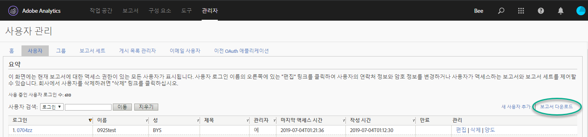
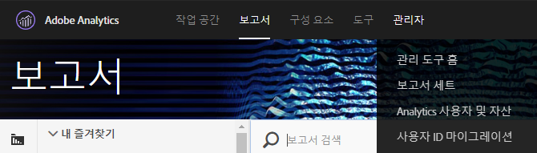
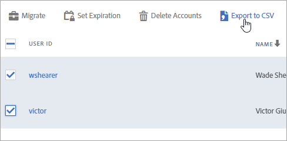
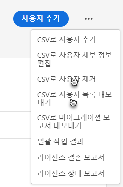
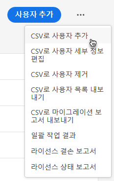
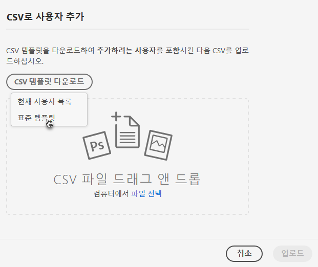
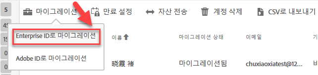

# Enterprise 및 Federated ID에 대한 Analytics 사용자 계정을 마이그레이션합니다{#migrate-analytics-user-accounts-for-enterprise-and-federated-ids}

Analytics 사용자 계정을 Admin Console에 Enterprise ID 또는 Federated ID로 마이그레이션하는 방법입니다.

## 전제 조건 {#concept-e60d8deb3fc54a1a81f1f47a26658de3}

Admin Console에서 사용자를 관리하기 위한 전제 조건입니다.

새 도메인 및 디렉터리의 경우 다음 단계를 수행하십시오.

* 디렉터리 설정
* 도메인 설정
* 디렉터리에 도메인 연결

도움이 필요한 경우 [ID 시스템 설정](https://helpx.adobe.com/enterprise/using/set-up-identity.html)을 참조하십시오.

다른 사업 부서의 조직이나 팀에서 이미 디렉터리를 생성한 경우 [디렉터리 신뢰](https://helpx.adobe.com/enterprise/using/set-up-identity.html#Directorytrusting)의 단계에 따라 Analytics을 사용하고 있는 조직에 디렉터리를 설정합니다.

## Enterprise 및 Federated ID에 대한 사용자 계정 마이그레이션 {#task-0cfb3e4400fd4ab58e4d9704528b05fa}

이 절차에서는 다음을 수행합니다.

* **[!UICONTROL Analytics]** &gt; **[!UICONTROL Analytics 사용자 및 자산에서 사용자 로그인 목록을 다운로드합니다]**.

* **[!UICONTROL 관리 콘솔]** &gt; **[!UICONTROL 사용자로부터 현재 사용자 목록을 다운로드합니다]**.

* 목록을 비교합니다(Admin Console에서 계정 데이터를 겹쳐 쓰지 않도록 중복되는 항목 검색).
* Upload a finished [!DNL .csv] (from **[!UICONTROL Admin Console]** &gt; **[!UICONTROL Users]**) with Enterprise ID or Federated ID users to the Admin Console.

기존 Adobe ID 사용자 계정을 Enterprise ID 또는 Federated ID로 마이그레이션해야 하는 경우, Adobe 고객 지원 센터에 문의하여 [대량 사용자 ID 전환](https://helpx.adobe.com/enterprise/using/bulk-operations.html)을 요청하십시오.

**사용자 계정을 마이그레이션하는 방법**

1. 다음 방법 중 하나를 사용하여 Analytics 사용자 관리에서 Analytics 사용자 로그인 파일([!DNL User Logins List.tab])을 다운로드합니다(이미 마이그레이션한 사용자인지 여부에 따라 다름).
   1. *마이그레이션 전에* **[!UICONTROL 관리]** &gt; **[!UICONTROL 사용자 관리 (기존)]** &gt; 사용자 ****&#x200B;편집을 탐색한 다음 보고서 **[!UICONTROL 다운로드를 클릭합니다]**.

      

      [보고서 다운로드] 링크는 사용자를 마이그레이션하지 않은 고객에게만 표시됩니다.

   1. *이미 사용자를 마이그레이션한* 경우 **[!UICONTROL Analytics]** &gt; **[!UICONTROL Analytics 사용자 및 자산으로 이동합니다]**.

      

   1. [!DNL Users] 페이지에서 사용자를 선택한 다음 CSV로 **[!UICONTROL 내보내기를 클릭합니다]**.

      

   1. Open the downloaded [!DNL User List.csv] file in Excel.

      *`Email`*&#x200B;파일에, *`First Name`*&#x200B;및 *`Last Name`* 값을 복사할 준비가 되었습니다 [!DNL sample.csv] (다음 단계에서 설명됨).

      >[!IMPORTANT]
      >
      >CSV 파일의 값은 쉼표로 구분해야 합니다.

      **팁**: 이 단계에서는 사용자 목록을 스트리밍하여 올바른 이메일 ID가 있는 사용자만 Enterprise 또는 Federated ID 마이그레이션에 포함할 것을 권장합니다.

1. [Admin Console]에서 Admin Console 사용자 목록을 다운로드합니다. 

   1. [관리 콘솔](http://adminconsole.adobe.html/#) &gt; **[!UICONTROL 사용자로]**&#x200B;이동한 다음 CSV로 사용자 목록 [내보내기를](https://helpx.adobe.com/enterprise/using/users.html)클릭합니다.

      

   1. Compare the two files: the existing Admin Console users in the exported [!DNL .csv] file ( [!DNL sample.csv], in this example) with the users in the Analytics [!DNL User Logins List.csv] file.

      >[!IMPORTANT]
      >
      >If you find duplicates, delete them from the Analytics [!DNL User Logins List.csv] file. 이 단계는 Admin Console에서 Experience Cloud 사용자 권한을 겹쳐 쓰지 못하게 하고 마이그레이션할 계정 목록을 제공하는 데 도움이 됩니다.

1. Admin Console에서 CSV 템플릿 다운로드:
   1. On the Users tab, click **[!UICONTROL Add users by CSV]**, then **[!UICONTROL Download CSV Template]**.

      

   1. **[!UICONTROL 표준 템플릿을]**&#x200B;선택합니다.

      이 단계에서는 [!DNL sample.csv] 템플릿 파일을 다운로드합니다.

      

1. *`Email`*, *`First Name`*&#x200B;및 *`Last Name`* 열 값을 [!DNL User Logins List.tab][!DNL sample.csv] 템플릿의 해당 열에 복사합니다.

   **템플릿 파일 예제**

   

1. 템플릿([!DNL sample.csv])에서 다음 필수 필드를 완료하십시오. 

<table id="table_1B5EEFDB5BD8436EB760BE5FFAB1CF02"> 
 <thead> 
  <tr> 
   <th colname="col1" class="entry"> 필드 </th> 
   <th colname="col2" class="entry"> 설명 </th> 
  </tr>
 </thead>
 <tbody> 
  <tr> 
   <td colname="col1"> 
이메일 
 </td> 
   <td colname="col2"> 
User Logins List.tab에서 복사됩니다. 
 </td> 
  </tr> 
  <tr> 
   <td colname="col1"> 
이름 
 </td> 
   <td colname="col2"> 
User Logins List.tab에서 복사됩니다. 
 </td> 
  </tr> 
  <tr> 
   <td colname="col1"> 
성 
 </td> 
   <td colname="col2"> 
User Logins List.tab에서 복사됩니다. 
 </td> 
  </tr> 
  <tr> 
   <td colname="col1"> 
ID 유형 
 </td> 
   <td colname="col2"> 
 Federated ID 또는  Enterprise ID. 
 </td> 
  </tr> 
  <tr> 
   <td colname="col1"> 
도메인 
 </td> 
   <td colname="col2"> 
도메인의  도메인과  이메일 열이 <a href="../c-migration-tool/migrate-enterprise.md#concept-e60d8deb3fc54a1a81f1f47a26658de3" format="dita" scope="local"> 사전 요구 사항에 설정된 도메인과 일치합니다</a>. 
 </td> 
  </tr> 
  <tr> 
   <td colname="col1"> 
국가 코드 
 </td> 
   <td colname="col2"> </td> 
  </tr> 
 </tbody> 
</table>

For more information about the fields in the [!DNL .csv] file, see [CSV file format](https://helpx.adobe.com/enterprise/using/users.html).

>[!NOTE]
>
>Other columns, such as *`Product Configurations`* and *`Admin Roles`* can be blank.

1. On the Users tab in the Admin Console, upload the template file by clicking **[!UICONTROL Add users by CSV]** (as shown in [Step 3](../c-migration-tool/migrate-enterprise.md#step-190321c6025947e38b195daed122c063).).
1. In Analytics, run the migration tool (as described in [Migrate Analytics user accounts](../c-migration-tool/t-migrate-users.md#task-f3355f3b14a340feae58cfa04c0ba1c9)).
1. **[!UICONTROL 마이그레이션]** &gt; **[!UICONTROL Enterprise ID로 마이그레이션을 클릭합니다]**.

   

   **[!UICONTROL 마이그레이션을]**&#x200B;클릭하면 사용자가 관리 콘솔에서 Enterprise ID/Federated ID 계정에 연결됩니다. The permissions of the legacy user account in Analytics will match the permissions granted to the Enterprise/Federated ID login in **[!UICONTROL Admin Console]** &gt; **[!UICONTROL Analytics]** &gt; **[!UICONTROL Product Profiles]**. 사용자 ID가 [마이그레이션 완료] 버킷에 표시됩니다. 기존 [!DNL my.omniture.com] 액세스를 비활성화할 수 있습니다.

   After migrating users, the status under the Migration Status column changes from *`Not Initiated`* to *`Migrated`*.

   마이그레이션 도구에 표시되는 Adobe ID 사용자는 이 프로세스에서도 마이그레이션할 수 있습니다. ID 전환이 수행될 때까지는 계속 Adobe ID로 로그인해야 합니다. ID 전환에 대한 지원은 Adobe 고객 지원 센터에 문의하십시오.
