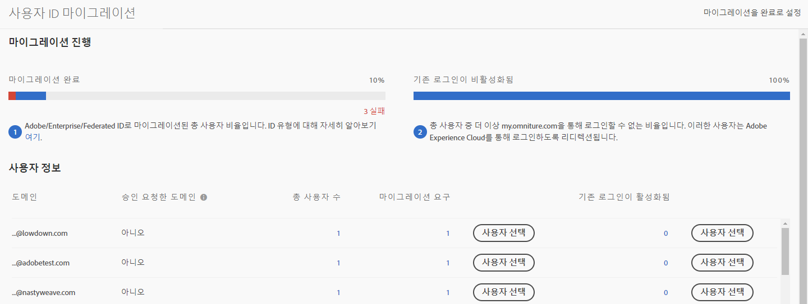
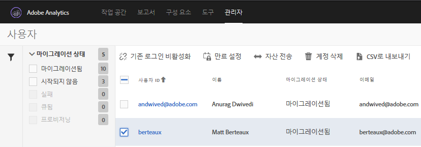

# Adobe ID에 대한 Analytics 사용자 계정 마이그레이션{#migrate-analytics-user-accounts-for-adobe-ids}

기존의 Analytics 사용자 관리 시스템에서 Admin Console로 사용자를 마이그레이션합니다.

## Adobe ID에 대한 Analytics 사용자 계정 마이그레이션 {#task-f3355f3b14a340feae58cfa04c0ba1c9}

기존의 Analytics 사용자 관리 시스템에서 Admin Console로 사용자를 마이그레이션합니다.

>[!NOTE]
>
>Experience Cloud를 통해 로그인하지 않은 관리자가 사용자 ID 마이그레이션 도구에 액세스하면 Experience Cloud 로그인 페이지로 리디렉션됩니다.

**Analytics 사용자를 마이그레이션하려면**

1. **Analytics** &gt; **[!UICONTROL 관리]** &gt; **[!UICONTROL 사용자 ID 마이그레이션으로 이동합니다]**.

   

   [사용자 ID 마이그레이션] 페이지에는 *마이그레이션 진행* 및 *사용자 정보*&#x200B;와 같은 두 개의 섹션이 있습니다.

   **마이그레이션 진행**

<table id="table_F9F1CFF762C745E198CB075A02BA2DDA"> 
 <thead> 
  <tr> 
   <th colname="col1" class="entry"> 단계 </th> 
   <th colname="col2" class="entry"> 설명 </th> 
  </tr>
 </thead>
 <tbody> 
  <tr> 
   <td colname="col1"> 
마이그레이션 완료 
 </td> 
   <td colname="col2"> 
사용자가 초대를 수락했습니다. 
 </td> 
  </tr> 
  <tr> 
   <td colname="col1"> 
기존 로그인이 비활성화됨 
 </td> 
   <td colname="col2"> 
회사 ID를 사용하는 기존 로그인이 비활성화되었습니다. 이제 사용자는 Adobe ID 또는 Enterprise ID를 사용하여 Experience Cloud에 액세스합니다. 모든 사용자가 이 단계에 도달했으면 마이그레이션을 완료했습니다. 
 
마이그레이션에서 기존 로그인은 비활성화됩니다. Users are redirected to  experiencecloud.adobe.com and must log in using the Adobe ID or Enterprise ID. 
 
See <a href="../c-migration-tool/t-disable-legacy-login.md#task-c9262e469814473c8a3ff3971c95570b" format="dita" scope="local"> Disable Legacy Logins</a> for more information. 
 </td> 
  </tr> 
 </tbody> 
</table>

**사용자 정보**

사용자 정보는 조직의 사용자를 도메인 이름으로 구분하여 설명합니다.

<table id="table_3822E27AF81E4A188562FEB5131548A5"> 
 <thead> 
  <tr> 
   <th colname="col1" class="entry"> 요소 </th> 
   <th colname="col2" class="entry"> 설명 </th> 
  </tr>
 </thead>
 <tbody> 
  <tr> 
   <td colname="col1"> 
도메인 
 </td> 
   <td colname="col2"> 
도메인은 현재 Analytics 사용자 기반의 이메일 ID에 해당합니다. 하나의 조직에서만 도메인을 요구할 수 있으며 시스템 관리자만 도메인을 요구할 수 있습니다. 자세한 내용은 <a href="https://helpx.adobe.com/enterprise/help/request-access-to-claimed-domain.html" format="html" scope="external">요구한 도메인에 대한 액세스 권한 요청</a>을 참조하십시오. 
 </td> 
  </tr> 
  <tr> 
   <td colname="col1"> 
도메인 승인 요구 
 </td> 
   <td colname="col2"> 
사용자를 Enterprise 또는 Federated ID로 마이그레이션하려면 시스템 관리자가 사용자를 마이그레이션하기 전에 Admin Console을 통해 사용 가능한 도메인을 청구해야 합니다. <a href="https://helpx.adobe.com/enterprise/help/identity.html" format="html" scope="external">여기</a>에서 추가 정보를 확인하십시오. 
 
Enterprise 또는 Federated ID에 대한 도메인을 승인 요청하지 않으려면 이 단계를 건너뛰고 사용자를 Adobe ID로 마이그레이션하십시오. <a href="https://helpx.adobe.com/enterprise/help/identity.html" format="html" scope="external">여기</a>에서 ID 유형을 확인하십시오. 
 </td> 
  </tr> 
 </tbody> 
</table>

1. Locate the domain containing the user IDs you want to migrate, then, under **[!UICONTROL Requiring Migration]**, click **[!UICONTROL Select Users]**.
1. [!DNL Users] 페이지에서 마이그레이션할 사용자를 선택한 다음 **[!UICONTROL 마이그레이션을 클릭합니다]**.

   **[!UICONTROL [마이그레이션]**] 를 클릭하면 사용자가 초대 (마이그레이션 시작) 를 받고 수락해야 합니다. 이 조치를 통해 사용자 ID를 [마이그레이션 완료됨]으로 이동합니다. 그런 다음 [!DNL my.omniture.com]에 대한 기존 액세스를 중단할 수 있습니다.

   

1. 사용자([Adobe ID 또는 Enterprise ID](https://helpx.adobe.com/enterprise/help/identity.html))를 마이그레이션할 ID 유형을 지정하십시오. 

   After migrating users, the status under the column Migration Status changes from *`Not Initiated`* to *`Migrated`*.

   *`Failed`* 표시되는 경우, 아이콘을 마우스로 가리키면 마이그레이션이 실패한 이유에 대한 설명이 표시됩니다.
