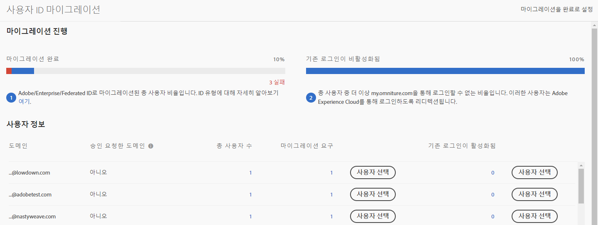
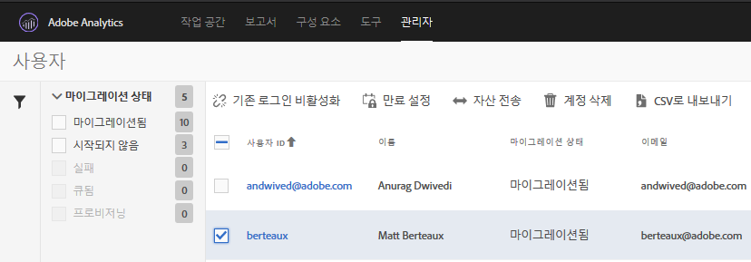

# Adobe ID에 대한 Analytics 사용자 계정 마이그레이션{#migrate-analytics-user-accounts-for-adobe-ids}

기존의 Analytics 사용자 관리 시스템에서 Admin Console로 사용자를 마이그레이션합니다.

## Adobe ID에 대한 Analytics 사용자 계정 마이그레이션 {#task-f3355f3b14a340feae58cfa04c0ba1c9}

기존의 Analytics 사용자 관리 시스템에서 Admin Console로 사용자를 마이그레이션합니다.

>[!NOTE] Experience Cloud를 통해 로그인하지 않은 관리자가 사용자 ID 마이그레이션 도구에 액세스하려고 하면 Experience Cloud 로그인 페이지로 리디렉션됩니다.

**Analytics 사용자를 마이그레이션하려면**

1. > **[!UICONTROL Analytics]** > **[!UICONTROL Admin]** > **[!UICONTROL User ID Migration]**&#x200B;으로 이동합니다.

   

   사용자 ID 마이그레이션 페이지에는 다음 두 섹션이 있습니다.마이그레이션 *진행* 및 *사용자 정보*.

   **마이그레이션 진행률**

   <table id="table_F9F1CFF762C745E198CB075A02BA2DDA"> 
   <thead> 
   <tr> 
      <th colname="col1" class="entry"> 위상 </th> 
      <th colname="col2" class="entry"> 설명 </th> 
   </tr>
   </thead>
   <tbody> 
   <tr> 
      <td colname="col1"> 
마이그레이션 완료 
 </td> 
      <td colname="col2"> 
사용자가 초대를 수락했습니다. 
 </td> 
   </tr> 
   <tr> 
      <td colname="col1"> 
기존 로그인 비활성화 
 </td> 
      <td colname="col2"> 
회사 ID를 사용한 기존 로그인이 비활성화됩니다. 이제 사용자는 Adobe ID 또는 Enterprise ID를 사용하여 Experience Cloud에 액세스합니다. 모든 사용자가 이 단계에 도달하면 마이그레이션을 완료했습니다. 
 
마이그레이션 시 기존 로그인이 비활성화됩니다. 사용자는  experiencecloud.adobe.com으로 리디렉션되며 Adobe ID 또는 Enterprise ID를 사용하여 로그인해야 합니다. 
 </td> 
   </tr> 
   </tbody> 
   </table>

   **사용자 정보**

   사용자 정보는 조직의 사용자를 도메인 이름으로 구분하여 대략적으로 설명합니다.

   <table id="table_3822E27AF81E4A188562FEB5131548A5"> 
   <thead> 
   <tr> 
      <th colname="col1" class="entry"> 요소 </th> 
      <th colname="col2" class="entry"> 설명 </th> 
   </tr>
   </thead>
   <tbody> 
   <tr> 
      <td colname="col1"> 
도메인 
 </td> 
      <td colname="col2"> 
도메인은 현재 Analytics 사용자 기반의 이메일 ID에만 적용됩니다. 하나의 조직에서만 도메인을 요구할 수 있으며 시스템 관리자만 도메인을 요구할 수 있습니다. 자세한 내용은 <a href="https://helpx.adobe.com/kr/enterprise/help/request-access-to-claimed-domain.html">요구한 도메인에 대한 액세스 권한 요청</a>을 참조하십시오. 
 </td> 
   </tr> 
   <tr> 
      <td colname="col1"> 
승인 요청한 도메인 
 </td> 
      <td colname="col2"> 
사용자를 Enterprise 또는 Federated ID로 마이그레이션하려면 시스템 관리자가 사용자를 마이그레이션하기 전에 Admin Console을 통해 사용 가능한 도메인을 요청해야 합니다. <a href="https://helpx.adobe.com/kr/enterprise/help/identity.html">여기</a>에서 추가 정보를 확인하십시오. 
 
Enterprise 또는 Federated ID에 대한 도메인을 승인 요청하지 않으려면 이 단계를 건너뛰고 사용자를 Adobe ID로 마이그레이션하십시오. <a href="https://helpx.adobe.com/kr/enterprise/help/identity.html">여기</a>에서 ID 유형을 확인하십시오. 
 </td> 
   </tr> 
   </tbody> 
   </table>

1. Locate the domain containing the user IDs you want to migrate, then, under **[!UICONTROL Requiring Migration]**, click **[!UICONTROL Select Users]**.
1. On the [!DNL Users] page, select the users you want to migrate, then click **[!UICONTROL Migrate]**.

   When you click **[!UICONTROL Migrate]**, users receive an invitation (Migration Initiated) and must accept it. 이렇게 하면 사용자 ID가 마이그레이션 완료됨으로 이동합니다. 그런 다음 `[!DNL my.omniture.com].`에 대한 기존 액세스를 중단할 수 있습니다.

   

1. 사용자(Adobe ID 또는 Enterprise ID)를 마이그레이션할 ID 유형을 지정하십시오.

   사용자를 마이그레이션한 후 마이그레이션 상태 열의 상태가 *`Not Initiated`*&#x200B;에서 *`Migrated`*&#x200B;로 바뀝니다.

   *`Failed`*&#x200B;가 표시되는 경우 아이콘 위로 마우스를 가져가 마이그레이션이 실패한 이유에 대한 설명을 확인하십시오.
