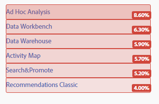
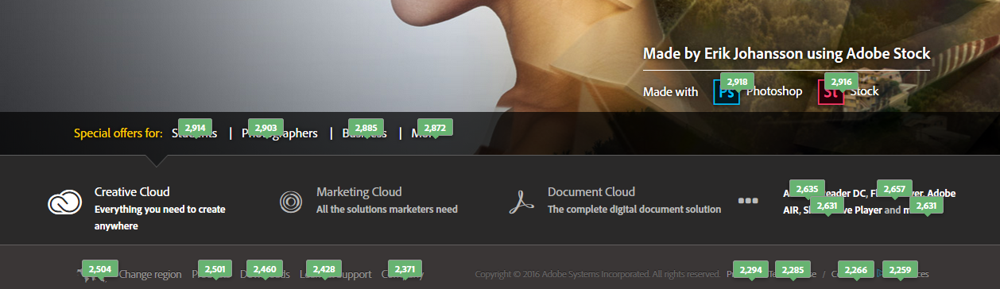
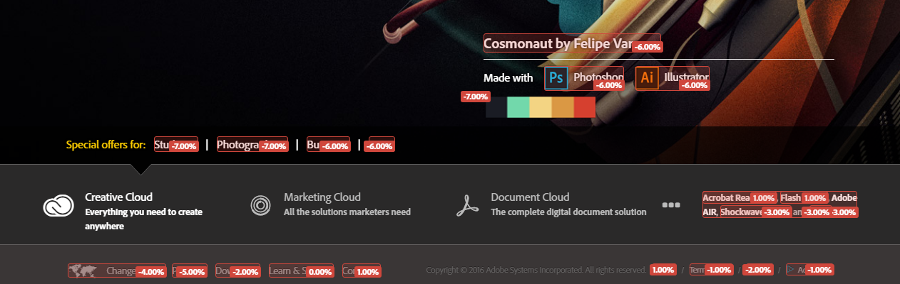

# 사용자 지정 가능 오버레이

오버레이는 페이지에 있는 링크들의 인기도를 쉽게 보고 이해할 수 있도록 데이터 시각화를 구성하는 여러 방법을 제공합니다.

오버레이를 사용하면 페이지에서 바로 클릭 데이터를 시각화할 수 있습니다. This is what separates a visual analysis tool like [!DNL Activity Map] from mostly tabular and graphical tools like Reports &amp; Analytics.

[!DNL Activity Map] 오퍼는 다음 세 가지 유형의 오버레이를 제공합니다.

* 그라데이션 오버레이(Heatmap)
* 버블 오버레이
* 승자 및 패자 오버레이

[다이내믹 컨텐츠에 대한 오버레이 렌더링](/help/analyze/activity-map/activitymap-link-tracking/activitymap-stl-track-custom-elements.md)을 구성할 수도 있습니다.

오버레이를 변경하려면 [[오버레이 설정] 패널](/help/analyze/activity-map/activitymap-overlay-settings.md)을 열고 사용할 수 있는 옵션을 편집하십시오.

오버레이를 마우스로 가리키면 해당하는 [세부 사항](/help/analyze/activity-map/activitymap-overlay-details.md)이 표시됩니다.

## Gradient overlay (Heatmap) {#section_06AF13DE05A1454D960176CD0DA921A6}

그라데이션 오버레이 사용 시 색상 강도는 링크의 인기도를 기반으로 합니다. 이 강도는 상위 30개 등급이나 절대적인 지표 값 함수로 표준화되어 있습니다.

이러한 지표는 페이지의 링크 상단에 일종의 '열지도'로서 오버레이되므로, 다음을 포함한 중요한 질문에 대한 답을 알 수 있습니다.

* 개별 페이지의 가치는 어떠한가?
* 페이지에서 개별 요소의 가치는 어떠한가?
* 페이지에서 가장 가치있는 '디지털 부동산'은 무엇인가?

## Bubble overlay {#section_A657AB3F64CB47F881BBFFD72B37D9D4}

버블 오버레이는 오버레이 컨텐츠(지표, 백분율 또는 등급)를 작은 설명선 버블로 표시합니다.

버블 오버레이는 도구 모음의 [오버레이 유형]에서 이 오버레이를 선택하면 표시됩니다. Bubble overlays show for all links that match the selection in [[!DNL Activity Map] Settings](/help/analyze/activity-map/activitymap-overlay-settings.md) (top 30, top 50, all...). 그라데이션 오버레이는 이 옵션이 선택되어 있지 않으면 표시됩니다.

> [!NOTE] 하위 메뉴에 대한 버블 오버레이는 하위 메뉴를 표시할 때만 표시됩니다.
>
>&gt;

## Gainers and losers overlays {#section_EE80278E20C14824869BF5A27A4634C8}

**[!UICONTROL 승자 및 패자 오버레이는]** 라이브 모드에서만 사용할 수 있습니다. 이 오버레이는 현재 기간의 지표를 지난 기간의 지표와 비교하여 링크 활동의 실시간 변경 사항을 보고하며 트렌드를 실시간으로 보는 시각적으로 강렬한 방법을 제공합니다.

이 실시간 오버레이는 이전 기간과 현재 기간 간의 지표 값 변화를 기반으로 클릭을 평가합니다.

