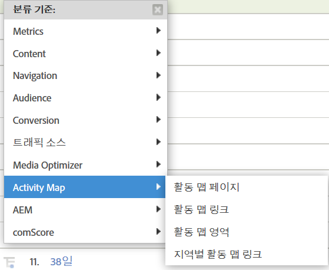

# Activity Map 활성화{#enable-activity-map}

Analytics 관리자가 Activity Map 링크 컬렉션 및 사용자 다운로드를 활성화하기 위해 완료해야 하는 절차에 대해 설명합니다.

## 1단계. AppMeasurement(Javascript) 코드를 v1.6(또는 이상)으로 업데이트{#section_5D1586289DF2489289B1B6C1C80C300D}

Activity Map 모듈은 AppMeasurement.js 파일의 일부입니다(파일의 맨 위에 있음). AppMeasurement 라이브러리는 Activity Map 모듈이 인스턴스화될 때 이 모듈을 로드합니다.

이 버전(또는 이상)의 AppMeasurement로 업데이트해야만 Activity Map 데이터를 수집할 수 있습니다.

1. **[!UICONTROL Analytics]** &gt; **[!UICONTROL 관리]** &gt; **[!UICONTROL 코드 관리자]**&#x200B;로 이동하여 최신 AppMeasurement 코드(AppMeasurement_Javascript-1.6.zip)를 다운로드하고 [구현하십시오](https://marketing.adobe.com/resources/help/en_US/sc/implement/js_implementation.html).

   Adobe에서는 Activity Map 모듈을 포함하여 코드에 수행한 변경 작업을 시각화하는 데 도움이 되기 위해 [샘플 구현 코드](/help/analyze/activity-map/activitymap-getting-started/activitymap-getting-started-admins/activitymap-sample-implementation-code.md)를 일부 포함했습니다.

1. 구현의 유효성을 검사합니다.

   1. 클릭 가능한 요소를 클릭하면, 데이터가 s_sq라는 쿠키에 저장됩니다.
   1. Activity Map 데이터는 추적 호출에 대한 쿼리 문자열에 표시됩니다. 예:

      ```
      …&c.&a.&Activity Map.&link=My%20Link&region=My%20Region&page=My%20Page&.Activity Map&.a&.c&...
      ```

1. 이 보고서를 **[!UICONTROL 지역별 Activity Map 링크]**&#x200B;로 분류하여 해당 페이지에 대한 링크/지역을 봅니다.  {width="400px"}

## 2단계. Activity Map 보고서 활성화 {#section_D14F15D2FC0346FCAD8B3B87E6DD33D4}

먼저, 보고서 세트 수준에서 Activity Map 보고서를 활성화해야 합니다.

1. Adobe Analytics에 로그인하고 **[!UICONTROL Analytics]** &gt; **[!UICONTROL 관리&gt; 보고서 세트 &gt;[보고서 세트 선택]&gt; 설정 편집 &gt; Activity Map]** &gt; **[!UICONTROL Activity Map 보고]**&#x200B;로 이동합니다.
1. Activity Map에서는 Activity Map 보고서에 있는 링크 데이터를 수집합니다. 활성화가 수행되도록 하려면, **[!UICONTROL Activity Map 보고서 활성화]**&#x200B;를 클릭하여 변수를 먼저 활성화합니다.

   이 단계에서는 데이터를 수집하는 데 필요한 모든 Analytics 차원이 추가됩니다.

1. 약 1시간 후, 사용자가 링크를 클릭한 모든 페이지를 보여주는 [Activity Map 페이지 보고서](/help/analyze/activity-map/activitymap-reporting-analytics.md)를 확인하십시오.

## 3단계. Activity Map 액세스 그룹에 사용자 추가 {#section_4C7A47BB7DEF4AFFBC276392467F9675}

1. **[!UICONTROL 그룹에 사용자 추가]**&#x200B;를 클릭합니다.

   이렇게 하면 관리 콘솔에 그룹 관리 페이지가 표시됩니다.

1. [사용자를 이 그룹에 추가](https://marketing.adobe.com/resources/help/en_US/reference/groups.html)하고 **[!UICONTROL 그룹을 저장]**&#x200B;합니다.

1. This allow your Admin users to download Activity Map from  **[!UICONTROL Adobe Analytics]** &gt; **[!UICONTROL Tools]** &gt; **[!UICONTROL ActivityMap]** .

> [!NOTE] 관리자가 아닌 사용자가 Activity Map을 다운로드하도록 하려면 '도구' 및 '레거시 ClickMap 설치'에 대한 권한을 제공하는 새 사용자 그룹을 만드십시오. 이 수준의 권한은 Activity Map 액세스와 함께 결합되어 도구를 다운로드하고 사용할 수 있는 권한을 제공합니다.
