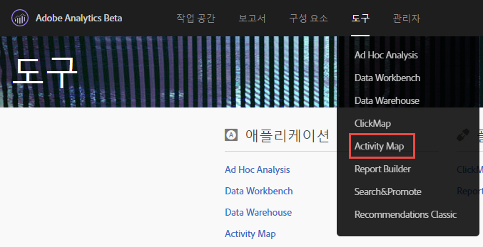
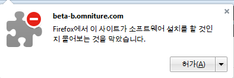
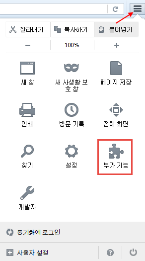

# Install Activity Map browser plug-ins{#install-activity-map-browser-plug-ins}

설치 프로세스는 사용 중인 브라우저에 따라 다릅니다.

Activity Map 브라우저 플러그인은

* Analytics 페이지 태그로서 수동으로 주입됩니다.
* 브라우저 도구 모음에서 단추나 메뉴 항목에 의해 시작됩니다.
* 데스크톱 브라우저인 Internet Explorer, Firefox, Chrome 및 Safari의 최신 버전과만 호환합니다.
* **[!UICONTROL 내 로그인 기억]기능을 지원합니다.**
* Analytics 페이지 코드를 포함하지 않는 웹 페이지에서 Activity Map 도구 모음을 주입&#x200B;**할 수 있습니다**. 페이지에 Analytics 페이지 코드가 포함되어 있지 않을 경우 오류 메시지를 표시합니다.
* 브라우저 플러그인 설치 프로세스를 수행해야 사용할 수 있습니다.

## Install Activity Map plug-in on Chrome {#section_6907253D5D5E4422967E6439207A013F}

1. **[!UICONTROL Adobe Analytics]** &gt; **[!UICONTROL 도구]** &gt; **[!UICONTROL Activity Map]**&#x200B;로 이동합니다. 

1. **[!UICONTROL Activity Map 다운로드를 클릭합니다]**.
1. **[!UICONTROL Activity Map 플러그인 설치를 클릭합니다]**.
1. 보안 경고에서 Activity Map 브라우저 플러그인을 다운로드할지를 물으면 **[!UICONTROL 예]라고 답합니다.**
1. 다운로드가 완료되면, .zip 파일의 위치를 찾아 컨텐츠를 압축 해제합니다.
1. Return to Chrome's address bar and enter `chrome://extensions`.
1. 개발자 모드 상자를 선택합니다.
1. [압축을 푼 확장 기능 로드]를 클릭하고 팝업에서 압축을 해제한 폴더를 선택합니다.
1. If you see an Adobe Analytics icon  {width="70px"} added to your tool bar, your download was successful. You can now [launch Activity Map](launch-Activity Map.md#concept_2392036DB1AF4B05BEA3E9F4EE9B46B8) from your page.

## Install Activity Map plug-in on Firefox {#section_1F69D3D22DB34D6992747B1A62C1D2DA}

1. **[!UICONTROL Analytics]** &gt; **[!UICONTROL Activity Map로 이동합니다]**.

1. **[!UICONTROL Activity Map 다운로드를 클릭합니다]**.
1. **[!UICONTROL Activity Map 플러그인 설치를 클릭합니다]**.
1. Click **[!UICONTROL Allow]** when this message appears: 

1. **[!UICONTROL 지금 설치를 클릭합니다]**.
1. Click the **[!UICONTROL Open Menu]** icon at the top right and select **[!UICONTROL Add-Ons]**. {width = "250 px"}

1. Activity Map이 Firefox 추가 기능 중 하나로 나열되어 있어야 합니다.
1. 도구 모음에 Adobe Analytics 아이콘  You can now [launch Activity Map](launch-Activity Map.md#concept_2392036DB1AF4B05BEA3E9F4EE9B46B8) from your page.

## Install Activity Map plug-in on Internet Explorer {#section_1A33705D7F784C4A88C9026ADC860FB8}

1. **[!UICONTROL Analytics]** &gt; **[!UICONTROL Activity Map로 이동합니다]**.

1. **[!UICONTROL Activity Map 다운로드를 클릭합니다]**.
1. **[!UICONTROL Activity Map 플러그인 설치를 클릭합니다]**.
1. **[!UICONTROL 실행]을 클릭하여 Activity Map 설치를 시작합니다.**
1. 팝업에 있는 **[!UICONTROL 예]를 클릭하여 프로그램이 컴퓨터에 변경 작업을 수행하도록 합니다.**
1. 설치 마법사의 지침을 따릅니다.
1. Activity Map이 제대로 설치되면, Internet Explorer에 Activity Map 도구 모음을 사용할 준비가 되었다는 알림이 표시됩니다. 활성화해서 애플리케이션 사용을 시작하십시오. You can now [launch Activity Map](launch-Activity Map.md#concept_2392036DB1AF4B05BEA3E9F4EE9B46B8) from your page.

## Install Activity Map plug-in on Safari {#section_4F306BDDFBC04D4CA48B7C37B0AACC48}

1. **[!UICONTROL Analytics]** &gt; **[!UICONTROL Activity Map로 이동합니다]**.

1. Navigate to <https://safari-extensions.apple.com/>.
1. Search for "activity" or "activitymap" and click through the Adobe Activity Map installation.  
1. If you see an Adobe Analytics icon  {width="70px"} added to your tool bar, your download was successful. You can now [launch Activity Map](launch-Activity Map.md#concept_2392036DB1AF4B05BEA3E9F4EE9B46B8) from your page.