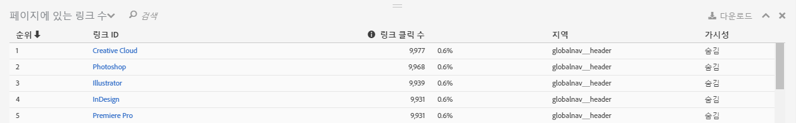
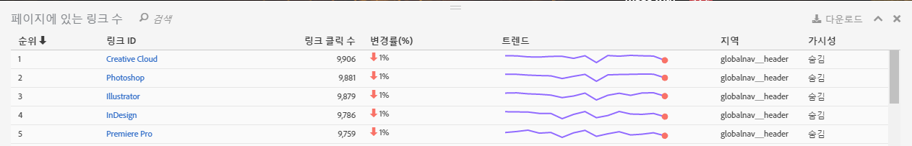

# 링크 보고서

링크 보고서는 현재 페이지에서 찾은 링크에 대해 보고합니다. 이 보고서는 해당 페이지에 대해 수집한 모든 링크에 대해 보고하지는 않습니다.

페이지에 있는 링크 수 보고서에서는 링크에 대한 탭 보기를 제공합니다. 때로 단일 보기로 등급이 지정된 링크 클릭(또는 다른 지표)을 봐야 할 수 있습니다. 이렇게 보면 링크들을 더 잘 비교할 수 있습니다. 페이지에 있는 모든 링크의 등급 목록(링크 ID별), 클릭 정보(횟수 및 비율) 및 페이지의 영역을 포함하는 페이지에 있는 링크 수 보고서를 만드십시오. Activity Map 도구 모음에서 페이지에 있는 링크 수 보고서 단추를 클릭합니다.

**[!UICONTROL 페이지에 있는 링크 수]보고서는 Activity Map 대시보드의 브라우저 프레임 아래에 열립니다.**

## Standard mode {#section_C8D2A1C07A2A4E3A8F84AC9240603FA7}

표준 모드에서, "페이지에 있는 링크 수" 보고서에는 전체 날짜 범위에 대해 집계한, 하루 범위에서 여러 날 범위까지의 링크 데이터가 표시됩니다. 각 링크에 대해 다음 정보가 표시됩니다.

<table id="table_3DE41B2CFA644B70AF802A3123CE51D9"> 
 <thead> 
  <tr> 
   <th colname="col1" class="entry"> 열 </th> 
   <th colname="col2" class="entry"> 설명 </th> 
  </tr> 
 </thead>
 <tbody> 
  <tr> 
   <td colname="col1"> 등급 </td> 
   <td colname="col2"> 페이지 등급. 표준 모드에서 등급 값은 클릭하는 열에 상관없이 동일하게 유지됩니다. </td> 
  </tr> 
  <tr> 
   <td colname="col1"> 링크 ID </td> 
   <td colname="col2">링크의 기본 ID (기본 ID가 [새로운 링크 추적 방법론] 로 정의되는 방법에 대한 자세한 내용은 (/home/analyze/activity-map/activitymap-link-tracking/activitymap-link-tracking-methodology. md) </td> 
  </tr> 
  <tr> 
   <td colname="col1"> 클릭 수 </td> 
   <td colname="col2"> 지정된 링크에 대한 원시 클릭 수와 해당 페이지에 대한 총 클릭 수를 기준으로 한 그 비율. 사용자가 도구 모음에서 다른 지표를 선택하면, 링크 보고서는 이 지표에 대해 보고합니다. </td> 
  </tr> 
  <tr> 
   <td colname="col1"> 영역 </td> 
   <td colname="col2"> 페이지에서 링크가 위치한 영역을 나타냅니다. </td> 
  </tr> 
  <tr> 
   <td colname="col1"> 가시성 </td> 
   <td colname="col2">링크의 가시성 상태와 관련이 있습니다. 다음 두 개의 값이 가능합니다. 
    <ul id="ul_BABCC0F64145407C9D439150A6898E6D">
     <li id="li_9AF0479BDCEB4A44A37292FAABFA83A5"><b>숨김</b>: 링크가 현재 페이지에 있지만, 최종 사용자에게는 표시되지 않습니다(탐색 메뉴에 있지만 사용자가 상위 메뉴의 위를 마우스로 가리키는 경우에만 표시되는 하위 메뉴처럼). </li>
     <li id="li_C6FA4EC27EDD4341AB9821E2B4BC9E60"><b>표시됨</b>: 현재 링크가 페이지에 표시되어 있습니다. 하지만, 폴더 아래에 표시될 수 있습니다. 사용자가 보려면 페이지를 스크롤해야 합니다. </li>
    </ul>
참고: 링크가 "숨김"으로 설정되어 있다면, 그에 대해 표시되는 오버레이가 없습니다. 
</td> 
  </tr> 
 </tbody> 
</table>

**데이터 필터**

특정 링크에 초점을 맞추려면 **[!UICONTROL 데이터 필터]필드에서 관련 용어를 검색할 수 있습니다.** 검색어와 일치하는 링크에만 오버레이가 있을 수 있습니다. 필터가 없으면, [Activity Map 설정](/help/analyze/activity-map/activitymap-overlay-settings.md)에 지정된 오버레이가 표시됩니다.

## Live mode {#section_AC1967217B5A4532ACB01D33636F6770}

라이브 모드에서 페이지에 있는 링크 수 보고서에는 몇 분 동안의 트렌드 데이터가 표시됩니다.

<table id="table_61D1FB0F02894055A1AB394DE4FE4742"> 
 <thead> 
  <tr> 
   <th colname="col1" class="entry"> 열 </th> 
   <th colname="col2" class="entry"> 설명 </th> 
  </tr> 
 </thead>
 <tbody> 
  <tr> 
   <td colname="col1"> 등급 </td> 
   <td colname="col2"> 페이지 등급. 그라데이션 또는 버블 오버레이의 경우, 등급 값은 클릭하는 열에 상관없이 동일하게 유지됩니다. 승자/패자 오버레이의 경우, 해당 등급 값은 가장 많이 얻거나 잃은 링크에 따라 변경됩니다. </td> 
  </tr> 
  <tr> 
   <td colname="col1"> 링크 ID </td> 
   <td colname="col2">링크의 기본 ID. 를 참조하십시오. </td> 
  </tr> 
  <tr> 
   <td colname="col1"> 링크 클릭 </td> 
   <td colname="col2"> 선택한 기간에 대한 총 클릭 수. </td> 
  </tr> 
  <tr> 
   <td colname="col1"> % 변경 </td> 
   <td colname="col2"> 현재 기간 링크 지표와 이전 기간 링크 지표 간 % 변화. 음의 % 변화는 빨간색으로 표시되고 양의 변화는 녹색으로 표시됩니다. </td> 
  </tr> 
  <tr> 
   <td colname="col1"> 트렌드 </td> 
   <td colname="col2"> 수집된 모든 기간에 대한 라인 차트. 현재 선택한 기간은 녹색 마커로 표시됩니다. 현재 마우스로 가리킨 기간은 빨간색 마커로 표시됩니다. </td> 
  </tr> 
  <tr> 
   <td colname="col1"> 영역 </td> 
   <td colname="col2"> 페이지에서 링크가 위치한 영역을 나타냅니다. </td> 
  </tr> 
  <tr> 
   <td colname="col1"> 가시성 </td> 
   <td colname="col2">링크의 가시성 상태와 관련이 있습니다. 다음 두 개의 값이 가능합니다. 
    <ul id="ul_B10C55ED4D3C4CF99506DC467E2E7CFB">
     <li id="li_EA646722A51041CC9E62C56DEF92C81F">숨김: 링크가 현재 페이지에 있지만, 여러분에게는 표시되지 않습니다(예: 페이지가 로드된 후 나타나는 링크). </li>
     <li id="li_F9543614C2894003AC9984A7404E2785">표시됨: 현재 링크가 페이지에 표시되어 있습니다. 하지만, 폴더 아래에 표시될 수 있습니다. 여러분이 보려면 페이지를 스크롤해야 합니다. </li>
    </ul></td> 
  </tr> 
 </tbody> 
</table>

## Sorting and filtering {#section_4B8E8233C21247CAA70DAEC2156548AD}

특정 페이지 영역(예: 왼쪽 패널)의 결과만 분석하여 웹 페이지에서 해당 특정 영역의 컨텐츠를 구성할 방법을 결정해야 하는 경우가 있습니다.

이런 용도를 위해 Adobe에서는 페이지에 있는 링크 수 보고서에 있는 링크에 대한 정렬 및 필터링 기능을 만들었습니다. 필터링은 필터 필드를 통해 사용할 수 있으며, 검색어는 링크 ID 열 및 링크 영역 열에 적용됩니다. 정렬은 머리글(등급, 링크 ID, 클릭 수, 시간이 지남에 따라 변경, 영역, 가시성)을 클릭하여 사용할 수 있고, 오름차순과 내림차순이 모두 가능합니다. 링크가 페이지에 있는 링크 수 보고서에서 필터링되면 오버레이는 웹 사이트에서 사라집니다.
